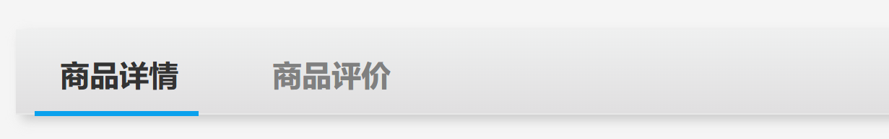
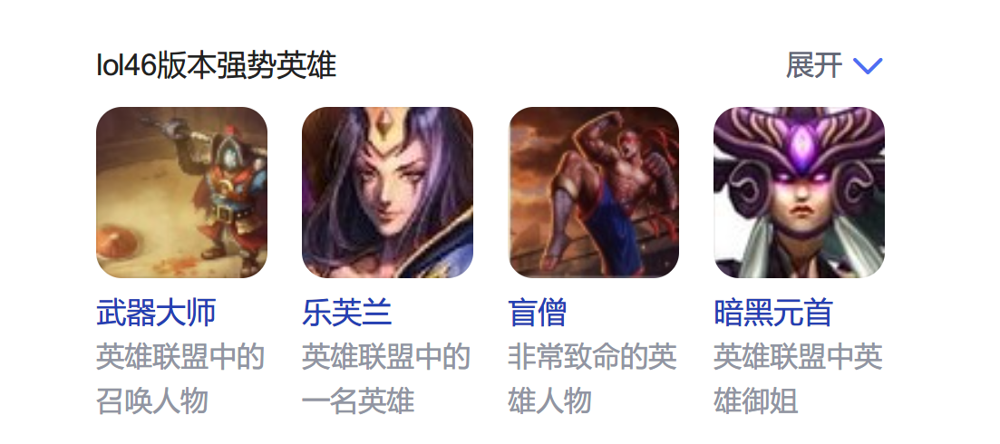

# DOM01

## 什么是DOM?

`Document Object Model`: 文档对象模型

- document: 文档 -- HTML代码的别名, 也叫 `模板`
- object : 对象 -- HTML代码在运行到浏览器上时, 会先被解析成 JS的对象, 然后把对象类型展示到 浏览器上


学习DOM能做什么?

- 利用JS 来操作页面. 实现更加丰富的动态变化

```html
<!DOCTYPE html>
<html lang="en">
  <head>
    <meta charset="UTF-8" />
    <meta http-equiv="X-UA-Compatible" content="IE=edge" />
    <meta name="viewport" content="width=device-width, initial-scale=1.0" />
    <title>dom</title>
  </head>
  <body>
    <!-- 可以把HTML理解成语法糖: 快速创建出 JS的DOM元素 -->
    <!-- 真正运行时, 会解析成JS的代码 -->
    <!-- 学习DOM之后, 就可以通过 JS 灵活操作页面 -->
    <div>Hello</div>
    <div>World</div>

    <script>
      console.log(window)
      // HTML代码真正运行时, 会转换成 window的document对象
      // 页面上显示的内容, 实际上是document对象
      console.log(window.document)

      setInterval(() => {
        var t = new Date().toLocaleTimeString()
        //
        document.title = t
      }, 1000)
    </script>
  </body>
</html>

```


### DOM树

HTML代码 解析成 document 对象时, 对象的结构 类似一颗树, 称为`DOM树`

关键词: `节点 node` 每个页面元素称为节点


## 查找元素的方案


### 基础节点读取

```html
<!DOCTYPE html>
<html lang="en">
  <head>
    <meta charset="UTF-8" />
    <meta http-equiv="X-UA-Compatible" content="IE=edge" />
    <meta name="viewport" content="width=device-width, initial-scale=1.0" />
    <title>基础节点读取: 09:17</title>
  </head>
  <body>
    <!-- HTML文本代码, 实际运行时被浏览器解析成 document 对象 -->
    <!-- 存储在 window.document 属性里 -->
    <!-- HTML代码必然带3个基础元素:  -->
    <script>
      // 关于打印: log-美化后的   dir-直接输出对象
      console.log(document.head)
      console.dir(document.head)

      console.log(document.body)
      // 整个的html节点
      console.log(document.documentElement)
    </script>
  </body>
</html>

```

### 自定义节点读取

```html
<!DOCTYPE html>
<html lang="en">
  <head>
    <meta charset="UTF-8" />
    <meta http-equiv="X-UA-Compatible" content="IE=edge" />
    <meta name="viewport" content="width=device-width, initial-scale=1.0" />
    <title>自定义节点读取 09:24</title>
  </head>
  <body>
    <div>Hello</div>
    <p>World!</p>
    <div>DOM666</div>

    <script>
      console.log(document.body)
      console.dir(document.body) // 后台展开看, 能不能找到3个子节点

      // 节点的子元素存储在 children(孩子们) 属性里
      console.log(document.body.children)

      // ES6提供的 数组解构 语法: 快速把数组的值放在不同的变量里
      // children: 所有子元素, 利用下标取值, 就可以获取指定序号的子元素
      // 例如 children[1] 就是序号1的元素
      const [d1, p, d2] = document.body.children
      console.log(d1)
      console.log(p)
      console.log(d2)

      // 提供了固定方法 来读取 指定元素
      // 例如: 第一个子元素

      //第一个子元素: 文本或标签都能读取出来, 只要是第一个子
      console.log(document.body.firstChild)
      //第一个元素类型的子元素: 只读取 第一个 标签元素
      console.log(document.body.firstElementChild)
    </script>
  </body>
</html>

```

### 通过id读取

```html
<!DOCTYPE html>
<html lang="en">
  <head>
    <meta charset="UTF-8" />
    <meta http-equiv="X-UA-Compatible" content="IE=edge" />
    <meta name="viewport" content="width=device-width, initial-scale=1.0" />
    <title>通过id读取元素 09:40</title>
  </head>
  <body>
    <div>
      <div>
        <div>
          <!-- id: 唯一标识 -->
          <p id="p1">Hello</p>
          <p>全普兄弟</p>
        </div>
        <div>World</div>
      </div>
    </div>

    <script>
      // 按照id查找元素
      const p1 = document.getElementById('p1')

      // 浏览器默认把 id 的元素, 自动读取; 绑定在同名的属性, 可以直接用
      console.log(p1)

      // 不推荐直接用id 属性
      // 1. 使用时没有代码提示
      // 2. 兼容性: 旧版本浏览器不支持此用法
      // 3. 猪队友: 你的小伙伴可能不知道能直接用
    </script>
  </body>
</html>

```

### 通过标签名读取

```html
<!DOCTYPE html>
<html lang="en">
  <head>
    <meta charset="UTF-8" />
    <meta http-equiv="X-UA-Compatible" content="IE=edge" />
    <meta name="viewport" content="width=device-width, initial-scale=1.0" />
    <title>通过标签名读取 09:51</title>
  </head>
  <body>
    <div>
      <p>Hello</p>
      <p>World!</p>
    </div>

    <script>
      // 读取所有的p标签
      // get获取 Elements元素们 By通过 Tag标签 Name名
      var a = document.getElementsByTagName('p')
      // 查询结果 是 类数组类型, 原型非数组
      console.log(a)
      // 然后: 利用序号精确读取 某一个
      var p1 = a[1]
      console.log(p1)
    </script>
  </body>
</html>

```

### 通过class查找

```html
<!DOCTYPE html>
<html lang="en">
  <head>
    <meta charset="UTF-8" />
    <meta http-equiv="X-UA-Compatible" content="IE=edge" />
    <meta name="viewport" content="width=device-width, initial-scale=1.0" />
    <title>通过class查找元素 10:15</title>
  </head>
  <body>
    <div>
      <div class="ok">111111</div>
      <div class="err">22222</div>
      <div class="err">33333</div>
      <div class="ok">44444</div>
    </div>

    <script>
      // 返回值: 类数组.  因为通过class可以有多个
      var a = document.getElementsByClassName('ok')
      console.log(a)

      // 利用下标取值, 找到具体元素
      console.log(a[1])
    </script>
  </body>
</html>

```

### 通过name查找

```html
<!DOCTYPE html>
<html lang="en">
  <head>
    <meta charset="UTF-8" />
    <meta http-equiv="X-UA-Compatible" content="IE=edge" />
    <meta name="viewport" content="width=device-width, initial-scale=1.0" />
    <title>通过name查找元素 10:21</title>
  </head>
  <body>
    <div>
      <input type="radio" name="sex" id="" />
      <input type="radio" name="sex" id="" />
      <input type="radio" name="sex" id="" />
    </div>

    <script>
      // 返回值: 类数组类型
      var a = document.getElementsByName('sex')
      console.log(a)

      // 通过下标获取指定元素
      console.log(a[1])
    </script>
  </body>
</html>

```

### 利用css查找

```html
<!DOCTYPE html>
<html lang="en">
  <head>
    <meta charset="UTF-8" />
    <meta http-equiv="X-UA-Compatible" content="IE=edge" />
    <meta name="viewport" content="width=device-width, initial-scale=1.0" />
    <title>利用css选择器查找 10:26</title>
  </head>
  <body>
    <div>
      <p>Hello</p>
      <p>World</p>
    </div>

    <script>
      // 最万能的 css 选择器
      // querySelector : 查单个元素
      // querySelectorAll : 查多个元素

      var p1 = document.querySelector('p:last-child')
      console.log(p1)

      // 所有的p标签
      // 类数组类型, 原型里有 forEach 可用来遍历
      var ps = document.querySelectorAll('p')
      console.log(ps)
    </script>
  </body>
</html>

```

## 内联样式操作

```html
<!DOCTYPE html>
<html lang="en">
  <head>
    <meta charset="UTF-8" />
    <meta http-equiv="X-UA-Compatible" content="IE=edge" />
    <meta name="viewport" content="width=device-width, initial-scale=1.0" />
    <title>内联样式 style操作 10:40</title>
    <style>
      #box {
        background-color: #36d;
        width: 200px;
        height: 200px;
      }
    </style>
  </head>
  <body>
    <button onclick="showBox()">显示</button>
    <button onclick="hideBox()">隐藏</button>
    <button onclick="toggleBox()">切换</button>
    <!-- <div id="box" style="display: none"></div> -->
    <div id="box"></div>

    <script>
      const box = document.getElementById('box')
      console.dir(box)
      // 隐藏
      function hideBox() {
        // 修改box元素的属性
        box.style.display = 'none'
      }
      // 显示
      function showBox() {
        box.style.display = '' //默认值是空字符串
      }
      // 切换
      function toggleBox() {
        if (box.style.display == '') {
          box.style.display = 'none'
        } else {
          box.style.display = '' //默认值是空字符串
        }
      }
    </script>
  </body>
</html>

```

### 案例: 菜单展开

```html
<!DOCTYPE html>
<html lang="en">
  <head>
    <meta charset="UTF-8" />
    <meta http-equiv="X-UA-Compatible" content="IE=edge" />
    <meta name="viewport" content="width=device-width, initial-scale=1.0" />
    <title>菜单展开 11:18</title>
    <style>
      #menu {
        /* 用户无法选择文本 */
        user-select: none;
      }
      #menu > div:last-child {
        display: flex;
        flex-direction: column;
        padding-left: 1em;
      }
    </style>
  </head>
  <body>
    <div id="menu">
      <div onclick="toggle()">快速入门</div>
      <div style="display: none">
        <span>JavaScript 基础知识</span>
        <span>JavaScript 高级知识</span>
        <span>JavaScript 进阶知识</span>
        <span>JavaScript 框架知识</span>
      </div>
    </div>

    <script>
      const d = document.querySelector('#menu >div:last-child')
      console.log(d)

      function toggle() {
        // 显示->隐藏  隐藏->显示
        // 利用css选择器查出来的元素, 使用时没有代码提示
        if (d.style.display == '') {
          d.style.display = 'none'
        } else {
          d.style.display = ''
        }
      }
    </script>
  </body>
</html>

```

## 事件

```html
<!DOCTYPE html>
<html lang="en">
  <head>
    <meta charset="UTF-8" />
    <meta http-equiv="X-UA-Compatible" content="IE=edge" />
    <meta name="viewport" content="width=device-width, initial-scale=1.0" />
    <title>事件 11:32</title>
    <style>
      #box {
        width: 200px;
        height: 200px;
        border: 1px solid gray;
      }
    </style>
  </head>
  <body>
    <!-- 绑定方式1: 利用HTML 添加 onclick 属性 -->
    <button onclick="clickMe()">点我</button>

    <div id="box"></div>

    <script>
      function clickMe() {
        console.log('啊啊啊')
      }

      const box = document.getElementById('box')
      console.dir(box) // 属性中查看 on 开头的

      // 所有事件都是on开头的:  on 当...时
      box.onclick = function () {
        console.log('盒子被点击')
      }
      // mouse: 鼠标  enter:进入  leave:离开
      let count = 0
      box.onmouseenter = function () {
        console.log('我进来了')
        count++
        if (count == 10) alert('打我呀, 笨蛋!')
      }
      box.onmouseleave = function () {
        console.log('我又出来了')
      }
    </script>
  </body>
</html>

```

## class操作

```html
<!DOCTYPE html>
<html lang="en">
  <head>
    <meta charset="UTF-8" />
    <meta http-equiv="X-UA-Compatible" content="IE=edge" />
    <meta name="viewport" content="width=device-width, initial-scale=1.0" />
    <title>class操作 11:48</title>
    <style>
      #box {
        width: 200px;
        height: 200px;
        border: 1px solid gray;
      }
      /* 代表 元素是 id='box' 同时带有 class='danger' */
      #box.danger {
        background-color: red;
      }
      #box.success {
        background-color: green;
      }
    </style>
  </head>
  <body>
    <!-- 真正开发时, 内联样式的书写过于复杂, 更常用 class 修改样式 -->
    <button>危险</button>
    <button>安全</button>
    <div id="box"></div>

    <script>
      // body的子元素中, 解构前两个
      const [btn0, btn1] = document.body.children
      const box = document.getElementById('box')
      // 属性 className 就是class属性. 因为class是JS关键词, 所以不能叫class
      console.dir(box)

      btn0.onclick = function () {
        box.className = 'danger'
      }
      btn1.onclick = function () {
        box.className = 'success'
      }
    </script>
  </body>
</html>

```


## 开关

```html
<!DOCTYPE html>
<html lang="en">
  <head>
    <meta charset="UTF-8" />
    <meta http-equiv="X-UA-Compatible" content="IE=edge" />
    <meta name="viewport" content="width=device-width, initial-scale=1.0" />
    <title>开关制作 14:00</title>
    <style>
      .switch {
        display: inline-block;
        border: 1px solid silver;
        width: 120px;
        height: 60px;
        border-radius: 30px;
        padding: 1px;
        /* 补间动画,过度 */
        transition: 0.3s;
      }
      .switch > span {
        transition: 0.3s;

        /* 行内块: 支持宽高内边距等 */
        display: inline-block;
        width: 58px;
        height: 58px;
        border: 1px solid silver;
        box-shadow: 1px 1px 2px 1px silver;
        border-radius: 50%;
        background-color: white;
      }
      .switch.on {
        background-color: blue;
      }
      .switch.on > span {
        margin-left: 57px;
      }
    </style>
  </head>
  <body>
    <!-- 制作顺序 HTML -> CSS -> JS -->
    <div class="switch">
      <span></span>
    </div>

    <script>
      // 利用css选择器: 找到要操作的元素
      var s = document.querySelector('.switch')

      s.onclick = function () {
        // this: 调用时所在对象, 即当前元素
        console.dir(this)
        // 操作class 有两种方案:
        // className属性: 简单的字符串, 就是class的值
        // classList属性: 专业的管理class的对象, 拥有各种操作class的方法

        // toggle: 自动判断, 有则删除,无则添加
        this.classList.toggle('on') //toggle:切换

        // if (this.className == 'switch') {
        //   this.className = 'switch on'
        // } else {
        //   this.className = 'switch'
        // }
      }
    </script>
  </body>
</html>

```

## 标签选择

```html
<!DOCTYPE html>
<html lang="en">
  <head>
    <meta charset="UTF-8" />
    <meta http-equiv="X-UA-Compatible" content="IE=edge" />
    <meta name="viewport" content="width=device-width, initial-scale=1.0" />
    <title>标签选择 14:39</title>
    <style>
      #tags {
        user-select: none;
      }
      #tags > span {
        display: inline-block;
        margin: 0 10px 10px 0;
        padding: 5px 10px;
        background-color: lightgray;
        border-radius: 4px;
        transition: 0.2s;
      }
      #tags > span.on {
        background-color: orangered;
        color: white;
      }
    </style>
  </head>
  <body>
    <h3>选择晚餐:</h3>
    <div id="tags">
      <span class="on">黄焖鸡</span>
      <span class="on">鸭血粉丝汤</span>
      <span>红烧排骨</span>
      <span>葱爆羊肉</span>
      <span>小鸡炖蘑菇</span>
      <span>烤鱼</span>
    </div>

    <script>
      // 先查出所有的 span 的标签, 然后遍历 挨个添加点击事件

      // 查询多个, 用带 All 的方法
      const tags = document.querySelectorAll('#tags > span')
      console.log(tags)
      // tags: 所有的元素;   tag:遍历出来的每一个, 之前变量名叫 value
      tags.forEach(tag => {
        console.log('tag:', tag)
        // toggle: 切换
        // 单击: 选中;  双击: 取消
        tag.onclick = function () {
          // this.classList.toggle('on')
          this.classList.add('on') //add: 添加
        }
        // double: 双倍;   dblclick 双击
        tag.ondblclick = function () {
          this.classList.remove('on') //remove: 移除
        }
      })
    </script>
  </body>
</html>

```

## 菜单展开

```html
<!DOCTYPE html>
<html lang="en">
  <head>
    <meta charset="UTF-8" />
    <meta http-equiv="X-UA-Compatible" content="IE=edge" />
    <meta name="viewport" content="width=device-width, initial-scale=1.0" />
    <title>菜单展开 15:15</title>
    <style>
      #menu {
        user-select: none;
        width: 300px;
      }
      #menu > div {
        border: 1px solid gray;
        margin-bottom: 5px;
      }
      #menu > div > div:first-child {
        background-color: aquamarine;
        padding: 5px;
        background-image: url('./imgs/zhankai.png');
        background-size: 20px 20px;
        background-repeat: no-repeat;
        background-position: left center;
        padding-left: 25px;
      }
      #menu > div > div:last-child {
        background-color: lightgray;
        padding: 10px;
        display: none;
      }
      /* 兄弟选择器 + */
      #menu div.open + div {
        display: block;
      }
      #menu > div > div.open {
        background-image: url('./imgs/shouqi.png');
      }
    </style>
  </head>
  <body>
    <div id="menu">
      <div>
        <!-- open:代表打开 -->
        <div>阶段1</div>
        <div>
          <div>SQL</div>
          <div>node.js</div>
          <div>express</div>
          <div>js</div>
        </div>
      </div>

      <div>
        <!-- open:代表打开 -->
        <div>阶段2</div>
        <div>
          <div>SQL</div>
          <div>node.js</div>
          <div>express</div>
          <div>js</div>
        </div>
      </div>

      <div>
        <!-- open:代表打开 -->
        <div>阶段3</div>
        <div>
          <div>SQL</div>
          <div>node.js</div>
          <div>express</div>
          <div>js</div>
        </div>
      </div>
      <div>
        <!-- open:代表打开 -->
        <div>阶段4</div>
        <div>
          <div>SQL</div>
          <div>node.js</div>
          <div>express</div>
          <div>js</div>
        </div>
      </div>
      <div>
        <!-- open:代表打开 -->
        <div>阶段5</div>
        <div>
          <div>SQL</div>
          <div>node.js</div>
          <div>express</div>
          <div>js</div>
        </div>
      </div>
    </div>

    <script>
      // DOM的核心操作之一: 切换样式class
      // 只要提前准备好不同的class, 利用js切换, 就可以实现页面变化
      // 难点: 主要在于css..

      const titles = document.querySelectorAll('#menu>div>div:first-child')
      console.log(titles)

      titles.forEach(title => {
        title.onclick = function () {
          this.classList.toggle('open')
        }
      })
    </script>
  </body>
</html>

```

## 页数指示

```html
<!DOCTYPE html>
<html lang="en">
  <head>
    <meta charset="UTF-8" />
    <meta http-equiv="X-UA-Compatible" content="IE=edge" />
    <meta name="viewport" content="width=device-width, initial-scale=1.0" />
    <title>页数指示 16:06</title>

    <style>
      #pages {
        background-color: #f5f5f6;
        padding: 10px;
        /* 用户无法选中文本 */
        user-select: none;
      }
      #pages > span {
        display: inline-block;
        width: 40px;
        text-align: center;
        /* 1行文字, 竖向居中的写法 */
        line-height: 40px;
        background-color: white;
        border-radius: 3px;
        color: #36d;
      }
      #pages > span:hover {
        background-color: rgba(51, 102, 221, 0.1);
      }
      #pages > span.current {
        background-color: #36d;
        color: white;
      }
    </style>
  </head>
  <body>
    <div id="pages">
      <!-- current: 当前 -->
      <span class="current">1</span>
      <span>2</span>
      <span>3</span>
      <span>4</span>
      <span>5</span>
      <span>6</span>
    </div>

    <script>
      const pages = document.querySelectorAll('#pages > span')
      console.log(pages)

      pages.forEach(page => {
        page.onclick = function () {
          // 1.找到当前高亮的, 删除其样式
          // var c = document.querySelector('#pages .current')
          // c.classList.remove('current')

          // 思路2: 遍历删除每个元素的样式, 不管有没有
          pages.forEach(page => page.classList.remove('current'))

          // 2. 为当前点击项 添加样式
          this.classList.add('current')
        }
      })
    </script>
  </body>
</html>

```

## 菜单练习

```html
<!DOCTYPE html>
<html lang="en">
  <head>
    <meta charset="UTF-8" />
    <meta http-equiv="X-UA-Compatible" content="IE=edge" />
    <meta name="viewport" content="width=device-width, initial-scale=1.0" />
    <title>菜单练习 16:41</title>
    <style>
      #menu {
        user-select: none;
        width: 140px;
        /* 弹性盒子: 默认横向排列 */
        display: flex;
        /* colomn: 列, 竖向排列;  */
        flex-direction: column;
      }
      #menu > span {
        border-left: 2px solid lightgray;
        padding: 8px 0 8px 15px;
        color: #555;
      }
      #menu > span:hover {
        color: #d84000;
      }
      #menu > span.current {
        border-color: #d84000;
        font-weight: bold;
        color: black;
        background-color: #fdf3ef;
      }
    </style>
  </head>
  <body>
    <div id="menu">
      <span class="current">概览</span>
      <span>数字</span>
      <span>字符串</span>
      <span>其他类型</span>
      <span>变量</span>
      <span>运算符</span>
    </div>

    <script>
      const titles = document.querySelectorAll('#menu span')

      titles.forEach(title => {
        title.onclick = function () {
          // 先删除所有元素的当前样式
          titles.forEach(title => title.classList.remove('current'))

          // 为当前元素 +当前样式
          this.classList.add('current')
        }
      })
    </script>
  </body>
</html>

```

## 导航栏

```html
<!DOCTYPE html>
<html lang="en">
  <head>
    <meta charset="UTF-8" />
    <meta http-equiv="X-UA-Compatible" content="IE=edge" />
    <meta name="viewport" content="width=device-width, initial-scale=1.0" />
    <title>导航栏</title>
    <style>
      #nav {
        user-select: none;
        /* 弹性盒子: 最常用, 后续的App开发更常用 */
        display: flex;
        width: 800px;
        background-color: #002c69;
        justify-content: center;
      }
      #nav > span {
        width: 130px;
        text-align: center;
        line-height: 40px;
        color: white;
      }
      #nav > span:hover {
        background-color: #194788;
      }
      #nav > span.current {
        background-color: #f39700;
      }
    </style>
  </head>
  <body>
    <div id="nav">
      <span class="current">首页</span>
      <span>关于净美仕</span>
      <span>公司动态</span>
      <span>产品中心</span>
      <span>联系我们</span>
    </div>

    <script>
      const titles = document.querySelectorAll('#nav span')

      titles.forEach(title => {
        title.onclick = function () {
          titles.forEach(title => title.classList.remove('current'))

          this.classList.add('current')
        }
      })
    </script>
  </body>
</html>

```

## 页数指示点

```html
<!DOCTYPE html>
<html lang="en">
  <head>
    <meta charset="UTF-8" />
    <meta http-equiv="X-UA-Compatible" content="IE=edge" />
    <meta name="viewport" content="width=device-width, initial-scale=1.0" />
    <title>页数指示点 17:55</title>
    <style>
      #indicator {
        user-select: none;
      }
      #indicator > span {
        display: inline-block;
        width: 20px;
        height: 20px;
        border-radius: 50%;
        background-color: #ccc;
      }
      #indicator > span.current {
        background-color: orange;
      }
    </style>
  </head>
  <body>
    <div id="indicator">
      <span class="current"></span>
      <span></span>
      <span></span>
      <span></span>
    </div>

    <script>
      const a = document.querySelectorAll('#indicator span')

      a.forEach(value => {
        value.onmouseover = function () {
          a.forEach(v => v.classList.remove('current'))

          this.classList.add('current')
        }
      })
    </script>
  </body>
</html>

```


## 作业

点击哪一个, 添加高亮的边框


点击不同的标签, 变化为选中状态:  即 黑体+下边线



展开效果:

- 页面的效果本身的图片随意, 点击展开/收起,  可以显示下方更多内容
- 可以通过 style.display 实现.  也可以利用class实现  都行




