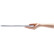

# DOM02

> FTP提供了 DOM阶段 壁纸, 可以下载使用

## 复习

什么是DOM?

- `Document Object Model`: 文档对象模型
  - 文档: HTML代码 -- 字符串类型,文本类型
  - 对象: 在运行之前会被浏览器解析成 JS 的对象类型, 存储在 window.document 属性里

学习DOM能做什么?

- 可以通过JS 来操作页面内容 -- 非常灵活

DOM树: document对象的形象描述

- HTML的标签是嵌套的, 转换成对象类型之后, 对象也是一个嵌套结构. 画出来像 树根 或 倒着的树
- `节点 node`: 元素的称呼

查找元素的多种方式

- 固定元素的查找
  - head
  - body
  - documentElement: 代表整个html
- 自定义元素的查找: 分3类方案
  - 与已知元素的关系: `children`, `firstElementChild`
  - 按照特征: `id`, `class`, `name`, `tagName`
  - css选择器:
    - querySelector: 查单个, 返回元素本身
    - querySelectorAll: 查所有, 返回值是类数组,  带有forEach 可以遍历

内联样式属性:

- style: 通过此属性来修改 内联样式 -- 优先级高于class

class属性:

- className: 就是class属性本身, 字符串类型
- `classList`: 存储了操作class的各种`易用方法`
  - add: 添加
  - remove: 移除
  - toggle: 切换

事件:

- 所有事件相关属性, 都是  `on` 开头, 代表 `当xxx时`
- onclick: 点击
- ondblclick: 双击
- onmouseover: 鼠标悬浮
- onmouseenter: 鼠标进入
- onmouseleave: 鼠标离开

## 作业

```html
<!DOCTYPE html>
<html lang="en">
  <head>
    <meta charset="UTF-8" />
    <meta http-equiv="X-UA-Compatible" content="IE=edge" />
    <meta name="viewport" content="width=device-width, initial-scale=1.0" />
    <title>作业 09:20</title>
    <style>
      #tags {
        user-select: none;
        width: 600px;
      }
      #tags > span {
        display: inline-block;
        padding: 10px;
        border: 2px solid gray;
        margin-bottom: 4px;
      }
      #tags > span:hover {
        background-color: rgba(0, 0, 0, 0.1);
      }
      #tags > span.cur {
        border-color: #0aa1ed;
      }
    </style>
  </head>
  <body>
    <div id="tags">
      <span class="cur">[E470C-2017新] i5 4G 500G</span>
      <span>[E470C-2017新] i5 8G 500G</span>
      <span>[E470C-2017新] i5 4G 1TB</span>
      <span>[E470C-2017新] i5 4G 256G SSD</span>
      <span>[E470C-2017新] i5 8G 256G SSD</span>
    </div>

    <script>
      // 1. 查找到所有的 标签
      const tags = document.querySelectorAll('#tags span')
      // 2. 遍历: 挨个绑定点击事件
      tags.forEach(tag => {
        tag.onclick = function () {
          // 3. 点击后: 简单粗暴 遍历删除每个标签的cur样式
          tags.forEach(v => v.classList.remove('cur'))
          // 4. 为点击项添加cur样式
          this.classList.add('cur')
        }
      })
    </script>
  </body>
</html>

```

```html
<!DOCTYPE html>
<html lang="en">
  <head>
    <meta charset="UTF-8" />
    <meta http-equiv="X-UA-Compatible" content="IE=edge" />
    <meta name="viewport" content="width=device-width, initial-scale=1.0" />
    <title>作业 09:40</title>
    <style>
      #tabs {
        user-select: none;
        background-color: lightgray;
      }
      #tabs > span {
        display: inline-block;
        padding: 10px;
        font-weight: bold;
        color: #555;
      }
      #tabs > span.cur {
        color: black;
        border-bottom: 2px solid #0aa1ed;
      }
    </style>
  </head>
  <body>
    <div id="tabs">
      <span class="cur">商品详情</span>
      <span>商品评价</span>
    </div>

    <script>
      const tabs = document.querySelectorAll('#tabs span')

      tabs.forEach(tab => {
        tab.onclick = function () {
          tabs.forEach(v => v.classList.remove('cur'))
          this.classList.add('cur')
        }
      })
    </script>
  </body>
</html>

```

```html
<!DOCTYPE html>
<html lang="en">
  <head>
    <meta charset="UTF-8" />
    <meta http-equiv="X-UA-Compatible" content="IE=edge" />
    <meta name="viewport" content="width=device-width, initial-scale=1.0" />
    <title>作业 10:15</title>
    <style>
      #box {
        user-select: none;
        border: 1px solid gray;
        width: 450px;
      }
      #box img {
        width: 100px;
        height: 100px;
      }
      #box > div:first-child {
        padding: 10px;
        display: flex;
        /* 空白间隔 */
        justify-content: space-between;
      }
      #box > div:last-child {
        display: none;
      }
      #box > div:last-child.open {
        display: block;
      }
    </style>
  </head>
  <body>
    <div id="box">
      <div>
        <span>lol46版本强势英雄</span>
        <span>展开</span>
      </div>
      <div>
        
        
        
        
      </div>
      <div>
        
        
        
        
        
        
        
        
      </div>
    </div>

    <script>
      const btn = document.querySelector('#box>div:first-child>span:last-child')
      console.log(btn)

      btn.onclick = function () {
        // 最后一个div
        const d = document.querySelector('#box>div:last-child')
        d.classList.toggle('open')

        // 标签的内容: innerHTML
        // 含有open->收起.  不含open->展开
        // contains: 判断是否拥有 某个样式
        this.innerHTML = d.classList.contains('open') ? '收起' : '展开'
      }
    </script>
  </body>
</html>

```

## 大小图切换

```html
<!DOCTYPE html>
<html lang="en">
  <head>
    <meta charset="UTF-8" />
    <meta http-equiv="X-UA-Compatible" content="IE=edge" />
    <meta name="viewport" content="width=device-width, initial-scale=1.0" />
    <title>大小图切换 11:11</title>
    <style>
      body {
        background-color: lightblue;
      }
      #box > div:last-child > img {
        /* transparent: 透明色 */
        border: 2px solid transparent;
        /* 如果不提前添加边框, 悬浮时再添加, 元素大小变化, 会动 */
      }
      #box > div:last-child > img.cur {
        border-color: #e53e41;
      }
    </style>
  </head>
  <body>
    <div id="box">
      <div>
        <!-- lg: large 大 -->
        
      </div>
      <div>
        <!-- small小 -> sm -->
        <!-- 自定义属性: 可以在元素上利用自定义属性 保存任何的值 -->
        <!-- 格式: data-属性名=值 -->
        
        
        
        
        
      </div>
    </div>

    <script>
      const imgs = document.querySelectorAll('#box>div:last-child>img')

      const img_lg = document.querySelector('#box>div:first-child>img')
      console.dir(img_lg) // 展开对象, 找src属性

      imgs.forEach(img => {
        img.onmouseover = function () {
          imgs.forEach(v => v.classList.remove('cur'))

          this.classList.add('cur')
          console.dir(this) //看看其中的 dataset 属性
          // dataset属性: 存储了元素的自定义属性的值
          // data-key=value :存在 dataset:{key:value}
          // data-lg = xxx : dataset: {lg: xxx}
          const lg = this.dataset.lg
          // 把小图上存储的大图, 设置给 大图的 src
          img_lg.src = `./imgs/${lg}` //大图名 拼接到路径里, 再赋值
        }
      })
    </script>
  </body>
</html>

```

## 自定义属性

```html
<!DOCTYPE html>
<html lang="en">
  <head>
    <meta charset="UTF-8" />
    <meta http-equiv="X-UA-Compatible" content="IE=edge" />
    <meta name="viewport" content="width=device-width, initial-scale=1.0" />
    <title>自定义属性 14:00</title>
  </head>
  <body>
    <!-- 每个元素 自带很多官方提供的属性, 例如 title id style... -->
    <!-- 额外提供了自定义属性的方案: data-属性名 -->
    <!-- 自定义属性存储在 dataset 属性中 -->
    <div id="box" data-aa="AA" data-xy="100" data-phone="10086"></div>

    <script>
      const box = document.getElementById('box')
      console.dir(box) //展开看属性中的 dataset

      console.log(box.dataset.phone)
    </script>
  </body>
</html>

```

## 轮播图

```html
<!DOCTYPE html>
<html lang="en">
  <head>
    <meta charset="UTF-8" />
    <meta http-equiv="X-UA-Compatible" content="IE=edge" />
    <meta name="viewport" content="width=device-width, initial-scale=1.0" />
    <title>轮播图 14:10</title>
    <style>
      #banner {
        user-select: none;
        width: 500px;
        height: 240px;
        border: 2px solid purple;
        /* 子元素的绝对定位, 需要父元素的相对定位配合 */
        position: relative;
      }
      #banner > div {
        position: absolute;
        bottom: 10px;
        /* background-color: lightblue; */
        width: 100%;
        text-align: center;
      }
      #banner > img {
        width: 100%;
        height: 100%;
      }
      #banner > div > span {
        display: inline-block;
        width: 16px;
        height: 16px;
        border-radius: 50%;
        background-color: white;
      }
      #banner > div > span.cur {
        background-color: yellowgreen;
      }
    </style>
  </head>
  <body>
    <div id="banner">
      
      <div>
        <!-- 自定义属性: 在小圆点上保存其对应的图片名 -->
        <span data-img="banner1.png" class="cur"></span>
        <span data-img="banner2.png"></span>
        <span data-img="banner3.png"></span>
        <span data-img="banner4.png"></span>
      </div>
    </div>

    <script>
      const dians = document.querySelectorAll('#banner>div>span')
      const el_img = document.querySelector('#banner>img')

      dians.forEach(dian => {
        dian.onmouseover = function () {
          dians.forEach(v => v.classList.remove('cur'))
          this.classList.add('cur')

          // 从 dataset 中读取自定义属性
          const img = this.dataset.img
          console.dir(this)
          // 图片名拼接到路径中, 再复制给 图片的src
          el_img.src = `./imgs/${img}`
        }
      })
    </script>
  </body>
</html>

```

## 标签栏

```html
<!DOCTYPE html>
<html lang="en">
  <head>
    <meta charset="UTF-8" />
    <meta http-equiv="X-UA-Compatible" content="IE=edge" />
    <meta name="viewport" content="width=device-width, initial-scale=1.0" />
    <title>标签栏 15:08</title>
    <style>
      #tabs {
        user-select: none;
        width: 400px;
      }
      #tabs > div:first-child {
        padding: 10px;
        background-color: #eee;
        display: flex;
      }
      #tabs > div:first-child > span {
        /* 自动拉伸: 平分空间 */
        flex: 1;
        text-align: center;
      }
      #tabs > div:first-child > span.cur {
        color: tomato;
      }
      #tabs > div:last-child > div {
        height: 200px;
        border: 1px solid gray;
        padding: 5px;
        display: none;
      }
      /* 带有cur样式的 显示 */
      #tabs > div:last-child > div.cur {
        display: block;
      }
    </style>
  </head>
  <body>
    <div id="tabs">
      <div>
        <!-- 自定义属性: 保存对应的详情元素的序号 -->
        <span data-index="0" class="cur">精选</span>
        <span data-index="1">美食</span>
        <span data-index="2">百货</span>
        <span data-index="3">个护</span>
      </div>
      <div>
        <div class="cur">精选...</div>
        <div>美食...</div>
        <div>百货...</div>
        <div>个护...</div>
      </div>
    </div>

    <script>
      const tabs = document.querySelectorAll('#tabs>div:first-child>span')
      const contents = document.querySelectorAll('#tabs>div:last-child>div')
      console.log(contents)

      tabs.forEach(tab => {
        tab.onmouseover = function () {
          tabs.forEach(v => v.classList.remove('cur'))
          this.classList.add('cur')

          // 获取自定义属性: index
          const index = this.dataset.index
          console.log('index:', index)

          // 相同做法: 先删除之前元素的cur样式, 再加新的
          contents.forEach(v => v.classList.remove('cur'))
          // 通过标签的序号, 找到对应的内容元素
          const a = contents[index] //下标取值, 看后台contents 和 index 的值
          console.log('a:', a)
          a.classList.add('cur')
        }
      })
    </script>
  </body>
</html>

```

## 输入框相关事件

```html
<!DOCTYPE html>
<html lang="en">
  <head>
    <meta charset="UTF-8" />
    <meta http-equiv="X-UA-Compatible" content="IE=edge" />
    <meta name="viewport" content="width=device-width, initial-scale=1.0" />
    <title>输入框相关事件 16:05</title>
  </head>
  <body>
    <input type="text" name="" id="inp" />

    <script>
      const inp = document.getElementById('inp')
      console.dir(inp)

      // 获得焦点 focus
      inp.onfocus = function () {
        console.log('focus: 获得焦点')
      }

      // 失去焦点 blur
      inp.onblur = function () {
        console.log('blur: 失去焦点')
      }

      // 输入框内容变化 change:  有改动 -> 回车或失去焦点
      // 事件参数: 事件触发的函数, 会接受事件参数--保存了事件相关的内容
      inp.onchange = function (e) {
        // 形参名随便写.  event事件, 简称习惯写 e
        console.log('change: 内容变化')
        // 事件中的target属性: 当前触发事件的元素.  相当于this关键词
        console.log(e)
        // 输入框的值存储在其 value 属性里
        console.log(e.target.value)
        console.log(this.value) //此场景中 this 和 e.target 是相同的元素
      }

      // 实时内容变化  input
      inp.oninput = function (e) {
        // 输入框内容的读取操作分两个方案:
        // 1. 利用事件参数读取
        console.log('input:', e.target.value)
        // 2. 利用this 读
        console.log('input:', this.value)
      }

      // 键盘事件 keyup 按键抬起
      inp.onkeyup = function (e) {
        console.log('keyup:', e)
        // 事件中: key 和 keyCode 可以用于辨别按钮是什么
        // key: 按键的名字   keyCode: 按钮的编号
        if (e.keyCode == 13) {
          alert('回车被点击了!')
        }
      }
    </script>
  </body>
</html>

```

## 手机号验证

```html
<!DOCTYPE html>
<html lang="en">
  <head>
    <meta charset="UTF-8" />
    <meta http-equiv="X-UA-Compatible" content="IE=edge" />
    <meta name="viewport" content="width=device-width, initial-scale=1.0" />
    <title>手机号验证 16:35</title>
    <style>
      input {
        /* 外轮廓: 即默认获得焦点时的高亮效果 */
        outline: none;
        transition: 0.3s;
        border: 2px solid gray;
        border-radius: 3px;
        font-size: 24px;
        padding: 10px;
      }
      .err {
        color: red;
        display: none;
      }
    </style>
  </head>
  <body>
    <input type="text" name="" id="phone" />
    <div class="err">手机号码格式不正确</div>
    <!-- 要求: 焦点时 边框变蓝,  失去焦点后 边框变红 -->
    <!-- 提示: style.border属性 -->
    <script>
      const phone = document.getElementById('phone')
      const err = document.querySelector('.err')

      phone.onfocus = function () {
        this.style.borderColor = 'blue'
        // 获得焦点时: 去掉内联样式的 设定.  则 class的display:none生效
        err.style.display = ''
      }

      phone.onblur = function () {
        // 空: 则删除内联样式 的 边框色
        if (this.value == '') {
          this.style.borderColor = ''
          return //结束当前函数, 后续代码不执行
          // 即: 如果输入框是空的, 则不进行后续的验证操作
        }

        // 正则验证:  手机号
        const reg = /^1[3-9]\d{9}$/
        // 验证输入框内容为假, 则变红
        if (reg.test(this.value) == false) {
          this.style.borderColor = 'red'
          err.style.display = 'block'
        } else {
          this.style.borderColor = '' //正确 则去掉特殊的边框色
        }
      }
    </script>
  </body>
</html>

```

## 勾选操作

```html
<!DOCTYPE html>
<html lang="en">
  <head>
    <meta charset="UTF-8" />
    <meta http-equiv="X-UA-Compatible" content="IE=edge" />
    <meta name="viewport" content="width=device-width, initial-scale=1.0" />
    <title>勾选操作 17:21</title>
  </head>
  <body>
    <div id="box">
      <label>
        <input type="checkbox" />
        <span>我已阅读并同意用户注册协议</span>
      </label>
      <br />
      <br />
      <!-- disabled: 不可用 -->
      <button disabled>提交注册</button>
    </div>

    <script>
      const chb = document.querySelector('#box input')
      const btn = document.querySelector('#box button')

      // change: 变更.  勾选状态变化时触发
      chb.onchange = function () {
        console.dir(this) // checked: 此属性代表勾选状态
        console.log(this.checked)

        // 勾选时  不可用属性 -- true 还是 false
        // if (this.checked) {
        //   btn.disabled = false // 勾选时, 不 不可用 -- 表示可用
        // } else {
        //   btn.disabled = true
        // }

        btn.disabled = !this.checked // ! 取反即可
      }
    </script>
  </body>
</html>

```

## 属性读取方式

```html
<!DOCTYPE html>
<html lang="en">
  <head>
    <meta charset="UTF-8" />
    <meta http-equiv="X-UA-Compatible" content="IE=edge" />
    <meta name="viewport" content="width=device-width, initial-scale=1.0" />
    <title>属性读取方式 17:40</title>
  </head>
  <body>
    <a href="http://tmooc.cn" id="a1" title="Tmooc" data-y="666">Tmooc</a>

    <script>
      // 属性的操作方式 分 新 旧两种
      const a = document.getElementById('a1')
      console.dir(a)

      // 新方案: 直接操作属性即可
      a.title = '百度一下' //修改操作
      // 旧方案: setAttribute(属性名, 值)
      a.setAttribute('href', 'http://www.baidu.com')

      // 读
      console.log(a.title)
      console.log(a.getAttribute('href'))

      // 自定义属性读
      console.log(a.dataset.y) //新写法中: 从dataset读取
      console.log(a.getAttribute('data-y')) //旧语法 直接读

      // 判断是否设置了某个属性
      console.log(a.title != '') // 默认值是空字符串, 不是空就是设置了
      console.log(a.target != '')
      // has: 有   Attribute:属性
      console.log(a.hasAttribute('title'))
      console.log(a.hasAttribute('target'))
    </script>
  </body>
</html>

```


## 作业

标签栏切换: 具体每个标签的内容, 自己随便写点即可


作业2:

输入框: 获得焦点时显示图1

失去焦点后: 检查输入框的值, 如果为空 则显示图2

失去焦点时: 检查输入框, 如果内容长度满足条件, 则显示图3 (`效果图里的不对`)

- 提示: 理论上有3个span标签, 各自有不同的样子.  根据条件来切换显示什么


