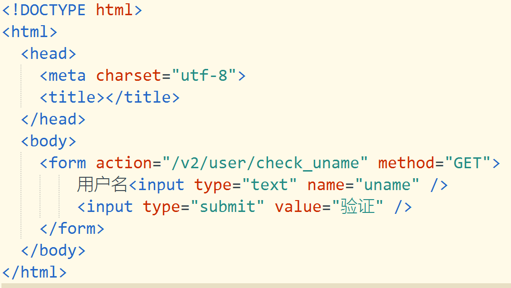
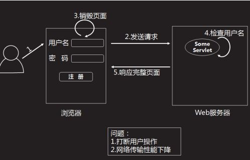
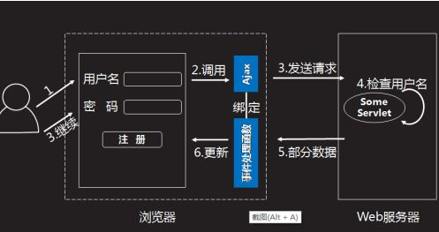
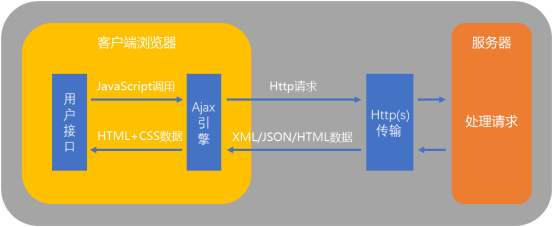

# 一.复习

目标：注册验证用户是否存在及登录功能

1.创建xz项目

2.引入一个 node_modules的包

2.在xz项目目录下创建pool.js，数据库相关配置

/**数据库连接池模块**/
//引入必须得第三方模块
const mysql = require('mysql')

//创建并导出一个数据库连接池
module.exports = mysql.createPool({
		host:'127.0.0.1',
		port:'3306',
		user:'root',      //必需
		password:'',
		database:'xz',    //必需
		connectionLimit:15
})

3.在xz项目目录下创建service.js 文件

//引入必须得模块文件和常量
const express = require('express')
const app = express()
const port = 8080

//启动WEB服务器--就是让它监听特定的端口
app.listen(port,()=>{
	console.log('服务器成功监听端口',port)
})

4.在xz项目目录下创建public目录用来存放静态资源

例如，html文件，image图片。。。。

5.在service.js文件中托管静态资源

//托管当前项目的静态资源
app.use(express.static('./public'))

6.在xz项目目录下创建router文件夹用来存储自定义路由器user.js

/**路由器模块  封装和user相关的路由**/
//引入必须模块
const express = require('express')
const pool = require('../pool')
const router = express.Router()
module.exports = router

(1）验证用户名是否存在的逻辑（GET请求)

router.get（路径，(req,res)=>{

​	//获取用户名

​	//通过pool.query查询该用户的uid

​	//若查询到结果，则证明用户存在

​	//返回 用户已存在的信息

​	//若查不到结果，则证明用户不存在

​	//返回 用户可以注册

}）

(2)最终代码

router.get('/check_uname',(req,res)=>{
	const n = req.query.uname
	pool.query('select uid from xz_user where uname=?'
	,[n],(err,result)=>{
		if(err)
		throw err
		if(result.length>0){
			res.send('exists')
		}else{
			res.send('non-exists')
		}
	})
})

7.在service.js文件引入自定义路由器

//引入自定义路由器模块
const userRouter = require('./router/user')
app.use('/v2/user',userRouter)

8.在public文件夹创建reg.html，目的以form的方式，对用户名进行验证

9.启动流程

（1）打开xampp，导入xz.sql的文件后（一次运行时导入），start开启mysql

（2）在xz的根路径下，启动node服务器

（3） 浏览器访问  http://127.0.0.1:8080/reg.html  输入内容进行验证

# AJAX异步交互

A 异步，

同步效果如下

异步效果如下

J  JavaScript  使用JavaScript来绑定和调用

A and  

X XML            数据传输方式

2.Ajax的执行流程

ajax的工作原理相当于在用户和服务器之间加了一个中间层(Ajax引擎)，使用户操作与服务器响应异步化

3.使用步骤

（1）创建异步对象  XMLHttpRequest   req/xhr

所有现代浏览器 (IE7+,FireFox,Chrome,Safari)均内建 XMLHttpRequest对象

需要创建一个专门用户做异步交互的对象  XMLHttpRequest    xhr

var xhr = new XMLHttpRequest()

(2) 设置请求信息

创建一个请求连接到服务器，先要使用我们创建的XMLHttpRequest对象，在这个对象里面有个open()方法，这个方法的作用类似初始化，并不会发起真正的请求

参数：

method   请求的类型/方式/方法    GET或POST  大小写不做限制

url   文件在服务器上的路径(数据)

xhr.open(method，url)

(3)发送异步请求

send() 方法发送请求，并接收一个可选的参数(body),但是根据请求方法的不同，参数也不同 

例如 

GET 方式

xhr.send(null)       或者     xhr.send()   

POST 方式

xhr.send(body)

4.接收响应

接收服务器发回的响应，异步接收

onload  属性

load  加载完成即响应成功，后处理服务返回的响应消息数据

xhr.onload = function(){

}

responseText属性

XMLHttpRequest.responseText  是响应主体被返回的文本，只能是文本格式，拿到可能需要转换

var result = xhr.responseText

5.Ajax的四步

使用Ajax请求服务器数据的步骤 --  四步

var xhr = new XMLHttpRequest()   //获取  XMLHttpRequest对象 用以发起请求

xhr.open('GET',url)							//open方法的作用是确定访求方式和请求路径

xhr.send() //发送请求						//  send方法作用是发送请求

xhr.onload = function(){				  //	xhr.onload的作用是响应完成后

​	console.log(xhr.responseText)	//  xhr.responseText 获取请求的数据

}

6.简易DOM操作

通过元素id获取网页中的元素

document.getElementById()

`<input type='text' id='uname'>`

用户的操作行为称之为事件

单击事件   onclick

光标移除   onblur

获取/设置元素的内容

< h1 id='zs'>张三< /h1>  其中  '张三'   就是元素的内容

zs.innerHtml = '内容'   修改为‘内容’

## 要求：

使用ajax异步请求

验证用户名是否存在

若存在，则鼠标移除时，后面span的内容修改为       抱歉，用户名已经存在

若不存在，则鼠标移除时，后面span的内容修改为    恭喜你，可以注册

## 流程步骤

1获取用户输入用户名           将用户名提交给服务器

2获取XMLHttpRequest对象  用来发送请求

3 声明url     用变量替换路径

4 xhr.open('get',url)  定义请求方式和路径

5 xhr.send（）   发送请求

6 xhr.onload = function(){

}

7 判断服务器响应的数据  xhr.responseText

if(xhr.responseText === 'exists'){

}else{

}

！！！！ 

获取intput文本框输入的内容

id.value

想获取服务器响应的内容

xhr.responseText

路径千万不要写错了

2.运用ajax实现登录功能

2.1 接口实现

接收get请求，路径是login，获取get请求参数 username和password

根据username 和 password查询数据库是否存在该数据

result 是查询结果集   如果集合中有内容，就是查到了 有该用户

如果集合中没有内容，就是没查到 ，就是没有这个用户

浏览器测试路径   http://127.0.0.1:8080/v2/user/login?username=123&password=123

还是   user.js

router.get('/login',(req,res)=>{
	//获取get请求传入的参数
	const uname = req.query.username
	const pwd = req.query.password
	//根据用户和密码查询用户uid
	pool.query('select uid from xz_user where uname=? and upwd=?'
	,[uname,pwd],(err,result)=>{
		if(err){
			throw err;                             14.25
		}
		//如果查询到的result结果集中有数据
		if(result.length>0){
			res.send("登录成功")
		}else{
			res.send("登录失败")
		}
	})
})

HTTP协议的路径要求

get

127.0.0.1:8080/路径1/路径2  ？  名称=值 & 名称 = 值

路径 1

在 service.js 中

路径 2

在自定义路由中

get请求中  从地址栏    ？  后面获取的

名称=值&名称=值

req.query.名称     获取值

登录功能 页面

在public文件下创建login.html

用户名和密码的id用来获取  文本框输入内容

id.value

按钮的id用来触发点击事件

b_login.onclick

通过按钮的id    b_login.onclick = function(){}  目的点击会触发该方法

获取两个输入框的值 以及  要提交的请求

接下来的 AJAX的四步

为了让响应结果显示在 h4的标题中

对响应结果做判断

