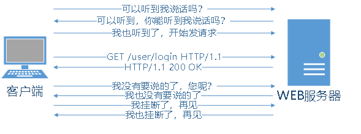
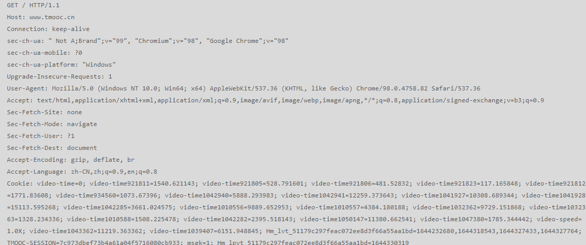
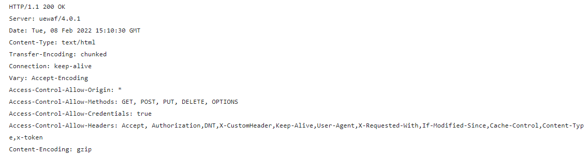

# HTTP协议

## 1.HTTP协议介绍

HTTP协议：Hyper Text Transfer Protocol，超文本传输协议。此协议规定的Web请求消息和响应消息的固定格式要求。由IETF委员会(www.ietf.org)制定

简而言之

HTTP协议就是由相关的委员会规定好的，请求和响应消息的固定格式。

HTTPS（Secure）是在某个版本的HTTP协议基础上，又增加了一层加密/解密层，可以将传输在互联网上的请求和响应消息进行加密和解密。

## 2.HTTP请求消息格式

  Request Message是客户端浏览器发给Web服务器的，其格式要求：

| 请求行：   请求方式   请求URI   协议版本                 |
| -------------------------------------------------------- |
| 请求头部  请求头部名:  请求头部值(多组)                  |
| 空行                                                     |
| 请求主体  有的请求有主体(POST/PUT)，有的则没有(GET/HEAD) |

## 3.常见的请求方式

 ①GET —— 表达客户端想要“获取”服务器的文件或数据

 ②POST—— 表达客户端想要“传递数据”给服务器，希望服务器存储下来生成一条记录

 ③PUT —— 表达客户端想要“放置数据”给服务器，希望服务器根据此数据更新一条记录

 ④DELETE —— 表达客户端想用“删除”服务器上的某个记录，

 ⑤HEAD —— 表示客户端想要“某个资源的响应消息头部，但不要该资源本身”

##  4.常用的请求头部及其含义

 ①Host: www.baidu.com	客户端想请求服务器上的哪个域名下的资源——HTTP/1.1新特性

 ②Connection: keep-alive  客户端申请“保持连接”以供后续的请求继续使用——HTTP/1.1新特性

 ③Cache-Control：no-cache  客户端告诉服务器如何缓存此次请求中的数据

 ④Pragma：no-cache  客户端告诉服务器如何缓存此次请求中的数据(旧版本时使用,但是,若都存在,以此为准)

 ⑤User-Agent：xxx 客户端告诉服务器当前“用户代理(即浏览器)”的类型

 ⑥Accept：  客户端告诉服务器自己可以接收的响应消息内容类型

 ⑦Accept-Language：zh   客户端告诉服务器当前用户的首选自然语言

 ⑧Accept-Encoding：客户端告诉服务器自己可以接收哪种格式的压缩数据

 ⑨Cookie：服务器保存在客户端用于追踪历史访问数据的

 ⑩Referer：当前请求发自哪个页面	

## 5.请求头中的Content-Type

请求实体内容的类型有四种

常见的媒体格式类型如下：

- text/html ： HTML格式
- application/x-www-form-urlencoded ： `<form encType="">`中默认的encType，form表单数据被编码为key/value格式发送到服务器（表单默认的提交数据的格式）
- multipart/form-data 表单上传文件时，就要让 form 的 enctype 等于这个值
- application/json： JSON数据格式

## 6.HTTP响应消息格式

Response Message：是服务器发给客户端浏览器的应答数据，它的格式如下：

| 状态行：   协议版本  状态码  原因短句                        |
| ------------------------------------------------------------ |
| 响应头部  响应头部名:  响应头部值(多行)                      |
| 空行                                                         |
| 响应主体  有的响应有主体(GET/POST/PUT/DELETE)，有的则没有(HEAD) |

## 7.状态码

常见的相应消息状态码及其对应的原因短句：
**1XX** **——** **提示性响应消息**
	100 Continue  请求未处理完，继续处理
	101 Switching Protocols  切换协议 

**2XX** **——** **成功的响应消息**
	200 OK 响应正常结束
	201 Created 客户端提交给服务器的已经被保存

**3XX** **——** **请求需要转向另一个地址**
	301 Moved Permanently 请求的资源永久移走了，需要配合Location头一起使用
	303 See Other
	304 Not Modified  请求的资源没有修改(请再次使用之前缓存的响应数据即可)

**4XX** **——** **客户端引起的错误**
	400 Bad Request 无效的请求消息
	401 Unauthorized 访问的资源需要授权
	402 Payment Required 请求的资源需要付费
	403 Forbidden
	404 Not Found
	405 Method Not Allow 请求方法不被服务器允许

**5XX** **——** **服务器端运行错误**
	500 Internal Server Error  服务器内部错误
	502 Bad Gateway 无效的网关
	503 Service Unavailable  服务器暂时不可用
	505 HTTP Version Not Support

## 8.常用的响应头部及其含义

 ①Server: nginx   服务器的种类
 ②Date: Wed, 05 Jan 2022 09:36:52 GMT   响应消息发出时间（注意HTTP协议中时间格式）
 ③Content-Type: text/html;charset=UTF-8  响应消息内容类型
 ④Connection: keep-alive  告诉对方启动“持久化连接”
 ⑤Content-Encoding: gzip   告诉客户端当前响应消息的压缩类型
 ⑥Expires: Wed, 05 Jan 2022 09:44:35 GMT   告诉客户端当前响应消息的主体数据过期时间(若没过期，则可以继续当做缓存数据使用；过期了就要抛弃了)
 ⑦Cache-Control: no-cache  服务器告诉客户端当前响应消息不要缓存
 ⑧Location: http://oracle.com  配合3XX系列的状态码，指定跳转地址
 ⑨Last-Modified：Wed, 05 Jan 2022 09:44:35 GMT  告诉客户端当前响应消息主体在服务器端最后一次修改时间
 ⑩Set-Cookie：服务器在向客户端保存以记录访问历史数据

## 9.响应中的Content-Type

请求或响应中实体内容的类型

常见的媒体格式类型如下：

text/html ： HTML格式

text/plain ：纯文本格式

text/xml ： XML格式

image/gif ：gif图片格式

image/jpeg ：jpg图片格式

image/png：png图片格式

以application开头的媒体格式类型：

application/xhtml+xml ：XHTML格式

application/xml： XML数据格式

application/atom+xml ：Atom XML聚合格式

application/json： JSON数据格式

application/pdf：pdf格式

application/msword ： Word文档格式

application/octet-stream ： 二进制流数据（如常见的文件下载）

application/x-www-form-urlencoded ： `<form encType="">`中默认的encType，form表单数

据被编码为key/value格式发送到服务器（表单默认的提交数据的格式）

## 10.HTTP协议详细汉语版地址

https://www.taodocs.com/p-82220892.html

