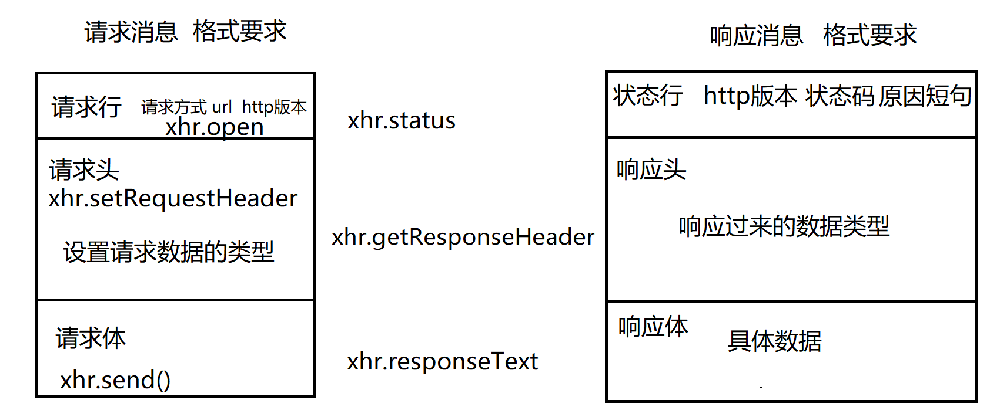
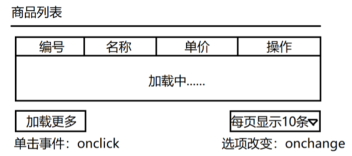
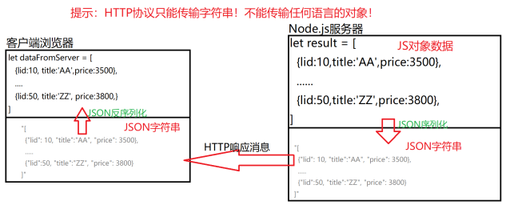

# 命名规则

不在乎长

通过  _  来对  id或者name等属性来进行命名

register_button                 注册的按钮

admin_login_button        管理员登录按钮

user_button_login           用户登录按钮

delete_product                 删除商品

# 复习及拓展

一 AJAX发送GET请求

1.创建一个能够发起HTTP请求消息的对象

let xhr = new XMLHttpRequest()                  --   必会

名称含义：向服务器发起HTTP请求消息，期望得到XML格式响应数据

2.XHR打开服务器的连接

xhr.open(method,url)    //发起一个异步请求       --    必会

xhr.open(method,url,true)   //发起一个异步请求

xhr.open(method,url,false)  //发起一个同步请求

xhr.setRequestHeader("Content-Type","text/html")  //设置一个请求消息头    --   必会

（例如 若上传文件，则Content-Type请求头需要修改为指定类型**multipart/form-data**

​	若传输的key/value的键值对，则需要对应类型**application/x-www-form-urlencoded**）

3.提前声明好：如果得到了服务器的响应消息，该如何处理

xhr.onload = function(){

​	xhr.status   //获取响应状态行中的状态码                              --      会

​	xhr.statusText    //获取响应状态行中的原因短句，例如  OK/NotFound           --   会

​	let all = xhr.getAllResponseHeader()   //得到所有的响应消息头部        -       了解

​	let value = xhr.getResponseHeader("Content-Type")   获取指定响应头部信息    --  掌握

​	let responseBody = xhr.responseText    响应消息的主体内容     -----   必会

}

4.向服务器发送请求消息

xhr.send()         //发送一个没有请求主体的请求消息

xhr.send(null) //发送一个没有请求主体的请求消息

xhr.send('username=dingding&password=123456')  //发送一个有请求主体的请求消息

一 ，商品列表

功能要求

页面加载时如下表格

表格包含   编号，名称，单价，操作(对于该数据的操作)

下面包含一个按钮还有 一个下拉选项框

加载更多          将数据全部显示表格内部，但是实际业务可能因为数据量过大，从而使用分页

点击下拉框，选择多少条，表格内部就显示多少条数据

1 创建必须数据库结构(查看商品表信息，xz_laptop)

打开xampp     进入mysql 

use xz             使用xz的库

show tables   查看所有表

desc xz_laptop  查看表结构

SELECT  lid,title,price FROM xz_laptop LIMIT 10;

（若出现乱码，set names gbk   或还是乱码   set names utf8 ）

2 编写服务器端数据接口

请求方法    GET

接口地址   /v2/product/list

请求查询字符串数据    pageSize  （可选）  点击加载更多不需要指定，点击页面条数的时候，需要指定

3 编写静态HTML页面

4 在HTML页面中异步请求服务器端接口数据

​	在某些时刻发起HTTP请求（4步）

开发流程：

1.在router文件夹创建product.js文件

2.在service.js中引入相关路由

3.在product.js的文件中

 路由:向客户端输出商品列表
			请求方法 ： GET
			请求地址    /v2/product/list
			请求查询字符串数据，pageSize - （可选）
			http://127.0.0.1:8080/v2/product/list?pageSize=10
			为了提升用户体验从实际业务出发,将默认显示10条数据
			如果用户指定了查询条数，那么显示用户需要的
			如果用户没有指定查询条数，显示10条

事件补充 onchange  值发生改变时会触发的事件

测试值改变会触发的代码

`<select id="select_number">
	<option value="10">每页显示10条数据</option>
	<option value="20">每页显示20条数据</option>
	<option value="30">每页显示30条数据</option>
	<option value="40">每页显示40条数据</option>
	<option value="50">每页显示50条数据</option>
</select>`

id="select_number"  用来触发点击事件的id

select_number.onchange=function(){}

value是用来提交的，当提交时会将元素的value属性的值进行提交

获取value ,通过id.value

select_number.value

开发product.html页面

	<h4>商品列表</h4>
	
   <!-- 分割线 -->
	<table border="1px" width="100%">
		<thead>
			<tr>
				<th>编号</th><th>名称</th><th>单价</th><th>操作</th>
			</tr>
		</thead>
		<tbody>
			<tr>
				<td id="productlist" colspan="4" align="center">点击下方按钮以加载数据...</td>
			</tr>
		</tbody>
	</table>		
	 
	<!-- 跟input的type="button" 功能一致-->
	<button id="load_data">加载商品数据</button>
1.tbody中的td的id="productlist"作用

为了将服务返回的商品信息数据，放进表格，因此需要改变td的内容

productlist.innerHTML = xhr.responseText  (服务器返回的商品信息)

2.button标签就是实现了  input中type=“button”的功能的简化版本

`<button id="load_data">加载商品数据</button>`

该button的id作用就是 当点击按钮的时候，要触发点击事件，去服务获取数据

load_data.onclick=function(){}

3.		选择显示页数的下拉框
		`<select id="choose_page">
			<option value="5">每页显示5条数据</option>
			<option value="10" selected>每页显示10条数据</option>
			<option value="15">每页显示15条数据</option>
			<option value="20">每页显示20条数据</option>
			<option value="50">每页显示50条数据</option>
		</select>`

（1）要根据下拉框的作用，使用id属性，id的作用为了获取当值发生改变时触发onchange事件，和获取value用来向服务器提交具体查询的条数，具体条数在每个option的value值中

点击加载更多的异步请求

1.绑定点击事件

2.发送ajax请求

3.将服务器响应的数据添加到td中

				
二 . XML和JSON

AJAX请求过程中，服务返回响应消息，可能有如下几种类型

1.简单的文本字符串

HTTP/1.1   200  OK

Content-Type：text/plain;charset=UTF-8

2.响应的消息是一段HTML片段  --- 比较少用 ，服务器把要显示的数据格式定死

HTTP/1.1    200   OK

Content-Type：text/html;charset=UTF-8

3.响应消息是一段XML数据  ，XML是一种用于描述数据的语言

<list>

​	<product>

​			<lid>1</lid>

​			<title>苹果笔记本</title>

​		   <price>888</price>

​	</product>

​	<product>

​			<lid>1</lid>

​			<title>苹果笔记本</title>

​		   <price>888</price>

​	</product>

</list>

客户端网页接收到上述XML响应消息，必须使用XML解释器程序，把上述数据转换为JS对象

[{lid:1,title:"苹果笔记本",price:3500},{},{}]

4.响应消息是一段JSON数据   --   一种用于描述数据的语言

HTTP/1.1 200 OK

Content-Type：application/json;charset=UTF-8

[{"lid":1,"title":"Apple MacBook Air 13.3英寸笔记本 银色(Core i5 处理器/8GB内存/128GB SSD闪存 MMGF2CH/A)","price":6988},{"lid":2,"title":"Apple MacBook Air 13.3英寸笔记本 银色(Core i5 处理器/8GB内存/256GB SSD闪存 MMGG2CH/A)","price":8268},{"lid":3,"title":"Apple MacBook Air 13.3英寸笔记本电脑 银色(Core i7 处理器/8GB内存/128GB SSD闪存 Z0TA0002L)","price":7488},{"lid":4,"title":"Apple MacBook Air 13.3英寸笔记本电脑 银色(Core i7 处理器/8GB内存/256GB SSD闪存 Z0TA0002L)","price":7888},{"lid":5,"title":"小米(MI)Air 13.3英寸全金属超轻薄笔记本(i5-6200U 8G 256G PCIE固态 940MX独显 FHD WIN10)银","price":4999},{"lid":6,"title":"小米(MI)Air 12.5英寸全金属超轻薄笔记本(Core M-7Y30 4G 128G固态硬盘 全高清屏 背光键盘 Win10)银","price":3599},{"lid":7,"title":"小米(MI)Air 12.5英寸全金属超轻薄笔记本(Core M-7Y30 4G 128G固态硬盘 全高清屏 背光键盘 Win10)金","price":3599},{"lid":8,"title":"小米(MI)Air 12.5英寸全金属超轻薄笔记本(Core M-6Y30 4G 128G SSD固态硬盘 全高清屏 WIN10) 银","price":3499},{"lid":9,"title":"联想(ThinkPad)轻薄系列E480c(20H3A00GCD)14英寸笔记本(i3-6006U 4G 500G 2G独显 Win10)黑色","price":3499},{"lid":10,"title":"联想(ThinkPad)轻薄系列E480c(20H3A000CD)14英寸笔记本(i5-6200U 4G 500G 2G独显 Win10)黑色","price":4499}]

JSON格式数据客端户非常容易处理

XML和JSON的异同

相同点：XML和JSON都用于批量数据

不同点，XML是采用"标签语法",非常复杂，JSON采用“类JS对象语法”精简的多

JSON一经推出就完全取代了XML

## JSON介绍

JSON  （JavaScript Object Notation） JS对象表示法，是一种语言，语法借鉴了JS对象语法的一部分

用于描述数据，把数据转换成字符串格式，在不同的系统间转换，目前所有的编程语言，都可以把自己的数据转换成JSON字符串，也可以把JSON格式的字符串转换自己内部的数据

JSON语法规则

1.一段JSON格式的数据本质是一个字符串

2.一段JSON字符串中只有一个   [] 要么是 {}

3.一个JSON对象中，可以包含多个键值对，形如  "键名":"键值"

4.JSON键可以是如下类型  "字符串"  数字  true/false  另外一个对象，另外数组  null

5.JSON中的键名和字符串类型的键值必须用引号或双引号

6.JSON中两个数据间的分隔符用 "逗号   ," 表示，但是最后一个数据后面不能加逗号

7.JSON片段中没有注"释"一说

JSON序列化：把服务器端编程语言中的数据转换为JSON格式的字符串

JSON反序列化：在浏览器中把接收的JSON格式的字符换转换为JS中的对象

目前各大浏览器及Node.js解释器都自带了JSON序列化和反序列化的工具

let obj = {...}

let jsonString = JSON.stringify(obj)  //JSON序列化方法

let objData = JSON.parse(jsonString)  //JSON反序列化方法

提示 在咱们的项目中 Express 提供的 res.send() 自带"JSON序列化"功能

1.点击下拉框，表格内显示数据

选项改变事件   onchange

表格添加          innerHTML

获取数据          AJAX

(1)在tbody的标签中 加入id属性，通过此id在tbody增加表格

`<tbody id="tb">`

tb.innerHTML = `<tr><td></td></tr>`

(2)通过select下拉框的id属性绑定选项改变事件，既当选项发生改变时触发

`<select id="choose_page">`

choose_page.onchange = function(){}

(3) 发送ajax请求

读取option的value，用来告诉服务器，要显示几条数据

		//为 "选择每页显示的条数" 下拉菜单的 "选项改变事件" 指定处理方法
			choose_page.onchange = function(){
				//读取下拉菜单当前选中option的value值
				let ps = choose_page.value
				//发送AJAX请求
				//1 创建对象
				let xhr = new XMLHttpRequest()
				//2 打开链接
				xhr.open('GET','/v2/product/list?pageSize='+ps)
				//3 准备处理
				xhr.onload = function(){
					//将相应的JSON字符串转换成JS对象
					let data = JSON.parse(xhr.responseText)
					console.log(typeof(data))  //查看data类型
					console.log(data)					//查看data值
					
					//获取返回的数据中的第一行数据  data[0]表示第一行数据
					//data[0].lid 表示获取id的值
					//date[0].title 表示获取title的值
					//data[0].price 表示获取price的值
					let html =  `
				  <tr>
					<td>${data[0].lid}</td>
					<td>${data[0].title}</td>
					<td>${data[0].price}</td>
					<td>删除</td>
				  </tr>
				`	//将第一行数据写入表格
					tb.innerHTML = html
				}
				//4  发送请求
				xhr.send()

