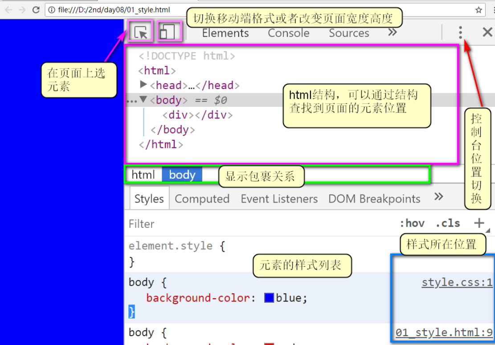

CSS  DAY01

HTML:Hyper Text Markup language ，用于创建页面内容，例如：文字，段落，图片，超链接，表格，列表，表单。。。

CSS：Cascading Style Sheet ，级联样式清单，用于控制页面的样式，例如：大小，颜色，背景，位置，边框，阴影。。。

CSS基础语法：

属性名:属性值;

属性:值1 值2 值3......值N;

编写CSS的三种方式

1 inline style： 样式写在某个HTML元素里面(style属性) --- 比较少用

2 inner style： 样式写在HEAD里面（``）--- 项目首页常用

3 outer style：样式写在独立的CSS文件里，页面文件引入(link标签)  --- 通常用于一二三级页面

作用范围：inline style  <   inner style  <  outer style

1 外部样式作用范围大，但是会增加页面的请求次数，从而拖累页面的性能

2 样式的优先级：!important  >  行内元素  >  内部样式   =   外部样式  >    浏览器默认样式

3 style>标签

在该标签里面可以定义网页的所有样式

语法：

	`<head>
		<meta charset="utf-8">
		<title></title>
		
	</head>`
	
	样式规则
	由选择器和样式声明的列表组成
	就是把很多声明好的样式，匹配给页面中的元素
	
	特点：
		需要通过选择器查找元素，嵌入在html文件中，影响html的大小
		只能在当前页面重用
		优先级低于内联样式
		多用于测试和学习

2.1 选择器

一 CSS选择器(selector)

用在内部或外部样式中，声明接下来的样式作用于哪些或哪个元素

选择器{

​	属性名:属性值;

}

CSS提供了如下几种选择器

1 通用选择器

*{ }

2 元素选择器 ，选中某个特定的HTML元素

h1{ }

3 群组选择器，一次使用多个选择器，选中多个HTML元素（用英文逗号分开）

p,h5{ }

4 ID选择器：选中某一个元素（为元素设定样式时，少用ID--ID常用于为元素绑定JS事件）

#id{ }

5 类选择器：选择某一个或某几个元素

.danger{}

`

`

可以同时声明多个class的值

`

`

6 伪类选择器 "假的类" -- 类名是规定的，不能自定义，表示选中某个时刻/状态

:link{}    选中"超链接未被访问过"的状态

:hover{}  选中"超链接/普通元素 鼠标悬停上方"的状态

:active{}  选中"超链接/按钮 等元素被激活"的状态

:visited{} 选中"超链接被访问过后"的状态

:focus{}  选中"获得了输入焦点的输入框"              

提示，如果希望看到超链接四个状态的改变，必须按照顺序指定样式

1 link    4 visited   2  hover  3  active   

7 属性选择器,通过属性或者属性=值 来选择具体的HTML元素

[readonly]{}

[name="upwd"]

8 控制台调试

