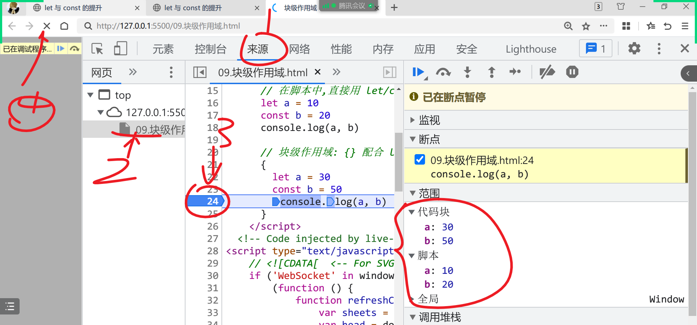

# JSCORE01

> 小新老师的网站: `xin88.top`
>
> 访问查看必读
>
> 微信名: `xin8022cc`
>
> 阶段壁纸:
>
> 


## 本阶段注意事项

理论部分的学习: `轻代码, 重理解`

- 代码本身都是玩具代码, 没什么实际含义.  重点需要理解原理:  此部分`不`要跟着`抄`, 要`听`

笔记:

- 老师习惯把注释当笔记用, 所以代码中会有大量的注释:  课上最好不要抄注释!

答疑时间

- 课上: 授课期间很难及时回复
- 课间回复
- 12:00 ~ 13:00
- 晚上 11:00 之前

问问题的要求:

- 简单粗暴直接: 直接发问题
  - 错误问题:`老师, 我代码和你一样, 为什么不行?` -- 一定要发代码截图
- 代码截图: `必须截全屏`

## JSCORE

总体分两个部分:

- 核心理论
  - JS的各种设计理念: `面试必考`内容 
- ES5/ES6新特性
  - JS的5 和 6 版本中添加的新特性, 新语法的使用 -- `实际开发`常用

## 声明提升


函数提升:

函数整体是声明, 函数提升的是 `函数体 + 函数名` 这个整体


考点: 变量声明.  提升的是`声明`; `不要带上赋值`


通过有 var 和 function 的声明:

- 官方文档 没有说 谁优先提升;  到底谁先提升 对最终效果没有影响


## 作用域+提升


### 两道题的差异:


### 相关代码

```html
<!DOCTYPE html>
<html lang="en">
  <head>
    <meta charset="UTF-8" />
    <meta http-equiv="X-UA-Compatible" content="IE=edge" />
    <meta name="viewport" content="width=device-width, initial-scale=1.0" />
    <title>声明提升</title>
  </head>
  <body>
    <!-- 
      什么叫声明?
      方式: var const let function 
     -->
    <script>
      // 声明一个变量a, 把数字6 存储
      var a = 6 //合写
      // 拆分成两步:
      var a // 开辟一个内存空间, 起名为 a;   var代表开辟内存空间
      a = 6 // 把 6 放入 名字是a 的内存空间
    </script>

    <script>
      // 声明提升: JS引擎的运行机制, 使用者不可见, 非常 `垃圾` 的机制
      // 广受诟病! -- 书写的/看见的 和 真正运行的 是不同的!
      // 程序员阅读JS代码时, 经常被眼睛所蒙蔽.. 看见的并非真正运行的样子
      //
      // JS代码在运行时, 分两个阶段:
      // 阶段1: 查找到所有的声明操作(var/let/const/function) 移动到作用域顶部
      // 阶段2: 然后执行变动后的代码

      console.log(a)
      a()

      function a() {
        console.log(111)
      }
    </script>
  </body>
</html>

```

```html
<!DOCTYPE html>
<html lang="en">
  <head>
    <meta charset="UTF-8" />
    <meta http-equiv="X-UA-Compatible" content="IE=edge" />
    <meta name="viewport" content="width=device-width, initial-scale=1.0" />
    <title>面试题</title>
  </head>
  <body>
    <script>
      // JS先把所有的声明(var/let/const/function)操作找出来, 提升到作用域顶部
      // 然后再执行整个代码
      // 此操作是JS引擎隐式完成
      function a() {
        console.log(1111)
      }
      a()

      function a() {
        console.log(2222)
      }
      a()
    </script>
  </body>
</html>

```

```html
<!DOCTYPE html>
<html lang="en">
  <head>
    <meta charset="UTF-8" />
    <meta http-equiv="X-UA-Compatible" content="IE=edge" />
    <meta name="viewport" content="width=device-width, initial-scale=1.0" />
    <title>Document</title>
  </head>
  <body>
    <script>
      // 考点: var 变量 = 值;  这是两个操作的合写
      // 声明操作: var 变量;    赋值: 变量 = 值
      var a = function () {
        console.log(111)
      }
      a() // 111

      var a = function () {
        console.log(2222)
      }
      a() // 2222
    </script>
  </body>
</html>

```

```html
<!DOCTYPE html>
<html lang="en">
  <head>
    <meta charset="UTF-8" />
    <meta http-equiv="X-UA-Compatible" content="IE=edge" />
    <meta name="viewport" content="width=device-width, initial-scale=1.0" />
    <title>面试题</title>
  </head>
  <body>
    <script>
      console.log(a) //函数a

      function a() {
        console.log(111)
      }
      a() // 111
      var a = 6
      a() //报错
    </script>
  </body>
</html>

```

```html
<!DOCTYPE html>
<html lang="en">
  <head>
    <meta charset="UTF-8" />
    <meta http-equiv="X-UA-Compatible" content="IE=edge" />
    <meta name="viewport" content="width=device-width, initial-scale=1.0" />
    <title>面试题</title>
  </head>
  <body>
    <script>
      console.log(a) //undefined
      console.log(b) // 报错:  函数b在表达式里, 不提升

      // 函数书写在表达式中: 函数表达式
      // 并非单纯的函数, 则 不 提升!
      var a = function b() {}
    </script>
  </body>
</html>

```

```html
<!DOCTYPE html>
<html lang="en">
  <head>
    <meta charset="UTF-8" />
    <meta http-equiv="X-UA-Compatible" content="IE=edge" />
    <meta name="viewport" content="width=device-width, initial-scale=1.0" />
    <title>Document</title>
  </head>
  <body>
    <script>
      // 作用域: JS中存在4种作用域
      // 全局作用域
      // 函数作用域
      // 块级作用域
      // 脚本作用域
      var a = 10
      var d = 20

      function b() {
        // 函数内声明的, 属于函数作用域
        var a = 33
        // 作用域链: 就近原则, 自己有用自己的, 自己没有到外层查找
        console.log(a, d) // 33 20
        console.log(c) // 报错: 未定义
      }

      b()
    </script>
  </body>
</html>

```

```html
<!DOCTYPE html>
<html lang="en">
  <head>
    <meta charset="UTF-8" />
    <meta http-equiv="X-UA-Compatible" content="IE=edge" />
    <meta name="viewport" content="width=device-width, initial-scale=1.0" />
    <title>面试题</title>
  </head>
  <body>
    <script>
      // 函数体中的代码, 必须调用函数才能触发
      function e() {
        console.log(111)
        console.log(222)
        console.log(333)
      }

      // 函数必须触发 才能运行函数体中的代码
      e() //用()触发函数
    </script>

    <script>
      console.log(a) // undefined
      var a = 6

      function b() {
        a = 10
        console.log(a) //10
      }
      console.log(a) //6
      b() //触发b函数内的代码: 打印出10
      console.log(a) //10
    </script>
  </body>
</html>

```

```html
<!DOCTYPE html>
<html lang="en">
  <head>
    <meta charset="UTF-8" />
    <meta http-equiv="X-UA-Compatible" content="IE=edge" />
    <meta name="viewport" content="width=device-width, initial-scale=1.0" />
    <title>面试题</title>
  </head>
  <body>
    <script>
      // 1. 函数触发后才能运行函数体的代码  函数名() 触发
      // 2. 作用域链: 优先使用自身内部声明的变量
      console.log(a) //undefined
      var a = 6

      function b() {
        a = 10 // 修改的是函数中var 的a; 作用域链的就近原则
        console.log(a) //10
        var a
      }
      console.log(a) //6
      b() // 触发函数体, 打印出10
      console.log(a) //6
    </script>
  </body>
</html>

```


## 断点调试

```html
<!DOCTYPE html>
<html lang="en">
  <head>
    <meta charset="UTF-8" />
    <meta http-equiv="X-UA-Compatible" content="IE=edge" />
    <meta name="viewport" content="width=device-width, initial-scale=1.0" />
    <title>浏览器的调试功能</title>
  </head>
  <body>
    <!-- 所有的浏览器都提供断点调试功能 -- 神器 -->
    <!-- 可以让JS代码一行一行执行, 便于程序员找BUG 和 观察程序 -->
    <script>
      console.log(111)
      console.log(222)
      console.log(333)

      var a = 6
      function b() {}
      console.log(a)
    </script>
  </body>
</html>

```


## 代码块



猜猜scopes中有什么?

- 闭包就是函数作用域


## 宿主环境

```html
<!DOCTYPE html>
<html lang="en">
  <head>
    <meta charset="UTF-8" />
    <meta http-equiv="X-UA-Compatible" content="IE=edge" />
    <meta name="viewport" content="width=device-width, initial-scale=1.0" />
    <title>宿主环境</title>
  </head>
  <body>
    <!-- JS运行在不同的平台, 拥有不同的API, 这个运行的平台 就叫宿主环境 -->
    <!-- 亮亮讲的 node.js 就是 JS的一个宿主环境: 提供了操作电脑相关的API -->
    <!-- 本阶段: 通过浏览器运行JS代码, 所以宿主环境就是 浏览器 -->
    <!-- 浏览器提供了大量的 操作页面的相关方法: 存储在全局对象 window 中 -->
    <script>
      console.log('window:', window)
      // 省略了默认的前缀:  window.alert()
      // alert('弹窗方法!')
      // window.alert('弹弹弹')
      // 声明变量存储在全局区: 全局区就是window对象
      var a = 1000
      // window对象是浏览器提供的
      console.log(a) //省略前缀window
      console.log(window.a)

      // clg
      // 关于分号: 看个人习惯和团队习惯
    </script>
  </body>
</html>

```

## 函数复习

```html
<!DOCTYPE html>
<html lang="en">
  <head>
    <meta charset="UTF-8" />
    <meta http-equiv="X-UA-Compatible" content="IE=edge" />
    <meta name="viewport" content="width=device-width, initial-scale=1.0" />
    <title>函数</title>
  </head>
  <body>
    <!-- 函数: function -->
    <!-- 函数主要作用: 封装 和 复用 -->
    <!-- 封装: function 函数名(){ 函数体... }  -->
    <!-- 封装就是用 {} 把一大段代码放在一起, 然后起个名字(函数名). 以后通过函数名就能触发 {}中的代码 -- 复用 -->
    <script>
      function show() {
        console.log(111)
        console.log(222)
        console.log(333)
        console.log('-------------------------')
      }
      // 触发函数的最简单方式: 用()
      show()
      show()
      show()
      show()

      // 参数: 通过传递参数(变量), 让函数体变化
      // 习惯 type 称为 形参: 形式参数.  形容此处需要什么样的变量
      function showDate(type) {
        const now = new Date()

        if (type == 1) console.log(now.toLocaleString())
        if (type == 2) console.log(now.toDateString())
        if (type == 3) console.log(now.toLocaleDateString())
        if (type == 4) console.log(now.toLocaleTimeString())
      }
      // 1 2 3 4 是实际的值,  称为 实参 : 实际参数
      showDate(1)
      showDate(2)
      showDate(3)
      showDate(4)
    </script>

    <script>
      // 返回值: 函数处理后的结果, 返回给调用方
      function taoge(food) {
        // return: 返回结果 到外部 -- 屁股
        return food + '核' //return会终止函数的运行
        // return 下方的代码不执行
        console.log(111111)
      }

      // 从头塞个苹果, 从屁股返回xxx.  利用变量接收
      var a = taoge('苹果')
      console.log(a)
    </script>
  </body>
</html>

```

## 函数的arguments

```html
<!DOCTYPE html>
<html lang="en">
  <head>
    <meta charset="UTF-8" />
    <meta http-equiv="X-UA-Compatible" content="IE=edge" />
    <meta name="viewport" content="width=device-width, initial-scale=1.0" />
    <title>函数的arguments属性</title>
  </head>
  <body>
    <script>
      // 函数默认带有一个 隐藏变量: arguments, 会保存函数收到的所有参数
      // 内容类似数组,但原型不是数组, 所谓称为: 类数组 类型 -- 类似数组的类型
      function show() {
        console.log('arguments:', arguments)
      }

      show(11, 22, 33, 44, 55)

      // 系统提供的求最大值 Math.max()
      console.log(Math.max(11, 22))
      console.log(Math.max(11, 22, 434, 143))
      console.log(Math.max(11, 22, 434, 143, 43, 435))

      //制作接收不固定数量参数的函数:
      function max() {
        console.log(arguments)
        // 暂时把数组中的 第一个元素 作为最大值
        var max_num = arguments[0]
        // 循环对比剩余的值
        for (var i = 1; i < arguments.length; i++) {
          // 如果遍历出来的值 > 临时的最大值, 则覆盖最大值
          var val = arguments[i] //下标取值
          // if的语法糖: if(){}  {}中只有一行,可以省略{}
          if (val > max_num) max_num = val
        }

        return max_num
      }

      console.log(max(11, 22))
      console.log(max(11, 22, 4, 23))
    </script>
  </body>
</html>

```

## 函数重载

```html
<!DOCTYPE html>
<html lang="en">
  <head>
    <meta charset="UTF-8" />
    <meta http-equiv="X-UA-Compatible" content="IE=edge" />
    <meta name="viewport" content="width=device-width, initial-scale=1.0" />
    <title>函数重载</title>
  </head>
  <body>
    <script>
      // 函数重载: 函数可以根据参数的 个数 or 类型不同, 来进行不同的逻辑处理
      // 函数重载是 利用 arguments 实现的 1个函数多用

      // max 升级:
      function max() {
        console.log('arguments:', arguments)

        // 如果数量 > 1 个, 就认为是多个数字
        // 不能写 >= 1 ; 因为 = 1 是传数组的场景
        if (arguments.length > 1) {
          // 注释详见 05 练习
          var max_num = arguments[0]
          for (var i = 1; i < arguments.length; i++) {
            var val = arguments[i]
            if (val > max_num) max_num = val
          }
          return max_num
        }

        // isArray: 判断值是否为数组类型
        // 此处利用 长度 == 1 也可以;  仅是为了教学所以演示类型判断
        if (Array.isArray(arguments[0])) {
          var nums = arguments[0]
          var max_num = nums[0]
          for (var i = 1; i < nums.length; i++) {
            var val = nums[i]
            // 如果遍历出来的元素, 比临时最大值大, 则 覆盖临时最大值
            if (val > max_num) {
              max_num = val
            }
          }
          return max_num
        }
      }

      var nums = [123, 43, 12]
      max(nums)

      console.log(max(nums))

      console.log(max(11, 43, 6, 56, 76))
      console.log('---------------------------------')

      // 系统的max函数: 只能接收 1个1个数字做参数, 无法处理数组
      console.log(Math.max(11, 22, 3))

      var nums = [123, 43, 12]
      console.log(Math.max(nums))
    </script>
  </body>
</html>

```

## 脚本作用域

```html
<!DOCTYPE html>
<html lang="en">
  <head>
    <meta charset="UTF-8" />
    <meta http-equiv="X-UA-Compatible" content="IE=edge" />
    <meta name="viewport" content="width=device-width, initial-scale=1.0" />
    <title>脚本作用域</title>
  </head>
  <body>
    <script>
      // 4种作用域:
      // 全局作用域
      // 函数作用域/局部作用域
      //
      // 脚本作用域
      // 块级作用域

      // var : 声明提升+全局变量污染
      // 浏览器中 window 就是全局对象 -> 全局作用域
      // window: 本身是存储系统属性的;
      // var 声明的变量也会存储在window里, 导致 自定义变量 和 系统变量混合在一起 -- 称为 全局变量污染
      var a = 10
      console.log(window)

      // ES6提供 let 和 const
      // let/const :没有全局污染, 因为声明的变量存储在 脚本作用域 中
      let aa = 10
      console.log(aa)
    </script>
  </body>
</html>

```

## let与const的提升

```html
<!DOCTYPE html>
<html lang="en">
  <head>
    <meta charset="UTF-8" />
    <meta http-equiv="X-UA-Compatible" content="IE=edge" />
    <meta name="viewport" content="width=device-width, initial-scale=1.0" />
    <title>let 与 const 的提升</title>
  </head>
  <body>
    <!-- 
      var : 声明提升
      let/const: 
        -- 有人说: 没有声明提升
        -- let/const有提升, 但是 提升后处于 `暂存死区` 状态:  在代码运行到 声明代码之前, 无法使用
     -->
    <script>
      // Cannot access 'a' before initialization
      // 不能访问 a 在初始化之前:  知道存在a 但是a不能用
      // console.log(a)

      // var a
      let a
      console.log(a)
      // var缺点: 没执行到声明代码, 就能使用变量
      // let优点: 代码一定是按顺序执行, 提前使用变量会报错

      // 实际工作时, 基本不用var 除非是考虑低版本兼容 才用var
      // 因为 let/const 是 2015年出品的
    </script>
  </body>
</html>

```

## 块级作用域

```html
<!DOCTYPE html>
<html lang="en">
  <head>
    <meta charset="UTF-8" />
    <meta http-equiv="X-UA-Compatible" content="IE=edge" />
    <meta name="viewport" content="width=device-width, initial-scale=1.0" />
    <title>块级作用域</title>
  </head>
  <body>
    <script>
      // ES6之前: 全局作用域 和 函数|局部作用域
      // ES6之后: 脚本作用域 和 块级作用域

      // 新增2个作用域都是伴随: let/const 而生
      // 在脚本中,直接用 let/const 声明的变量, 就会存在脚本区
      let a = 10
      const b = 20
      console.log(a, b)

      // 块级作用域: {} 配合 let/const 使用
      // 哪些语法带{} 能形成块级作用域: if for switch while
      // function 带{}, 但是是函数作用域
      // 对象{}: 其中不能写let, 所以不会形成块级作用域
      // var c = {name:'mike', age:'44', let k=33}

      {
        let a = 30
        const b = 50
        console.log(a, b)
      }

      // ES6之前: 全局window + 局部 函数
      // ES6之后: 脚本(新的全局)  + 块级(局部作用域)
    </script>
  </body>
</html>

```

## 闭包

```html
<!DOCTYPE html>
<html lang="en">
  <head>
    <meta charset="UTF-8" />
    <meta http-equiv="X-UA-Compatible" content="IE=edge" />
    <meta name="viewport" content="width=device-width, initial-scale=1.0" />
    <title>闭包</title>
  </head>
  <body>
    <!-- 闭包: 闭包是函数的一个 被动技能 -->
    <!-- 技能描述: 函数声明时会检测函数体, 找到使用的变量, 如果非自身的变量, 则存储在 自身的scopes 属性里, 而如果此变量是函数作用域的, 称为闭包 Closure -->

    <script>
      var a = 10

      function b() {
        var b = 20
        // c 的 {} 叫函数体,  检测{}中的代码 就叫 检测函数体
        function c() {
          var c = 30
          // 使用了 a b c 3个变量, 按照作用域链的 就近原则
          // a -> var/let/const/function 声明, 当前函数中没有声明a
          // -> 找上层作用域, b函数中也没有声明
          // -> 再到上一层, 全局区中有 a: 说明这个a 就是全局的a
          // 同理: b 属于 b函数中的变量
          // 同理: c 属于 当前函数声明的
          console.log(a, b, c)
        }
        // log: 打印出的是 美化后的样子, 非本质
        // dir: direct 直接输出, 看到函数原本的样子
        // 函数本质是个对象类型
        // scopes: 作用域们
        console.dir(c)
      }
      b()
    </script>
  </body>
</html>

```

## 闭包的作用

```html
<!DOCTYPE html>
<html lang="en">
  <head>
    <meta charset="UTF-8" />
    <meta http-equiv="X-UA-Compatible" content="IE=edge" />
    <meta name="viewport" content="width=device-width, initial-scale=1.0" />
    <title>闭包的作用</title>
  </head>
  <body>
    <script>
      // 闭包的作用: 函数把函数体中所有使用的变量, 保存到自身的scopes 属性中,  保障后期无论在哪里运行, 都可以正常执行
      var a = 10
      let k = 100 //let 在全局中声明 -- 脚本作用域

      function b() {
        var b = 20

        function c() {
          var c = 30
          {
            let y = 200

            // 把函数存放到 全局区
            window.d = function () {
              var d = 40
              console.log(a + b + c + d + k + y)
            }
          }
        }
        c()
      }
      b()

      console.log(window) //全局中有 d 函数
      d() //全局区内容调用时, 省略window前缀
      // d函数的函数体, 只有 var d = 40,  其他用到的 a , b , c 哪来的?
      // 答案: 闭包被动技能 - 在(声明/书写)时把用到的属于其他作用域的变量存储到自身的是scopes 属性里
      console.dir(d)

      // 总结:
      // 函数 scopes: 保存函数体中, 非函数自身声明的变量
      // 为什么: 函数在使用时, 为了保障正常运行, 需要到 scopes 中找到使用的非自身的变量
      // 分类: 保存在scopes中的变量, 按照所在的作用域进行分类存储: Block块, Script脚本, Global全局, Closure函数(称为闭包)
    </script>
  </body>
</html>

```

## 猜猜scopes存的什么

```html
<!DOCTYPE html>
<html lang="en">
  <head>
    <meta charset="UTF-8" />
    <meta http-equiv="X-UA-Compatible" content="IE=edge" />
    <meta name="viewport" content="width=device-width, initial-scale=1.0" />
    <title>猜猜scopes中存什么</title>
  </head>
  <body>
    <script>
      function a() {
        var a = 10
        var k = 60
        function b() {
          var b = 20
          var k = 30
          var x = 99
          function c() {
            var x = 30
            console.log(a + k + x)
          }
          console.dir(c)
        }
        b()
      }
      a()
    </script>
  </body>
</html>

```

## 闭包的作用

```html
<!DOCTYPE html>
<html lang="en">
  <head>
    <meta charset="UTF-8" />
    <meta http-equiv="X-UA-Compatible" content="IE=edge" />
    <meta name="viewport" content="width=device-width, initial-scale=1.0" />
    <title>闭包的作用</title>
  </head>
  <body>
    <!-- 主要在 ES6 出现 块级作用域之前, 用闭包来形成局部作用域 -->

    <script>
      // 需求: 记录show函数被调用次数
      // 问题: 全局变量污染, num存储在全局区
      // var num = 0
      // 新的方案: num是专为 show 函数准备的, 能不能就放在show函数上存储?

      // 前提 ES6 之前: 只有两种作用域 -- 全局 + 局部|函数
      function a() {
        var num = 0
        // 可以省略window.
        window.show = function () {
          num++
          console.log('您是世界上最漂亮的女人', num)
        }
      }
      a()
      console.dir(window.show)
      show()
      show()
      show()
      show()
    </script>

    <script>
      // 现在: ES6 有了块级作用域
      {
        let num = 0
        window.show1 = function () {
          num++
          console.log('num:', num)
        }
      }
      show1()
      show1()
      show1()
      show1()
      console.dir(show1)
    </script>
  </body>
</html>

```

## 柯里化

```html
<!DOCTYPE html>
<html lang="en">
  <head>
    <meta charset="UTF-8" />
    <meta http-equiv="X-UA-Compatible" content="IE=edge" />
    <meta name="viewport" content="width=device-width, initial-scale=1.0" />
    <title>函数的柯里化</title>
  </head>
  <body>
    <script>
      // 利用函数的闭包被动: 实现的函数写法
      // 常见于高端框架中, 面试题中, 但实际开发使用很少

      // 柯里化: 把多参数的函数 转为单参数的函数
      function add(a, b, c) {
        console.log(a + b + c)
      }
      add(10, 20, 30)

      //柯里化的样子:
      function ke_add(a) {
        // a接10
        var x = function (b) {
          // b 接20
          console.log(a + b)
        }
        return x
      }
      // ke_add(10) -> x -> function(b){ console.log(a + b) }
      // x(20) -> 20传给参数b,  然后打印了 a+b 的值
      ke_add(10)(20)

      // 升级: 合写
      function ke_add1(a) {
        return function (b) {
          return function (c) {
            console.log(a + b + c)
          }
        }
      }
      // ke_add1(10) -> function (b) {....}
      // ke_add1(10)(20) -> function (c){}
      // ke_add1(10)(20)(30) -> 触发最后的函数, 完成打印
      // 面试题: 实现如下效果, 实现 3个数字的累加
      ke_add1(10)(20)(30)

      // 练习题: 计算出总和
      // 中间代表是 两个参数
      ke_add2(10)(20, 30)(40) //结果: 100
    </script>
  </body>
</html>

```

## 作业

```js
// 练习题: 计算出总和
// 中间代表是 两个参数
ke_add2(10)(20, 30)(40) //结果: 100
```


