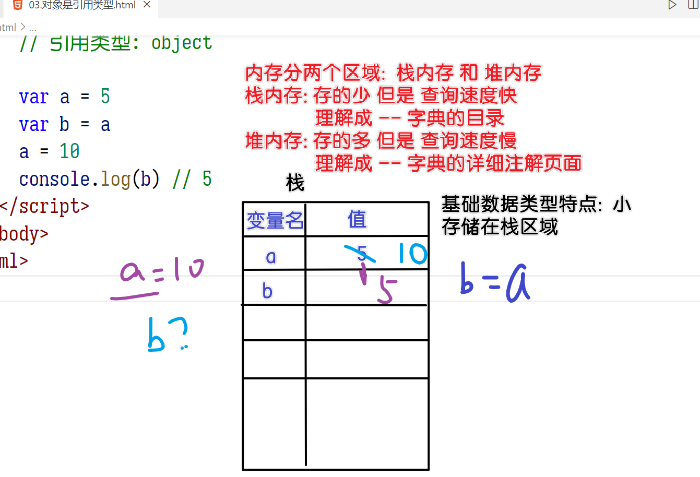
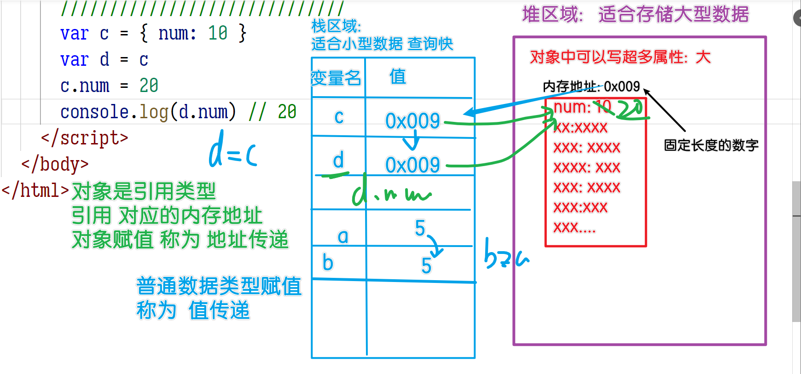
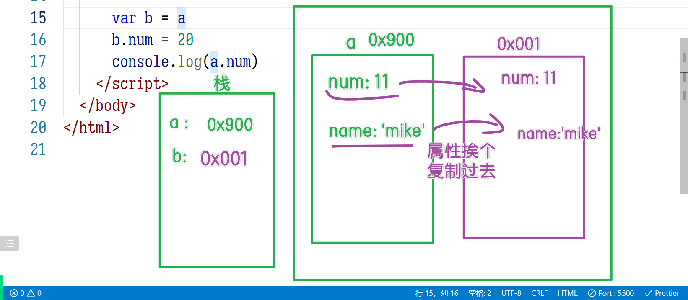
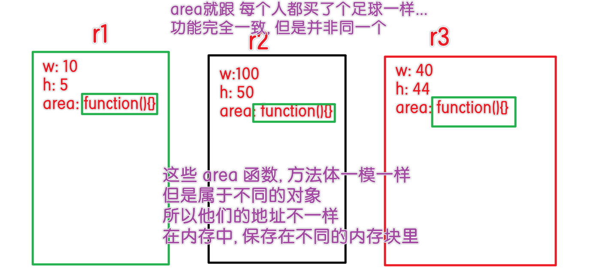
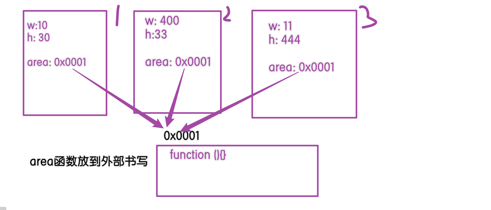
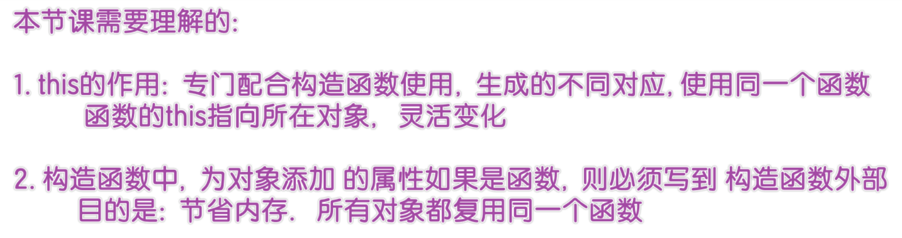

# JSCORE02

> 小新老师的网站: xin88.top

## 昨日内容

- 声明提升

  - 除了JS以外的编程语言, 都是按照代码书写顺序依次执行
  - JS带有声明提升: 代码在运行前会`先编译`一次, 把所有的声明(`var/let/const/function`)操作提取到`所在作用域的顶部`

- 作用域: 4种

  - 全局: ES6`前` -- `Global`
    - 在浏览器上, 就是 window 对象
    - 宿主对象: JS运行在不同的宿主上, 可以操作宿主的各种API, 浏览器的API存储在window对象里
    - 利用 var/function 在脚本中声明的变量, 就存储在全局window里
  - 脚本: ES6`后`  -- `Script`
    - `let/const` 在脚本中声明的变量, 存储在脚本作用域 -- 只能通过`断点`看到
    - 脚本作用域类似window, 都是全局作用域
    - 脚本作用域 服务于 const/let;   全局作用域 服务于 var
  - 函数: ES6`前` -- `Local`
    - 函数在触发时, 函数体就是函数作用域:  英文 `Local` 局部
  - 块级: ES6`后` -- `Block`
    - 利用 `{}` 配合 `let/const` 使用时形成
    - if/for/switch/while
    - 注意: 函数的{}是函数作用域;  对象的{}中不能写let

- 函数

  - 函数的特点: 封装+复用

  - 函数就是用`{}`把一大段代码封装在一起, 然后起个 名字, 以后通过`名字()`就能触发`{}`中的代码

  - 参数: 调用函数时 传入的变量

    - 函数自带`arguments` 这个`类(似)数组` 的变量, 其中存储了所有传入的 实参
    - 利用 arguments 可以完成:
      - 制作不固定数量参数的函数, 例如 max 求一堆数字的最大值
      - `函数重载`: 一个函数 根据自身接收的参数 `数量` 或 `类型` 不同, 函数体中执行不同的代码

  - 返回值: return

    - 函数执行后, 返回出来的值:  类似:`给涛哥苹果, 涛哥返回 苹果核`
    - return意味着函数的结束, 所以 return 下方的代码不执行

  - 闭包

    - 闭包是函数的`被动`技能

    - 函数是一个对象类型, 利用 `console.dir` 的方式可以打印出函数的本质

    - 函数拥有一个属性:`Scopes` 保存函数体中使用的 `非自身声明`的 来自`其他作用域`的 变量

      如下场景: b函数中, 用var关键词声明了b变量, 这个b变量就是自身声明的

      a变量: b函数里没有声明, 所以根据`作用域链: 自身没有的变量到上级作用域找`

      ```js
      function a(){
         var a = 10
         console.log(k) // 报错! 未定义
          
         function b(){
             // let const var:  在全局中 {}块级里 有差异
             // 在函数中没有差异
             // let b
             // var k
             
             let b = 20
             var k = 100
             console.log(a+b)
         }
      }
      a()
      ```

    - scopes的作用: 函数在运行时, 会执行函数体中代码, 遇到非函数体自身的变量, 就会到 scopes 中查找使用 -- 保障函数的正常运行

    - 来自不同作用域的变量, 在 scopes 中名称不同

      函数作用域中的变量, 存储在 scopes 中, 称为闭包

      ```js
      var a = {
          scopes:[
              0: Block (块) {a: 10},
          	1: Script (脚本) {b: 11},
              2: Closure (闭包/函数/局部) {c:22},
              4: Global (全局) {d: 33}
          ]
      }
      ```

    - 闭包的作用: ES6之前, 只有两种作用域 `全局` 和 `局部`

      - 如果希望把一个变量存储在函数上, 利用闭包把变量放在函数的 scopes 属性里


## 作业

```html
<!DOCTYPE html>
<html lang="en">
  <head>
    <meta charset="UTF-8" />
    <meta http-equiv="X-UA-Compatible" content="IE=edge" />
    <meta name="viewport" content="width=device-width, initial-scale=1.0" />
    <title>作业</title>
  </head>
  <body>
    <script>
      // 面试题: 完成如下函数, 实现4个数字的累加
      ke_add(10)(20, 30)(40)

      function ke_add(a) {
        // 返回另一个函数, 接收两个参数
        return function (b, c) {
          return function (d) {
            console.log(a + b + c + d)
          }
        }
      }
    </script>

    <script>
      // 在脚本中直接声明的 var/function, 存储在全局window对象里
      function a() {} // window.a = function a(){}

      a = 6 // window.a = 6
      // 变量 函数 都是 对象的属性, 只是值不同而已
      console.log(a)
    </script>

    <script>
      // 直接写在 script里, 在脚本中
      let a = 10
      // 写在 {} 里, 就是块级
      {
        let a = 20
      }

      {
        let num = 0
        function show() {
          // 误区: 书写了 就算声明??
          // 正确: 用关键词 var/let/const/function 才算声明
          num++ // 直接写变量, 叫使用
          // num非当前函数声明的, 所以属于上层的块级作用域
          // 非自身的变量, 存储在 scopes 里
          console.log(num, '次')
        }
      }
      console.dir(show)
      show() // 函数名() 触发的是 show的{} 中的代码 -- 函数体
      show()
    </script>
  </body>
</html>

```

## 对象类型

```html
<!DOCTYPE html>
<html lang="en">
  <head>
    <meta charset="UTF-8" />
    <meta http-equiv="X-UA-Compatible" content="IE=edge" />
    <meta name="viewport" content="width=device-width, initial-scale=1.0" />
    <title>对象类型</title>
  </head>
  <body>
    <script>
      // 声明方式1: 字面量
      var a = { name: 'mike', age: 33 }
      console.log(a)

      // 声明方式2: 构造方式
      var b = new Object()

      // 添加属性
      b.name = 'lucy'

      var x = 'age'
      // 对象.属性名 : 固定语法,  属性名 不是变量
      b.x = '999' // 添加 属性名是 x , 值是 999
      // 对象[变量]
      b[x] = '1001' // x的值是age, 所以添加了 age:1001

      console.log(b)
    </script>
  </body>
</html>

```


## 对象是引用类型






```html
<!DOCTYPE html>
<html lang="en">
  <head>
    <meta charset="UTF-8" />
    <meta http-equiv="X-UA-Compatible" content="IE=edge" />
    <meta name="viewport" content="width=device-width, initial-scale=1.0" />
    <title>对象是引用类型</title>
  </head>
  <body>
    <script>
      // JS数据类型有哪些?
      // 基础类型: number string boolean null undefined + bigInt symbol
      // 引用类型: object

      var a = 5
      var b = a
      a = 10
      console.log(b) // 5

      /////////////////////////////
      var c = { num: 10 }
      var d = c
      c.num = 20
      console.log(d.num) // 20
    </script>
  </body>
</html>

```


## 浅拷贝

原理: 制作一个新的对象, 把要拷贝对象中的属性 `挨个` 放到新的对象里



```html
<!DOCTYPE html>
<html lang="en">
  <head>
    <meta charset="UTF-8" />
    <meta http-equiv="X-UA-Compatible" content="IE=edge" />
    <meta name="viewport" content="width=device-width, initial-scale=1.0" />
    <title>对象的浅拷贝</title>
  </head>
  <body>
    <script>
      // 对象的浅拷贝:  即 复制对象

      var a = { num: 11, name: 'mike' }

      // 赋值为新的 空对象
      var b = {}
      // 遍历 a 对象, 把其中的值挨个放到 b 对象里
      for (let key in a) {
        console.log('key:', key)
        // key变量中, 存储了 属性名
        // 通过属性名获取值:  a[变量]
        var value = a[key] // 错误写法: a.key 读取名字是key的属性

        // 存储到b对象里  b[key]   key是变量
        b[key] = value // 错误: b.key  增加名字是key的属性
      }

      console.log(b)
      b.num = 20
      console.log('a.num:', a.num)

      // 深拷贝: 如果对象的属性也是对象类型, 需要利用递归实现
      // 高端面试题 -- 等 亮哥讲解!

      // 考试使用递归实现
      // 真正工作: 对象->转JSON->再转对象 就行
    </script>
  </body>
</html>

```

## this指向

```html
<!DOCTYPE html>
<html lang="en">
  <head>
    <meta charset="UTF-8" />
    <meta http-equiv="X-UA-Compatible" content="IE=edge" />
    <meta name="viewport" content="width=device-width, initial-scale=1.0" />
    <title>函数的this指向</title>
  </head>
  <body>
    <script>
      // 函数中带有一个 this 关键词:  代表函数运行时所在对象
      // 函数分两个阶段:
      // 1. 声明(书写)时:  function a(){}
      // 2. 运行(调用)时:  a()

      function a() {
        // this: 函数通过这个关键词 可以知道 自身在哪个对象中触发的
        console.log('this:', this)
      }
      console.log(window)
      a() // window.a()

      var gege = { name: 'gege', show: a }
      gege.show()

      var dong = { name: '俊东', show: gege.show }
      dong.show()
    </script>
  </body>
</html>

```

### 面试题

```html
<!DOCTYPE html>
<html lang="en">
  <head>
    <meta charset="UTF-8" />
    <meta http-equiv="X-UA-Compatible" content="IE=edge" />
    <meta name="viewport" content="width=device-width, initial-scale=1.0" />
    <title>面试题</title>
  </head>
  <body>
    <script>
      var length = 10

      function a() {
        // this: 代表函数触发时所在对象
        // 误区(考点): 和声明/书写时 所在位置无关
        console.log(this.length)
      }

      var gege = {
        show: function (a) {
          // a函数触发时,没有前缀, 则属于哪个对象?
          // 只有window可以省略不写,  window.a()
          a() // window.length 10

          // arguments 保存了函数收到的所有参数
          // show 触发时, 传递了3个实参
          arguments[0]()
          // arguments[0] : 保存在arguments中序号0 的函数
          // arguments[0](): 此时 函数中的this 就是arguments
          // arguments.length 代表参数的个数

          console.log(arguments)
        },
      }

      gege.show(a, 10, 20)
    </script>
  </body>
</html>

```


## 构造方法

情况: 同样作用的 area 函数, 作用相同; 每个对象都制作一个, `浪费内存!`



共享:  把函数放到构造函数之外书写, 构造函数中只要赋值 方法的地址即可







> 疑问: `外面`的函数X也能获得w，h吗?  -- 曹同学
>
> 答: 函数中有this, `不看`函数在哪里声明/书写.  只看`运行时`在哪个对象里
>
> r1.area();  所以 area中的this就是 r1

> 疑问: this 跟 共享是一个意思不?  -- 张
>
> 答: this就是为函数共享而生的, 函数在不同对象里, 就为所在对象服务, 就靠this机制: 代表运行时所在对象

```html
<!DOCTYPE html>
<html lang="en">
  <head>
    <meta charset="UTF-8" />
    <meta http-equiv="X-UA-Compatible" content="IE=edge" />
    <meta name="viewport" content="width=device-width, initial-scale=1.0" />
    <title>构造函数</title>
  </head>
  <body>
    <script>
      // 构造函数: 快速构建创造 固定结构 的对象 的函数

      // 如果函数的作用是生成对象的, 就叫 构造函数
      function Student(name, age, phone) {
        var obj = {}

        obj.name = name
        obj.age = age
        obj.phone = phone

        return obj
      }

      var s1 = Student('格格', 18, '10086')
      var s2 = Student('振东', 28, '10032')
      var s3 = Student('东帅', 18, '10036')
      console.log(s1)
      console.log(s2)
      console.log(s3)
    </script>
  </body>
</html>

```

## new运算符

```html
<!DOCTYPE html>
<html lang="en">
  <head>
    <meta charset="UTF-8" />
    <meta http-equiv="X-UA-Compatible" content="IE=edge" />
    <meta name="viewport" content="width=device-width, initial-scale=1.0" />
    <title>new运算符</title>
  </head>
  <body>
    <script>
      // 构造函数是 JS中最常见的一种函数用法
      // 可以说是固定写法:
      // 1. 先制作一个空对象
      // 2. 向对象中添加属性
      // 3. 返回制作的对象

      // 制作一个构造函数, 创建出矩形对象
      function Rect(w, h) {
        // 作者提供new运算符: 默认隐式完成两行代码 (暂时)
        // var this = {}
        console.log('this:', this)

        this.w = w
        console.log(this)
        this.h = h
        console.log(this)

        // return this
      }

      var r1 = new Rect(10, 5)
      console.log(r1) //希望得到 {w:10, h:5} 这样的对象
    </script>
  </body>
</html>

```

### 面试题

```html
<!DOCTYPE html>
<html lang="en">
  <head>
    <meta charset="UTF-8" />
    <meta http-equiv="X-UA-Compatible" content="IE=edge" />
    <meta name="viewport" content="width=device-width, initial-scale=1.0" />
    <title>面试题</title>
  </head>
  <body>
    <script>
      var a = 10

      function test() {
        this.a = 90
      }

      // new运算符会在函数中, 隐式声明 var this = {}
      // this.a 就是 {}.a = 90, 会在{}中添加 {a:90}, 没有影响到全局的a
      new test()
      console.log(a) // 10

      // 默认不写,前缀是 window.test(),  所以 test() 中的this是window
      // 其中的 this.a 修改的就是 window.a = 90
      test() // 运行时所在对象: window
      console.log(a) // 90 //没有前缀: 所以是 window.a
    </script>
  </body>
</html>

```

```html
<!DOCTYPE html>
<html lang="en">
  <head>
    <meta charset="UTF-8" />
    <meta http-equiv="X-UA-Compatible" content="IE=edge" />
    <meta name="viewport" content="width=device-width, initial-scale=1.0" />
    <title>面试题详解</title>
  </head>
  <body>
    <script>
      var a = 10

      // 函数触发时: this代表其所在对象
      function test() {
        // window.a = 90
        // this 就是 window, 所以此处就是 window.a
        this.a = 90
      }
      // 对象.属性名() : 属性名 在 前面的对象里
      test() // window.test()  //考点:JS到底隐式做了哪些
      console.log(a)
    </script>

    <script>
      var a = 10

      function test() {
        // this关键词被 多用了:  作者把 this 作为空对象的默认变量名
        // 恰好 和 之前讲的 关键词this同名 -- 造成误解
        // var this = {}
        this.a = 90 // 这里的this和window毫无关系
        // return this
      }
      // new 隐式完成 对象的生成 + 返回
      var t = new test()
      console.log(t.a) // 90
      console.log(a) // window.a
    </script>
  </body>
</html>

```

## 构造函数的问题

```html
<!DOCTYPE html>
<html lang="en">
  <head>
    <meta charset="UTF-8" />
    <meta http-equiv="X-UA-Compatible" content="IE=edge" />
    <meta name="viewport" content="width=device-width, initial-scale=1.0" />
    <title>构造函数的缺点</title>
  </head>
  <body>
    <script>
      function Rect(w, h) {
        this.w = w
        this.h = h

        // 算面积的方法: 宽x高
        // function: 声明/创建 函数的关键词
        this.area = function () {
          // 为什么要设置一个 多变的 this 关键词: 代表运行时所在对象
          // 原因: 就是配合 构造函数使用
          // 在哪个对象中使用, 就服务于所在对象
          console.log(this.w * this.h)
        }
      }

      var r1 = new Rect(10, 5)
      var r2 = new Rect(100, 51)
      var r3 = new Rect(107, 15)
      console.log(r1)
      r1.area()

      console.log(r2)
      r2.area()

      console.log(r3)
      r3.area()
      // 并非同一个函数
      console.log('r1.area == r2.area:', r1.area == r2.area) //false
    </script>
  </body>
</html>

```

## 改造构造函数

```html
<!DOCTYPE html>
<html lang="en">
  <head>
    <meta charset="UTF-8" />
    <meta http-equiv="X-UA-Compatible" content="IE=edge" />
    <meta name="viewport" content="width=device-width, initial-scale=1.0" />
    <title>构造函数改造</title>
  </head>
  <body>
    <script>
      function Rect(w, h) {
        this.w = w
        this.h = h
        // 对象的area属性, 值是外部的 x 函数
        this.area = x
      }

      // 如果构造函数中, 对象的属性是函数, 一定要放到外部书写 -- 省内存

      // 函数放到外部书写:
      var x = function () {
        console.log(this.w * this.h)
      }

      var r1 = new Rect(10, 5)
      var r2 = new Rect(100, 51)
      var r3 = new Rect(107, 15)
      console.log(r1)
      r1.area()

      console.log(r2)
      r2.area()

      console.log(r3)
      r3.area()
      // 并非同一个函数
      console.log('r1.area == r2.area:', r1.area == r2.area) //false
    </script>
  </body>
</html>

```

## 原型链

```html
<!DOCTYPE html>
<html lang="en">
  <head>
    <meta charset="UTF-8" />
    <meta http-equiv="X-UA-Compatible" content="IE=edge" />
    <meta name="viewport" content="width=device-width, initial-scale=1.0" />
    <title>原型链机制</title>
  </head>
  <body>
    <script>
      // 其他语言:java php c...  继承机制,  自己没有则找 父类要

      // 原型链机制: JS引擎自带的机制.
      // 当读取对象的属性时:   对象.属性名
      // 如果对象有: 读取出来
      // 如果对象没有: 则到对象的__proto__(系统隐式提供的原型链属性)属性中查找
      //   如果找的到, 就用
      //   如果找不到, 就是undefined

      var a = { name: '凯凯' }
      a.__proto__.name = 'mike'
      a.__proto__.age = 19
      console.log(a)
      console.log(a.name) // 凯凯
      console.log(a.age) // 19
      console.log(a.salary) // undefined

      // 官方规定: 隐式提供的原型链属性应该 美化后显示(谷歌浏览器.火狐浏览器)
      // 360浏览器: 没有遵循官方规定, 是原样显示的
    </script>
  </body>
</html>

```

## 原型机制

```html
<!DOCTYPE html>
<html lang="en">
  <head>
    <meta charset="UTF-8" />
    <meta http-equiv="X-UA-Compatible" content="IE=edge" />
    <meta name="viewport" content="width=device-width, initial-scale=1.0" />
    <title>原型机制</title>
  </head>
  <body>
    <script>
      function Rect(w, h) {
        this.w = w
        this.h = h

        // this.area = prototype.x // 为什么要把函数在外面写? 省内存
        // this.zc = prototype.y //周长
        // 写100次赋值 太繁琐了

        // 所以作者才设计的原型机制:
        // 把外部存储 方法的对象, 赋值给对象的 原型链__proto__
        // 对象.area()  对象本身没有area属性, 自然到 __proto__ 中查找
        this.__proto__ = prototype
      }

      // 最好把属于一个函数的方法, 放在一起存储 -- 规矩
      // 比喻: 以前家栋的袜子到处扔.. 现在家栋有媳妇了, 袜子要放在一个抽屉里, 干净利索.   这就是为什么用对象保存方法的原因
      // prototype: 专业称呼 原型.  可以随便起名
      var prototype = {
        // 属性名: 值 的语法,  值是函数 所以看着比较长
        // 作者比较贴心, 允许省略 : function 不用写, 可以自己试试
        area: function () {
          console.log(this.w * this.h)
        },
        zc: function () {
          console.log((this.w + this.h) * 2)
        },
        //放了100个方法
      }

      var r1 = new Rect(10, 5)

      console.log(r1)
      r1.area() // this的功劳: 在哪个对象里, 就算哪个对象的
      r1.zc()
    </script>
  </body>
</html>

```

## new运算符

```html
<!DOCTYPE html>
<html lang="en">
  <head>
    <meta charset="UTF-8" />
    <meta http-equiv="X-UA-Compatible" content="IE=edge" />
    <meta name="viewport" content="width=device-width, initial-scale=1.0" />
    <title>new运算符</title>
  </head>
  <body>
    <script>
      function Rect(w, h) {
        // new运算符: 作者提供的, 用于省略构造函数的固定代码的
        // var this = {}
        this.w = w
        this.h = h

        // __proto__: 原型链 -- 对象的属性
        // prototype: 原型 -- 构造函数的属性
        // this.__proto__ = Rect.prototype
        // return this
      }

      // 全局中声明的, 存储在全局中: window里
      // prototype 是为 Rect 函数而生的, 放在全局区会造成全局污染
      // 所以放在 Rect函数中 更合适
      // 函数是对象类型: 函数体只是函数的一部分
      console.dir(Rect)

      // 函数抽离到外部的方法, 应该保存到
      // 函数的 prototype 属性里:  作者专门准备的属性
      Rect.prototype.area = function () {
        console.log(this.w * this.h)
      }

      Rect.prototype.zc = function () {
        console.log((this.w + this.h) * 2)
      }

      var r1 = new Rect(10, 20)
      console.log(r1)

      // 面试常考:
      // 对象的 原型链 就是 构造函数的原型
      console.log(r1.__proto__ == Rect.prototype) //true

      var r2 = new Rect(220, 300)
      // r1.__proto__ = Rect.prototype
      // r2.__proto__ = Rect.prototype
      // 同一个构造函数 创建的对象, 原型是相同的
      console.log(r1.__proto__ == r2.__proto__) // true
    </script>
  </body>
</html>

```


## 作业

猜猜打印结果


题目2:

```html
<!DOCTYPE html>
<html lang="en">
  <head>
    <meta charset="UTF-8" />
    <meta http-equiv="X-UA-Compatible" content="IE=edge" />
    <meta name="viewport" content="width=device-width, initial-scale=1.0" />
    <title>面试题</title>
  </head>
  <body>
    <script>
      function A() {
        this.name = 'a'
        this.color = ['green', 'yellow']
      }
      function B() {}
      B.prototype = new A()
      var b1 = new B()
      var b2 = new B()
      b1.name = 'change' //考点:原型链机制: 是 读属性发动的, 赋值不会触发
      b1.color.push('black') // push 添加元素到数组末尾

      console.log(b1.name) //change
      console.log(b2.name) // a
      console.log(b1.color) // [green, yellow, black]
      console.log(b2.color) // [green, yellow, black]

      console.log(b1) // 引用类型, 同一个构造函数生成的不同对象,原型相同
      console.log(b2)
    </script>
  </body>
</html>

```


