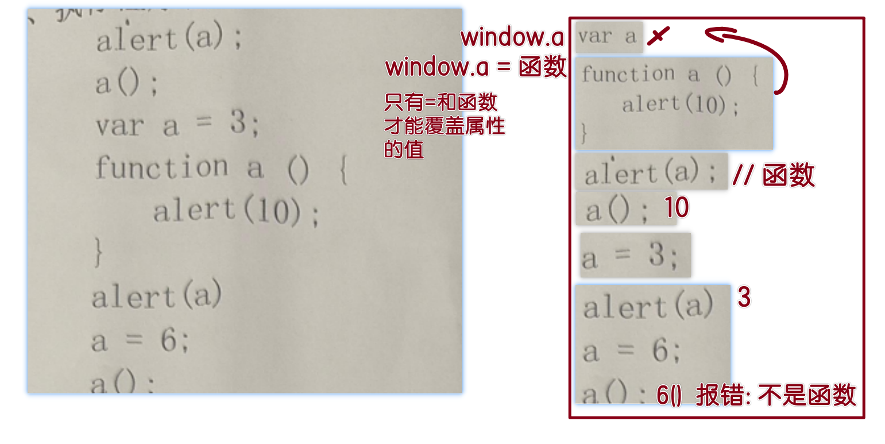

# JSCORE03

## 复习

- 数据类型分`2`类
  - 基础: number string boolean undefined null  + bigInt symbol
  - 引用: object

- 内存分两个存储区域

  - 栈内存: 类似于`目录`,  适合存储小型数据 -- 基础数据类型
    - 优点: 查询速度快
  - 堆内存: 类似于`详情页`, 适合存储大型数据 -- 对象类型
    - 缺点: 查询速度慢

- 引用类型

  - `let a  = {}`: a中存储的是 对象类型的地址, 保存在 `栈内存`
  - 当使用a时, 先`快速`在栈内存中找到地址, 然后再到堆内存中找到地址对应的对象
  - 存储对象类型的变量, 在互相赋值时, 称为 `地址传递`

- 浅拷贝: 克隆对象, 创建一个空对象, 然后把已有对象的值遍历 保存到新的对象里

- 构造函数:

  - 构造函数不是看语法

    - `错误`理解: 用new触发的就是构造, 不用new就是普通函数
    - 正确理解: 要看函数做什么, 如果函数是为了生成一个对象类型, 就叫构造函数

  - new运算符做了什么?

    ```js
    function Demo(a, b){
       // new运算符: 隐式完成3行代码
       var this = {} // 1
        
       this.a = a
       this.b = b
        
       // __proto__: 原型链 -- 属于构造函数创建的对象的一个属性
       // prototype: 原型 -- 属于构造函数的一个属性
       this.__proto__ = Demo.prototype  // 2
        
       return this // 3
    } 
    
    const x = new Demo(10, 20)
    // x {a:10, b: 20}
    ```

  - 对象的`__proto__` 就是 其构造函数的 `prototype`

  - `__proto__`: 对象在读取属性时, 如果自己没有, 则到 `__proto__` 原型链中查找

  - 为什么用 prototype 原型机制?

    - 目的: `省内存`
    - 场景: 构造函数中, 为对象新增的方法/函数, 应该复用, 所以存储在 原型中

## 面试题

函数中声明的变量, 属于函数作用域.  全局中无法读取使用

> 函数能用全局的:   作用域链 -- 向上层查找
>
> 全局不能用函数的


```html
<!DOCTYPE html>
<html lang="en">
  <head>
    <meta charset="UTF-8" />
    <meta http-equiv="X-UA-Compatible" content="IE=edge" />
    <meta name="viewport" content="width=device-width, initial-scale=1.0" />
    <title>面试题</title>
  </head>
  <body>
    <script>
      function A() {
        this.name = 'a'
        this.color = ['green', 'yellow']
      }
      function B() {
        // var this = {}
        // this.__proto__ = B.prototype
        // return this
      }

      // new A() 得到的对象 {name:"a", color:['green', 'yellow']}
      B.prototype = new A()

      // b1.__proto__ = B.prototype = {name:"a", color:['green', 'yellow']}
      var b1 = new B()
      var b2 = new B()

      console.log(b1 == b2) //false: 不是同一个
      // 都是 B.prototype 原型属性
      console.log(b1.__proto__ == b2.__proto__) //true

      console.log(b1)

      // = :赋值符号
      //考点: 原型链机制: 是 读属性发动的, 赋值不会触发
      b1.name = 'change' // 赋值: 为对象添加属性 name:'change'
      // 没有 = , 非赋值, 是读操作 -- 触发原型链
      b1.color.push('black') // push 添加元素到数组末尾

      console.log(b1.name) //change
      console.log('b2:', b2)
      console.log(b2.name) // a  -- 原型里的

      // b1 和 b2 对象 的原型链__proto__ 都是 构造函数B的prototype属性
      // 属于引用类型,
      console.log(b1.color) // [green, yellow, black]
      console.log(b2.color) // [green, yellow, black]

      console.log(b1) // 引用类型, 同一个构造函数生成的不同对象,原型相同
      // console.log(b2)
    </script>

    <script>
      // 数组是对象类型的一种, 在堆内存
      // 考点: 地址传递/引用类型,  a和b是同一个
      var a = [11, 22]
      var b = a
      b.push(33)
      console.log(a)
    </script>
  </body>
</html>

```

## 原型应用

```html
<!DOCTYPE html>
<html lang="en">
  <head>
    <meta charset="UTF-8" />
    <meta http-equiv="X-UA-Compatible" content="IE=edge" />
    <meta name="viewport" content="width=device-width, initial-scale=1.0" />
    <title>原型的应用</title>
  </head>
  <body>
    <script>
      // new Array(1,2,3,4,4)
      var nums = [11, 23, 32, 445, 53, 26]

      // max(nums)
      console.log(nums)
      // 数组使用的所有方法, 存储在构造函数的原型里
      console.log(Array.prototype)
      // 为数组扩充方法: 只需要添加到数组的原型里
      Array.prototype.max = function () {
        // this: 方法运行时所在对象, xx.max()
        // console.log('this:', this)
        var max_num = this[0] //this是数组, 下标取值

        for (var i = 1; i < this.length; i++) {
          var value = this[i] // 通过序号获取值
          // 如果值比最大值大, 则覆盖已有的最大值
          if (value > max_num) max_num = value
        }
        return max_num
      }

      console.log(nums.max())

      // 只要在数组的构造方法原型中, 添加自定义方法后
      // 所有的数组对象 都可以使用这个方法
      // 以后的框架中: 经常会有对系统对象增加方法的场景
      // var a = [12, 4, 3, 5465, 56]
      // console.log(a.max())

      console.log([12, 4, 3, 5465, 56].max())
    </script>
  </body>
</html>

```

## 严格模式

```html
<!DOCTYPE html>
<html lang="en">
  <head>
    <meta charset="UTF-8" />
    <meta http-equiv="X-UA-Compatible" content="IE=edge" />
    <meta name="viewport" content="width=device-width, initial-scale=1.0" />
    <title>严格模式</title>
  </head>
  <body>
    <!-- 严格模式: 是JS的第5个版本, 称为 ES5  2009年发布, 推出的特性 -->
    <script>
      // 在最上方书写固定的如下字符串:  就会开启严格模式
      'use strict'
      // 严格模式下: 只有声明(var/let/const/function)过的变量才能用

      // 可以让代码中存在风险的行为: 出现报错.  辅助程序员写出健壮的代码
      var servername = 'localhost'
      // 修改服务器名
      // 默认的前缀: window.
      // window.servrname = 'xin88.top'  // 对象添加属性写法
      // 由于写错单词导致了意外的 全局变量声明 -- 全局污染
      servrname = 'xin88.top'

      console.log(window)
    </script>
  </body>
</html>

```

```html
<!DOCTYPE html>
<html lang="en">
  <head>
    <meta charset="UTF-8" />
    <meta http-equiv="X-UA-Compatible" content="IE=edge" />
    <meta name="viewport" content="width=device-width, initial-scale=1.0" />
    <title>严格模式</title>
  </head>
  <body>
    <script>
      // 严格模式: 构造函数如果直接调用, this指向undefined 代替window, 防止全局变量污染
      'use strict'

      // 构造函数的名字 都是大驼峰 -- 为了明显区分与普通函数
      function Rect(w, h) {
        // 直接调用 Rect(),  默认前缀是 window.Rect
        // 所以这里的this 就是 window,
        // window.w = w ; 导致全局中新增w 属性 -- 污染
        this.aw = w
        this.ah = h
      }

      // 家栋: 不会用构造函数, 不知道需要new
      Rect(100, 4)
      console.log(window)

      var r1 = new Rect(10, 5)
      console.log(r1)
    </script>
  </body>
</html>

```

```html
<!DOCTYPE html>
<html lang="en">
  <head>
    <meta charset="UTF-8" />
    <meta http-equiv="X-UA-Compatible" content="IE=edge" />
    <meta name="viewport" content="width=device-width, initial-scale=1.0" />
    <title>阻止静默失败</title>
  </head>
  <body>
    <script>
      // 静默失败: 有问题但是不报错
      // 严格模式下: 所有的问题都会暴露出来
      'use strict'

      var emp = { eid: '10001', ename: 'mike' }

      // freeze: 冻结对象,   对象中的内容不可修改
      Object.freeze(emp)

      emp.eid = '9999999' //修改
      console.log(emp)
    </script>
  </body>
</html>

```

```html
<!DOCTYPE html>
<html lang="en">
  <head>
    <meta charset="UTF-8" />
    <meta http-equiv="X-UA-Compatible" content="IE=edge" />
    <meta name="viewport" content="width=device-width, initial-scale=1.0" />
    <title>严格模式</title>
  </head>
  <body>
    <script>
      // 严格模式下: 匿名函数自调用时, 递归中 禁用callee
      // 推荐使用 命名函数自调用 代替
      'use strict'

      // 阶乘: 5! = 5 * 4 * 3 * 2 * 1
      // 递归
      function jie(n) {
        if (n > 1) {
          return n * jie(n - 1)
        } else {
          return 1
        }
      }
      console.log(jie(5))

      function jie(n) {
        return n > 1 ? n * jie(n - 1) : 1
      }
      jie(5)

      // ES5提供了 命名函数自调用写法
      // 强制推广新特性: 代替 callee
      var a = (function fn(n) {
        return n > 1 ? n * fn(n - 1) : 1
      })(5)
      console.log('a:', a)

      // 修改为自调用写法
      var a = (function (n) {
        // 匿名函数自调用时, 用什么来代表当前函数?
        console.log(arguments)
        // 属性 callee 代表当前函数
        // 严格模式下: 禁用了 callee
        // 递归需要大量的循环操作, 查找callee 消耗系统资源, 被禁用了
        return n > 1 ? n * arguments.callee(n - 1) : 1
      })(5)

      console.log(a)
    </script>
  </body>
</html>

```

## 修改对象原型链指向

```html
<!DOCTYPE html>
<html lang="en">
  <head>
    <meta charset="UTF-8" />
    <meta http-equiv="X-UA-Compatible" content="IE=edge" />
    <meta name="viewport" content="width=device-width, initial-scale=1.0" />
    <title>修改对象的原型链</title>
  </head>
  <body>
    <script>
      // 对象类型的 __proto__ 默认指向其 构造函数的prototype
      // 但是我们可以修改 其指向其他的原型对象

      function show() {
        // 类数组: 原型非数组的原型, 没有数组方法
        // 强制把 原型链 指向 数组的原型

        // 官方不推荐直接操作 __proto__ 属性
        // arguments.__proto__ = Array.prototype
        // 官方提供了专门的方法来修改
        // 参数1: 要改的对象   参数2: 要指向的原型
        Object.setPrototypeOf(arguments, Array.prototype)

        arguments.push(999)
        console.log(arguments)
      }

      show(11, 22, 33, 44, 55)
    </script>
  </body>
</html>

```

## 创建对象并指定原型

```html
<!DOCTYPE html>
<html lang="en">
  <head>
    <meta charset="UTF-8" />
    <meta http-equiv="X-UA-Compatible" content="IE=edge" />
    <meta name="viewport" content="width=device-width, initial-scale=1.0" />
    <title>创建对象并指定原型</title>
  </head>
  <body>
    <script>
      // var a = new Object()

      // create: 创建
      // 参数: 自定义创建出的对象的原型
      var a = Object.create(Array.prototype)

      console.dir(Object)
      // 函数是个对象类型

      console.log(a)

      function b() {}
      b.age = 33
      console.dir(b)

      // 语法糖: 作者提供的固定语法, 用来简化代码的
      // 糖: 甜的 -- 让用户像吃了糖一样甜蜜..幸福..
      var obj = {
        a: function () {
          console.log('aaa')
        },
        // 允许省略 : function
        b() {
          console.log('bbb')
        },
      }
      obj.a()
      obj.b()
    </script>
  </body>
</html>

```

## 对象的精确配置

```html
<!DOCTYPE html>
<html lang="en">
  <head>
    <meta charset="UTF-8" />
    <meta http-equiv="X-UA-Compatible" content="IE=edge" />
    <meta name="viewport" content="width=device-width, initial-scale=1.0" />
    <title>对象的精确配置</title>
  </head>
  <body>
    <script>
      // 开启严格模式, 取消静默失败
      'use strict'

      var emp = {
        eid: '10001', //唯一标识, 员工标识
        ename: '涛涛',
        eage: 38,
      }
      // 期望: emp的eid属性无法被修改, 只能看 -- 只读
      // define: 定义  property: 属性
      // defineProperty: 用于为某个属性添加 精确的配置项
      // 3个参数分别为: 对象, 属性名, 配置项
      Object.defineProperty(emp, 'eid', {
        // ctrl+i: 弹出提示
        writable: false, // 是否可以写: false代表不可以
      })

      // Cannot assign to read only property 'eid' of object
      // 严格模式报错: eid只读, 无法修改
      emp.eid = true
      console.log(emp)
    </script>
  </body>
</html>

```

```html
<!DOCTYPE html>
<html lang="en">
  <head>
    <meta charset="UTF-8" />
    <meta http-equiv="X-UA-Compatible" content="IE=edge" />
    <meta name="viewport" content="width=device-width, initial-scale=1.0" />
    <title>对象的精确配置</title>
  </head>
  <body>
    <script>
      'use strict'

      var emp = { eid: '10001', ename: '涛涛' }

      Object.defineProperty(emp, 'eid', {
        writable: false, //不可写/只读
        configurable: false, //可重新配置: false代表不能删
      })

      // 希望eid 不可写 + 不可删除
      // Cannot delete property 'eid'
      delete emp.eid

      console.log(emp)
    </script>
  </body>
</html>

```

```html
<!DOCTYPE html>
<html lang="en">
  <head>
    <meta charset="UTF-8" />
    <meta http-equiv="X-UA-Compatible" content="IE=edge" />
    <meta name="viewport" content="width=device-width, initial-scale=1.0" />
    <title>对象的精确配置</title>
  </head>
  <body>
    <script>
      var emp = {
        eid: '10001',
        ename: '涛涛',
        salary: 12000,
      }
      // 精确配置: 让salary属性不可遍历
      Object.defineProperty(emp, 'salary', {
        enumerable: false, //可列举的 : false代表不可以
      })

      for (let key in emp) {
        console.log('key:', key)
      }

      // 打印中, 浅色的属性代表不可遍历
      console.log(emp)
    </script>
  </body>
</html>

```

```html
<!DOCTYPE html>
<html lang="en">
  <head>
    <meta charset="UTF-8" />
    <meta http-equiv="X-UA-Compatible" content="IE=edge" />
    <meta name="viewport" content="width=device-width, initial-scale=1.0" />
    <title>对象的精确配置</title>
  </head>
  <body>
    <script>
      var emp = { eid: '10001', ename: '涛涛' }

      // 区别:
      // 普通方式声明的属性: 所有配置都是真 - 可写, 可遍历, 可删
      // 用 define 方式声明: 所有配置都是假 - 不可写, 不可遍历, 不可删

      // 新增 age 属性
      Object.defineProperty(emp, 'age', {
        value: 40, //值: 赋值
        // configurable: true, //可以手动配置
      })

      delete emp.ename //普通方式声明: 可以删
      delete emp.age //define方式声明: 不可以删除

      console.log(emp)
    </script>
  </body>
</html>

```

### 用途

```html
<!DOCTYPE html>
<html lang="en">
  <head>
    <meta charset="UTF-8" />
    <meta http-equiv="X-UA-Compatible" content="IE=edge" />
    <meta name="viewport" content="width=device-width, initial-scale=1.0" />
    <title>用途</title>
  </head>
  <body>
    <script>
      // 高端的知识点通常是 框架中使用 -- 底层知识
      // 为数组原型中添加新的方法
      var nums = [11, 22, 33, 44, 55]

      // 为了保障原型中的属性不被遍历到, 所以用 define 方式新增属性
      Object.defineProperty(Array.prototype, 'sum', {
        value: function () {
          let total = 0
          for (let key in this) {
            console.log('key:', key)
            total += this[key] //下标取值: key是序号
          }
          return total
        },
      })

      // Array.prototype.sum = function () {
      //   for (let key in this) {
      //     console.log('key:', key)
      //   }
      // }

      console.log(nums)

      console.log(nums.sum()) //得到总和
    </script>
  </body>
</html>

```

```html
<!DOCTYPE html>
<html lang="en">
  <head>
    <meta charset="UTF-8" />
    <meta http-equiv="X-UA-Compatible" content="IE=edge" />
    <meta name="viewport" content="width=device-width, initial-scale=1.0" />
    <title>对象的精确配置</title>
  </head>
  <body>
    <script>
      // 计算属性:  total是属性, 但是结果是通过计算得到的, 本质是个函数
      var p = {
        pname: '苹果',
        price: 18,
        count: 33,
        // 总价格
        // 语法糖: 省略 :function 变短
        // 语法糖: get 前缀, 代表这是个计算属性, 用的时候默认自动调用, 不需要额外加()
        get total() {
          return this.price * this.count
        },
      }
      console.log(p.price)
      console.log(p.total)

      p.price = 100
      console.log(p.total)
      console.log(p.total)
      console.log(p.total)
      console.log(p.total)
    </script>

    <script>
      // 练习:
      var r1 = {
        width: 100,
        height: 50,
        // 增加一个 area 属性, 计算出面积  width*height
        get area() {
          return this.width * this.height
        },
      }

      console.log(r1.area) // 5000
    </script>
  </body>
</html>

```

```html
<!DOCTYPE html>
<html lang="en">
  <head>
    <meta charset="UTF-8" />
    <meta http-equiv="X-UA-Compatible" content="IE=edge" />
    <meta name="viewport" content="width=device-width, initial-scale=1.0" />
    <title>对象的精确配置</title>
  </head>
  <body>
    <!-- 利用 define 方式新增计算属性 -->
    <script>
      var r1 = { w: 10, h: 40 }

      Object.defineProperty(r1, 'area', {
        // get: function () {},
        get() {
          return this.w * this.h
        },
      })
      console.log(r1)
      // area: 有 get 配置项, 直接自动触发get获取值
      console.log(r1.area)
    </script>

    <script>
      var p = {
        price: 100,
        count: 45,
      }
      // 利用define 新增属性:  total 计算出总价格
      Object.defineProperty(p, 'total', {
        get() {
          return this.price * this.count
        },
      })

      console.log(p.total) //不需要()就能触发
    </script>
  </body>
</html>

```

### 配置多个属性

```html
<!DOCTYPE html>
<html lang="en">
  <head>
    <meta charset="UTF-8" />
    <meta http-equiv="X-UA-Compatible" content="IE=edge" />
    <meta name="viewport" content="width=device-width, initial-scale=1.0" />
    <title>同时配置多个属性</title>
  </head>
  <body>
    <script>
      var emp = { eid: '10001' }

      // 参数2: 对象类型, 多个属性的配置
      // defineProperties: 新函数, 配置多个
      Object.defineProperties(emp, {
        eid: { writable: false },
        ename: { value: '认真的格格' },
        salary: { value: '****' },
      })
      console.log(emp)
    </script>
  </body>
</html>

```

## 赋值监听

```html
<!DOCTYPE html>
<html lang="en">
  <head>
    <meta charset="UTF-8" />
    <meta http-equiv="X-UA-Compatible" content="IE=edge" />
    <meta name="viewport" content="width=device-width, initial-scale=1.0" />
    <title>对象的精确配置</title>
  </head>
  <body>
    <script>
      // 拦截/监听赋值操作
      var emp = {
        ename: '亮亮',
        age: 35,
      }

      // 提前为 age 声明 _age 这个辅助属性
      // 默认是不可写的状态, 必须手动配置成可写, 后续的
      // this._age = value;  才能正常赋值
      Object.defineProperty(emp, '_age', {
        writable: true, //可写
        value: 35, //默认值
      })

      Object.defineProperty(emp, 'age', {
        // emp.age  读取属性时, 如果get配置项, 则返回此函数的返回值
        get() {
          return this._age
        },
        // set: 设置
        // 当对属性age赋值时, 如果发现 set 配置项, 则赋值被拦截
        set: function (value) {
          console.log('age赋值为:', value)
          if (value > 1 && value < 110) {
            // 正确时: 赋值给age
            // 此写法: 会再次触发 age 的set, 造成无限循环
            // this.age = value
            // 习惯上创建 辅助属性 _age,  _是一个标识, 代表是辅助的
            this._age = value
          } else {
            throw Error('亮亮活不到:' + value)
          }
        },
      })

      // 设定: 1-110
      // emp.age = 200
      emp.age = 50
      console.log(emp)
      // 虽然 年龄真正存储在 _age 属性里, 但是用户不知道
      // console.log(emp._age)
      console.log(emp.age) //触发 get 配置项
    </script>

    <!-- 
      拦截器: 属性在赋值时, 排除一些明显不合法的赋值
      - 给age属性添加 set 配置项, 拦截属性的赋值操作 = 
      - 判断值不合理 - throw 抛出错误
      - 判断值合理 - 把值保存下来
        -- this.age = value;  会再次触发set 造成无限循环
        -- 解决方案: 做一个辅助属性 _age 来存储值, 打破循环
        -- 辅助属性应该是幕后的, 所以做成不可遍历 -- 浅色 更合适
          -- 利用 define 方式为 emp 增加_age; 默认此方式新增的属性 所有配置都是假
              必须手动设置为 writable:true;  运行赋值
      - 读取属性的值: 
        - 由于值存在 _age 里,  通过 emp._age 可以读取 但是 对用户不合理
        - 存 emp.age = 50; 凭什么要写 emp._age才能读;  应该实现 emp.age 也能读取
        -- emp.age 读操作, 会触发 计算属性 get 配置, 在get配置项中,返回_age 的值即可
      - 如果一个属性 age, 同时具有 get/set 两个配置项, 就是深色的
     -->
  </body>
</html>

```

```html
<!DOCTYPE html>
<html lang="en">
  <head>
    <meta charset="UTF-8" />
    <meta http-equiv="X-UA-Compatible" content="IE=edge" />
    <meta name="viewport" content="width=device-width, initial-scale=1.0" />
    <title>Document</title>
  </head>
  <body>
    <script>
      // define新增的属性所有配置项都是假, 即 不可遍历/浅色
      // 如果在 对象中书写了age, 则默认是可遍历
      // 如果没有写age, 用define添加的get/set, 则是不可遍历
      var emp = { age: 10 }

      Object.defineProperty(emp, '_age', { value: 10, writable: true })
      console.log(emp)

      Object.defineProperty(emp, 'age', {
        get() {
          return this._age
        },
        set(value) {
          this._age = value
        },
      })

      // 属性分 读 和 写 两种操作, 区别在于是否有 = 赋值
      console.log(emp.age) //读 -- 如果有get配置,会触发
      emp.age = 50 //写 -- 如果有set配置项, 则触发set

      console.log(emp.age)
    </script>
  </body>
</html>

```

## 箭头函数

```html
<!DOCTYPE html>
<html lang="en">
  <head>
    <meta charset="UTF-8" />
    <meta http-equiv="X-UA-Compatible" content="IE=edge" />
    <meta name="viewport" content="width=device-width, initial-scale=1.0" />
    <title>ES6</title>
  </head>
  <body>
    <!-- ES6: JS的第六个版本, 在2015年6月发布.  是JS升级最大的版本, 提供了大量的新特性 和 各种语法糖 -->
    <!-- 参考网站: https://es6.ruanyifeng.com/ -->
    <script>
      // 箭头函数, 解决两个问题:
      // 1. 简化匿名函数写法
      // 2. 提供新的this指向

      var a = function () {}
      // 作者: 很讨厌关键词  function
      var a = () => {}

      // 提供两个语法糖写法
      // 1. 参数只有一个, ()可以省略
      var a = name => {
        console.log(name)
      }

      a('mike')

      // 2. 函数体中只有一行代码, 可以省略  {return }
      var a = (x, y) => {
        return x + y
      }

      var a = (x, y) => x + y

      console.log(a(10, 20))

      // 坑:
      var a = () => {
        return { x: 10, y: 30 }
      }

      // 省略后: 对象的{} 被误认为是 函数的{}
      // 用() 包围对象, 解决歧义
      var a = () => ({ x: 10, y: 30 })
    </script>
  </body>
</html>

```

## 箭头函数的this

```html
<!DOCTYPE html>
<html lang="en">
  <head>
    <meta charset="UTF-8" />
    <meta http-equiv="X-UA-Compatible" content="IE=edge" />
    <meta name="viewport" content="width=device-width, initial-scale=1.0" />
    <title>箭头函数的this</title>
  </head>
  <body>
    <script>
      // 面试最常见问题: 区分 this 的指向
      // function: 指向 `运行时` 所在 `对象`
      // 箭头函数: 指向 `声明时` 所在 `作用域` 的this
      var a = function () {
        console.log('a:', this)
      }
      // 声明/书写: 在全局中写的, this永远都是全局的this
      var b = () => console.log('b:', this)

      // 语法糖: { 属性名: 变量名 } 恰好一样, 可以合一
      var obj = { name: 'OBJ', a, b }
      obj.a() // a运行时, 在 obj 里, 所以this就是obj
      obj.b()
    </script>

    <script>
      var emp = {
        name: 'mike',
        // emp.show():  所以show的this是 emp
        show: function () {
          console.log('show:', this) // emp
          // 声明/书写: 在show函数中书写的, 使用的是show中的this

          window.aa = () => {
            console.log('aa:', this) // emp
          }
        },
      }

      emp.show()
      aa() //??
    </script>
  </body>
</html>

```


递归


## 格式化插件配置

> 教程详见: www.xin88.top

在`设置`中, 可以`搜索`找到这些配置项





