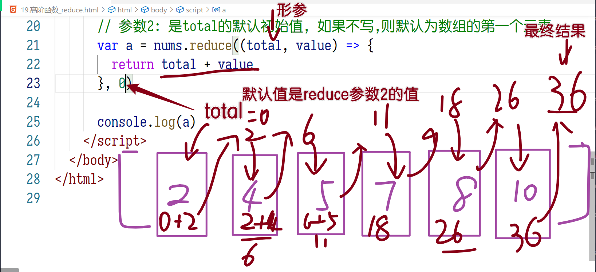

# JSCORE04

## 复习

> 三大难点:
>
> - 闭包
>
>   - 函数在声明时, 会把函数体中 `非自身` 的变量, 存储在 `scopes` 属性里
>     - 自身的变量: 存储在函数的`函数体`中,  `function (){函数体...}`
>   - 按照变量所在的作用域分成4类: `Block块`, `Script脚本`, `Global全局`, `Closure闭包`
>   - 闭包本质: 就是函数作用域, 只是名字叫闭包
>   - 作用: ES6之前常用, 把函数使用的变量存在 函数作用域里, 避免全局污染
>
> - 原型
>
>   - 构造函数 创建的对象, 其中的方法统一存储在外部, `节省内存`
>
>   - 存在外部: 构造函数的 `prototype` 属性中,  称为`原型`
>
>   - new运算符隐式完成3件事
>
>     ```js
>     function Demo(){
>         var this = {}
>         this.__proto__ = Demo.prototype
>         return this
>     }
>     ```
>
>   - 原型链机制: `读`取对象属性时, 对象没有 则到 `__proto__` 中查找使用
>
> - 赋值监听
>
>   - 赋值操作: `=`,  如果属性有 `set` 配置项, 则自动触发; 通过set来监听赋值操作
>   - `get`: 计算属性,  属性是个函数, 但是使用时不需要 `()`, 就会自动触发
>   - 辅助属性: _xxx  来存储实际的值.  目的是打破循环

严格模式: ES5  2009年推出的版本

- 让存在风险的代码, 在后台报错
- 用法: 在脚本开头书写 `'use strict'`
- 新增的报错:
  - 没有声明(`var/let/const/function`) 的属性, 不允许使用
  - 构造函数,如果不用new 直接调用.  则内部的this指向 undefined, 不再是window
  - 取消静默失败
  - 禁用 `arguments` 的`callee`,  现在使用 命名函数自调用 实现递归

对象的精确配置:

- `Object.defineProperty` 配置单个属性
- `Object.defineProperties` 配置多个属性
- 配置项
  - writable: 是否可写
  - configurable: 是否可配置 -- false则不能删除属性
  - value: 赋值
  - enumerable: 可遍历/可枚举;  不可枚举的属性 后台是浅色(IE除外)
  - set: 向属性赋值时触发
  - get: 读取属性时触发

箭头函数

- `()=>{}`
- 语法糖:
  - 参数就一个, 省略():  `name =>{}`
  - 函数体就一行, 省略 `{return  }` : `(x,y) => x+y`
    - 坑: 返回值是对象类型, 用`()`包围, 防止歧义
- this指向: `面试常考`
  - function: `运行时`所在`对象`. 就是this
  - 箭头: `声明时`所在`作用域`的this

## 保护对象

```html
<!DOCTYPE html>
<html lang="en">
  <head>
    <meta charset="UTF-8" />
    <meta http-equiv="X-UA-Compatible" content="IE=edge" />
    <meta name="viewport" content="width=device-width, initial-scale=1.0" />
    <title>保护对象的方式</title>
  </head>
  <body>
    <script>
      'use strict'

      var emp = { ename: 'mike', age: 19 }

      // 属性有4个操作: 增删改查
      // prevent: 阻止  extension: 扩展 -- 增加属性
      // Object.preventExtensions(emp)

      // seal: 密封  -- 不允许 增 删
      // Object.seal(emp)

      // freeze: 冻结 -- 不允许 增 删 改
      Object.freeze(emp)

      // Cannot add property phone, object is not extensible
      // 无法添加属性 phone, 对象是一个不可扩展的
      // emp.phone = '10086'

      // Cannot delete property 'age'
      // 不能删除属性 age
      // delete emp.age

      // Cannot assign to read only property 'age'
      // 不能赋值给 只读属性 age
      emp.age = 99

      console.log(emp)
    </script>
  </body>
</html>

```

## 函数的触发方式

```html
<!DOCTYPE html>
<html lang="en">
  <head>
    <meta charset="UTF-8" />
    <meta http-equiv="X-UA-Compatible" content="IE=edge" />
    <meta name="viewport" content="width=device-width, initial-scale=1.0" />
    <title>函数的触发方式</title>
  </head>
  <body>
    <script>
      function show(a, b) {
        console.log('this:', this)
        console.log(a + b)
      }
      // 函数的触发方式有很多种: 其中用()是最常见的方式
      // ()的特点: 自动设定this的指向 -> 运行时所在对象
      show(11, 22)

      console.dir(show)

      // 函数对象的原型中, 存在 call(调用) 方法
      var emp = { ename: '楠楠' }
      // call: 手动指定函数中的this指向, 指向参数1对象
      show.call(emp, 11, 22)
    </script>
  </body>
</html>

```

### call

```html
<!DOCTYPE html>
<html lang="en">
  <head>
    <meta charset="UTF-8" />
    <meta http-equiv="X-UA-Compatible" content="IE=edge" />
    <meta name="viewport" content="width=device-width, initial-scale=1.0" />
    <title>Document</title>
  </head>
  <body>
    <script>
      function show() {
        console.log('this:', this)
      }
      // 函数是对象类型, 其原型中拥有 call 方法
      console.dir(show)
      var emp = { name: 'gege' }
      // call有什么用: 触发show函数的同时, 指定其中的this指向参数1; 一次性操作,临时性的.

      // call是怎么设置this的指向:  不用你管, 作者实现的
      show.call(emp)
      console.log('emp:', emp)

      var obj = { name: '非凡' }
      show.call(obj)

      show.call({ name: 'mike' })
    </script>

    <script>
      // 函数触发时, 才知道this是什么
      function abb(a, b) {
        console.log(a + b + this.c)
      }

      var x = { c: 100 }
      abb.call(x, 10, 20)

      var y = { c: 200 }
      abb.call(y, 20, 20)
    </script>

    <script>
      function add() {
        // 类数组: 原型非数组, 用不了数组的方法
        console.log(arguments)
        // arguments.__proto__ = Array.prototype
        var nums = [1, 2, 3]
        nums.push(4) // push的this是谁?  nums!
        // push的this如果换成 arguments 呢?
        Array.prototype.push.call(arguments, 4)
        // 调用数组原型的push方法, 指定其this指向 arguments 对象, push就会把 4 添加到 arguments 里
      }

      add(1, 2, 3)
    </script>
  </body>
</html>

```

### apply

```html
<!DOCTYPE html>
<html lang="en">
  <head>
    <meta charset="UTF-8" />
    <meta http-equiv="X-UA-Compatible" content="IE=edge" />
    <meta name="viewport" content="width=device-width, initial-scale=1.0" />
    <title>apply</title>
  </head>
  <body>
    <script>
      // 函数的apply
      // apply 和 call 一样
      function show(a, b) {
        console.log(a + b + this.c);
      }

      var x = { c: 100 };
      show.call(x, 10, 20);
      // 唯一差异: 参数用数组类型
      show.apply(x, [10, 20]);

      // 用途: 在ES6之前用, 由于书写过于繁琐, ES6中有了新语法
      var max = Math.max(11, 22, 33, 44, 5);
      console.log(max);

      var nums = [12, 324, 54, 65, 76, 7];
      // max函数无法处理数组类型, 只接受 1个1个传递的
      // var max = Math.max(nums);
      // max中没有用到this关键词, 所以参数1 写什么都行,不影响
      var max = Math.max.apply(null, nums);

      //ES6中:  ...展开符
      var max = Math.max(...nums);

      console.log(max);
    </script>
  </body>
</html>

```

### bind

```html
<!DOCTYPE html>
<html lang="en">
  <head>
    <meta charset="UTF-8" />
    <meta http-equiv="X-UA-Compatible" content="IE=edge" />
    <meta name="viewport" content="width=device-width, initial-scale=1.0" />
    <title>bind</title>
  </head>
  <body>
    <!-- bind：绑定 -->
    <!-- 为函数绑定 this指向 和 相关参数, 返回绑定好的新函数 -->
    <script>
      function show(a, b) {
        console.log(a + b + this.c);
      }

      var x = { c: 100 };

      var show_b = show.bind(x, 10, 20);
      console.dir(show_b);
      console.log(show_b == show);

      // 后期随时都可以触发
      show_b();
    </script>

    <!-- 
      函数的触发方式 有 4 种:
      - 普通() : 最常用,  this自动指向触发时所在对象
      - call: 手动指定this, 框架底层常见, 面试常考
      - apply: 在ES6中有替代方案, 数组转换成参数
      - bind: 绑定好参数和this, 以后触发 -- 5阶段才用到
     -->
  </body>
</html>

```

## 函数增强

```html
<!DOCTYPE html>
<html lang="en">
  <head>
    <meta charset="UTF-8" />
    <meta http-equiv="X-UA-Compatible" content="IE=edge" />
    <meta name="viewport" content="width=device-width, initial-scale=1.0" />
    <title>函数增强</title>
  </head>
  <body>
    <!-- ES6中: 对函数进行了 增强, 添加了新特性 -->
    <script>
      // 参数的默认值:  参数=值
      // 触发函数时, 如果没有传入参数, 则使用默认值
      function show(name = 'mike') {
        console.log('name:', name);
      }

      show();
      show('亮亮');
    </script>

    <script>
      // 剩余参数: 代替 arguments(类数组,callee禁用)
      // ... 多功能运算符
      // 形参中书写: 代表接收所有剩余参数
      // ...形参名: 剩余参数存储在 形参中, 名字随意
      function show(a, ...args) {
        // a 接收了 11
        // 剩下的 22 33 放在args里
        console.log(args);
        // args是数组类型, 可以用数组的方法
        args.push('mike', '33');
      }

      show(11, 22, 33);
    </script>
  </body>
</html>

```

## 展开语法

```html
<!DOCTYPE html>
<html lang="en">
  <head>
    <meta charset="UTF-8" />
    <meta http-equiv="X-UA-Compatible" content="IE=edge" />
    <meta name="viewport" content="width=device-width, initial-scale=1.0" />
    <title>展开语法</title>
  </head>
  <body>
    <script>
      // ... 是多用的, 不同位置作用不同, 形参中就是 剩余参数
      // ... 展开符, 放在数组前, 会去掉数组的[], 暴露其中的内容
      var nums = [11, 22, 33, 44];

      var a = [...nums, 88, 99];

      console.log(a);

      // 利用 ... 合并数组
      var a = [11, 22];
      var b = [33, 44];
      // 合并 , 以前用 concat   a.concat(b)
      var c = [...a, ...b];
      console.log(c);

      // 实参时:
      // max不接数组类型
      console.log(Math.max(nums));
      // ES6之前依赖 函数的apply方法实现: 麻烦
      console.log(Math.max(...nums));
    </script>
  </body>
</html>

```

```html
<!DOCTYPE html>
<html lang="en">
  <head>
    <meta charset="UTF-8" />
    <meta http-equiv="X-UA-Compatible" content="IE=edge" />
    <meta name="viewport" content="width=device-width, initial-scale=1.0" />
    <title>对象展开语法</title>
  </head>
  <body>
    <script>
      // ... : 此运算符放在对象前, 可以展开对象
      var a = { x: 10, y: 20 };
      // 同名属性, 后写的覆盖先写的
      var b = { ...a, z: 30, y: 99 };
      console.log(b);
    </script>
  </body>
</html>

```

## 数组解构

```html
<!DOCTYPE html>
<html lang="en">
  <head>
    <meta charset="UTF-8" />
    <meta http-equiv="X-UA-Compatible" content="IE=edge" />
    <meta name="viewport" content="width=device-width, initial-scale=1.0" />
    <title>数组解构</title>
  </head>
  <body>
    <script>
      var nums = [11, 22, 33];
      // 把数组的中的元素, 存储在不同的变量中

      // ES6后:   var [变量, 变量] = [值, 值]
      var [a, b, c] = nums;
      console.log(a, b, c);

      // 不完全解构
      var [x, , y] = nums;
      console.log(x, y);

      // ES6前:
      var a = nums[0];
      var b = nums[1];
      var c = nums[2];
    </script>
  </body>
</html>

```

## 对象解构

```html
<!DOCTYPE html>
<html lang="en">
  <head>
    <meta charset="UTF-8" />
    <meta http-equiv="X-UA-Compatible" content="IE=edge" />
    <meta name="viewport" content="width=device-width, initial-scale=1.0" />
    <title>对象解构</title>
  </head>
  <body>
    <script>
      var emp = {
        ename: 'mike',
        age: 18,
        phone: '19932321122',
      };

      // 不完全解构:
      var { phone } = emp;
      console.log(phone);

      // ES6后:  先写出解构的格式  var {} = 对象
      var { ename, age, phone } = emp;
      console.log(ename, age, phone);

      // ES6前
      var ename = emp.ename;
      var age = emp.age;
      var phone = emp.phone;
    </script>

    <script>
      // 别名写法
      var obj = { price: 999, name: '千足金' };

      const price = 666; //全局中已存在 price 属性

      // 解构出 obj 的price
      // var { 属性名: 别名 }
      // 属性名price, 变量名:pprice,  值存在变量名pprice里
      var { price: pprice } = obj;
      console.log(pprice);
    </script>
  </body>
</html>

```

### 使用场景

```html
<!DOCTYPE html>
<html lang="en">
  <head>
    <meta charset="UTF-8" />
    <meta http-equiv="X-UA-Compatible" content="IE=edge" />
    <meta name="viewport" content="width=device-width, initial-scale=1.0" />
    <title>Document</title>
  </head>
  <body>
    <script>
      // 数组解构的使用场景:
      var a = 10
      var b = 20

      // 希望互换 a 和  b 的值
      //       [b,a] 是个数组, [20, 10]
      // 必须用分号前缀, 与上一句代码分割,
      // 否则会认为是 20[a,b] 报错
      ;[a, b] = [b, a]

      // var [a, b] = [20, 10]

      console.log(a, b)
    </script>

    <script>
      var r1 = {
        w: 10, //宽
        h: 20, //高
        len: 30, //长
        // get: 计算属性, 使用时不用() 就能触发
        get area() {
          // 面积= (长x宽 + 长x高 + 宽x高)*2
          const { w, h, len } = this
          // 相当于
          // const w = this.w
          // const h = this.h
          // const len = this.len

          return (w * h + w * len + h * len) * 2
        },
      }

      console.log(r1.area)
    </script>
  </body>
</html>

```

## 参数解构

```html
<!DOCTYPE html>
<html lang="en">
  <head>
    <meta charset="UTF-8" />
    <meta http-equiv="X-UA-Compatible" content="IE=edge" />
    <meta name="viewport" content="width=device-width, initial-scale=1.0" />
    <title>参数解构</title>
  </head>
  <body>
    <script>
      // 如果传入的实参是 对象类型, 则形参位置可以直接用解构语法
      function show({ name, age }) {
        // 值从形参中解构出来
        // const { name, age } = args

        console.log(name, age)
      }

      var obj = { name: 'mike', age: 18 }

      show(obj)
    </script>
  </body>
</html>

```

## 复杂解构

```html
<!DOCTYPE html>
<html lang="en">
  <head>
    <meta charset="UTF-8" />
    <meta http-equiv="X-UA-Compatible" content="IE=edge" />
    <meta name="viewport" content="width=device-width, initial-scale=1.0" />
    <title>复杂解构</title>
  </head>
  <body>
    <script>
      var gege = {
        name: '格格',
        age: 18,
        skills: ['js', 'html', 'css'],
        phone: {
          name: 'iPhone 13 pro',
          price: 12999,
        },
      }

      // 解构出所有的属性
      var {
        name,
        age,
        skills: [s1, s2, s3],
        phone: { name: pname, price },
      } = gege

      console.log(name, age, s1, s2, s3, pname, price)

      var game = {
        gname: 'LOL',
        maker: '腾讯',
        teams: ['WBG', 'V5', 'RNG'],
        desc: {
          year: 2007,
          maker: 'Rock',
        },
      }

      // 解构出所有的值, 保存到变量里
      var {
        gname,
        maker,
        teams: [t1, t2, t3],
        desc: { year, maker: d_maker },
      } = game

      console.log(gname, maker, t1, t2, t3, year, d_maker)
    </script>
  </body>
</html>

```

## 数组高阶函数

```html
<!DOCTYPE html>
<html lang="en">
  <head>
    <meta charset="UTF-8" />
    <meta http-equiv="X-UA-Compatible" content="IE=edge" />
    <meta name="viewport" content="width=device-width, initial-scale=1.0" />
    <title>数组的高阶函数</title>
  </head>
  <body>
    <script>
      // 由于JS在网页中的工作, 通常是与数组相关
      // 通过接口得到的数据通常是 数组类型
      // 所以ES6 为数组增加了 更加易用的 一些高阶函数

      // 高阶函数: 函数中 使用了其他函数的 函数, 就叫高阶函数
      // 例如: 带有 回调函数 的函数

      var nums = [11, 22, -33, 44, 55]

      // 要求: 判断数组的每一个元素是否都是正数
      // every: 每一个, 其参数要求是函数(固定接3参)
      // 作用: 自动把 数组中的每个元素, 传递给 箭头函数
      var a = nums.every((value, index, array) => {
        // 三个参数, 分别为: 值, 下标, 数组
        console.log('value:', value)
        console.log('index:', index)
        console.log('array:', array)
        console.log('------------------------')
        // 返回每次判断的结果:  值>0 为真代表正数
        return value > 0
      })

      // every: 每个元素都会被箭头函数处理, 如果返回值都是真的, 则最终结果为真;  如果返回值有假的, 则最终结果为假
      console.log(a ? '都是正数' : '非都是正数')

      var emps = [
        { name: '亮亮', age: 22 },
        { name: '涛涛', age: 30 },
        { name: '格格', age: 17 },
        { name: '鑫磊', age: 42 },
      ]
      // 判断是否都成年  age>17
      var a = emps.every((value, index, array) => {
        // value: 是数组的元素, 即对象类型
        return value.age > 17
      })

      // 简化1: 函数体中只用了value, 另外两个形参可以省略不写
      var a = emps.every(value => {
        return value.age > 17
      })

      // 简化2: 箭头函数的函数体只有一行, 可以省略 {return }
      var a = emps.every(value => value.age > 17)

      console.log(a ? '都成年' : '非都成年')

      var nums = [12, 44, 2, 3, 54]
      // 判断数组中, 是否都是偶数    数字 % 2 == 0   对2取余是0
      var a = nums.every(value => value % 2 == 0)
      console.log(a ? '都是偶数' : '非都是偶数')

      var stus = [
        { name: '凯凯', married: false },
        { name: '格格', married: false },
        { name: '梦瑶', married: true },
        { name: '子文', married: false },
      ]

      // 判断是否都已婚:  即 married 是真
      // married本身就是boolean类型, 没必要 == true
      var a = stus.every(value => value.married)
      console.log(a ? '都已婚' : '非都已婚')
    </script>
  </body>
</html>

```

```html
<!DOCTYPE html>
<html lang="en">
  <head>
    <meta charset="UTF-8" />
    <meta http-equiv="X-UA-Compatible" content="IE=edge" />
    <meta name="viewport" content="width=device-width, initial-scale=1.0" />
    <title>高阶函数_some</title>
  </head>
  <body>
    <script>
      // some: 一些
      // 判断数组中是否有满足条件的元素
      var nums = [1, 31, 43, 65, 13]
      // 判断数组中是否有 偶数:  即 有一个就算有

      // some: 自动遍历每个元素, 返回判断的结果, 如果有真的, 就是真, 没有真的, 就是假
      var a = nums.some((value, index, array) => {
        // 对2 取余0, 代表偶数
        return value % 2 == 0
      })

      var a = nums.some(value => value % 2 == 0)

      console.log(a ? '有偶数' : '没有偶数')
    </script>
  </body>
</html>

```

```html
<!DOCTYPE html>
<html lang="en">
  <head>
    <meta charset="UTF-8" />
    <meta http-equiv="X-UA-Compatible" content="IE=edge" />
    <meta name="viewport" content="width=device-width, initial-scale=1.0" />
    <title>高阶函数_filter</title>
  </head>
  <body>
    <!-- 数组过滤: filter -->
    <script>
      var nums = [12, 4, 34, 54, 76, 213, 43, 65, 6, 5]
      // 过滤出: 所有的偶数, 把他们组合成新的数组

      // filter: 把判断后 满足条件的元素 组合成新数组
      // 所有的高阶函数,没特殊说的, 都是3个参数
      var a = nums.filter((value, index, array) => {
        return value % 2 == 0
      })

      var a = nums.filter(value => value % 2 == 0)

      console.log(a)

      var emps = [
        { name: '家栋', salary: 8000 },
        { name: '雷', salary: 18000 },
        { name: '格格', salary: 15000 },
        { name: '涛涛', salary: 15000 },
      ]
      // 过滤出 薪资 > 1w的
      // value: 数组中的每个元素, 此处是对象类型
      var a = emps.filter(value => value.salary > 10000)
      console.log(a)
    </script>
  </body>
</html>

```

```html
<!DOCTYPE html>
<html lang="en">
  <head>
    <meta charset="UTF-8" />
    <meta http-equiv="X-UA-Compatible" content="IE=edge" />
    <meta name="viewport" content="width=device-width, initial-scale=1.0" />
    <title>高阶函数_map</title>
  </head>
  <body>
    <script>
      // map: 映射
      // 把数组的每个元素, 处理后的返回值, 组成新的数组
      var nums = [11, 22, 33, 44, 55, 66]
      // 元素的值都x2
      var nums_2 = nums.map(value => value * 2)

      var nums_2 = nums.map((value, index, array) => {
        return value * 2
      })

      console.log(nums_2)

      // 实际工作时:  数据转 HTML代码
      var data = ['js', 'css', 'html', 'express']

      // 每个元素放button里:  <button>js</button>
      var data_html = data.map(value => {
        return '<button>' + value + '</button>'
      })

      console.log(data_html)
    </script>
  </body>
</html>

```

```html
<!DOCTYPE html>
<html lang="en">
  <head>
    <meta charset="UTF-8" />
    <meta http-equiv="X-UA-Compatible" content="IE=edge" />
    <meta name="viewport" content="width=device-width, initial-scale=1.0" />
    <title>高阶函数_forEach</title>
  </head>
  <body>
    <script>
      // JS遍历数组 有4种方式
      var nums = ['mike', 'lucy', 'lily', 'tom']

      // 基础方式: for
      for (let i = 0; i < nums.length; i++) {
        console.log(i, nums[i])
      }

      // for...in: 本意是遍历对象, 获取属性名
      for (let key in nums) {
        console.log(key, nums[key])
      }

      // ES6提供 for...of: 专门遍历数组
      for (let value of nums) {
        console.log(value) //直接得到值, 没有序号
      }

      // 数组的高阶函数: forEach
      // 不同于之前学习的高阶函数, forEach 单纯的遍历, 没有返回值
      nums.forEach((value, index, array) => {
        console.log(index, value)
      })
    </script>
  </body>
</html>

```


## reduce

如果图看不懂, 看视频展示更清晰



```html
<!DOCTYPE html>
<html lang="en">
  <head>
    <meta charset="UTF-8" />
    <meta http-equiv="X-UA-Compatible" content="IE=edge" />
    <meta name="viewport" content="width=device-width, initial-scale=1.0" />
    <title>高阶函数_reduce</title>
  </head>
  <body>
    <script>
      // reduce: 合并归纳 -- 把数组每个元素组合在一起, 得到一个结果

      var nums = [12, 4343, 546, 7676, 6, 23, 454, 656, 767]
      // 求数组元素总和
      // let total = 0
      // nums.forEach(value => (total += value))
      // console.log(total)

      // reduce: 把上方的写法 合并到一个函数里, 合完的结构只能死记硬背
      // 参数2: 是total的默认初始值, 如果不写,则默认为数组的第一个元素
      var a = nums.reduce((total, value) => {
        return total + value
      }, 0)

      console.log(a)
    </script>

    <script>
      var products = [
        { name: '苹果1', price: 22, count: 10 },
        { name: '苹果2', price: 12, count: 120 },
        { name: '苹果3', price: 42, count: 13 },
        { name: '苹果4', price: 3, count: 10 },
      ]

      // 计算商品总和
      // 如果不写参数2, 默认是数组的第一个值, 一定要写参数2
      var a = products.reduce((total, value) => {
        //单价x数量:
        return total + value.price * value.count
      }, 0)
      console.log(a)
    </script>
  </body>
</html>

```


## 考试题地址

https://ks.wjx.top/vj/PpQXzuu.aspx


