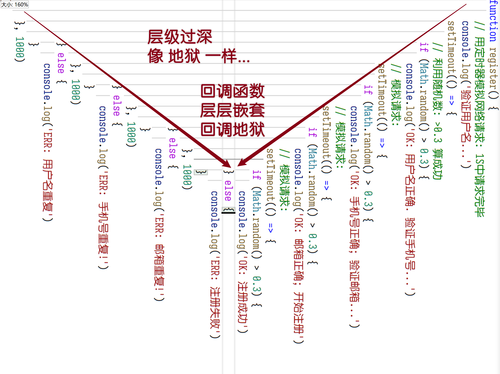
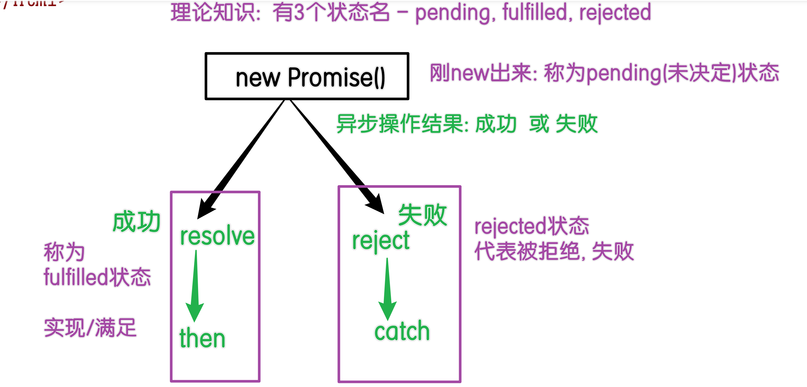
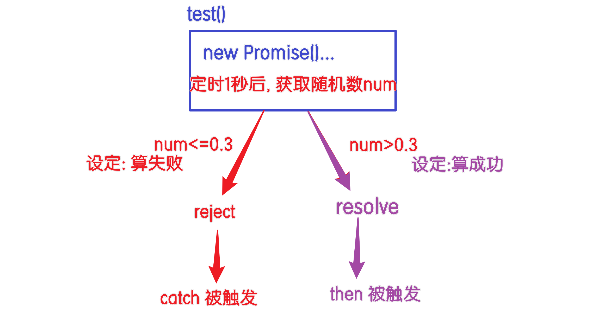
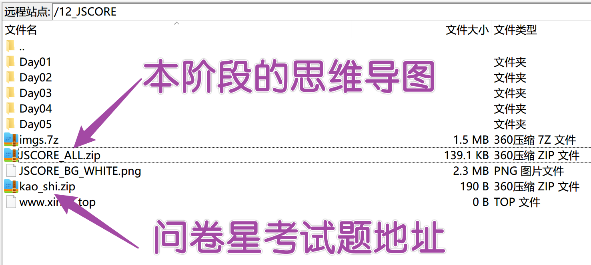

# JSCORE05

## 复习

- 声明提升

  - 声明变量的关键词: `var/let/const/function`
  - `var/let/const`: 声明变量,  不会赋值
  - `function`: 声明变量+赋值, 提升整个函数

- 闭包

  - 函数在声明时, 会检测函数体中使用的变量, `如果`这些变量是非函数自身声明, 来自于其他作用域的, 则存储在函数的`scopes` 属性里
  - 这些变量根据所属的作用域分成4类: `script`, `block`, `global`, `closure闭包`
  - ES6之前: 利用闭包提供一个 局部作用域的变量, 代替全局声明的, 防止全局变量污染

- 原型

  - 构造函数: 函数如果用来创建对象, 则称为 构造函数

  - new运算符: new运算符会隐式完成 `3` 件事

    ```js
    function demo(){
        var this = {}
        this.__proto__ = demo.prototype
        return this
    }
    ```

  - 原型prototype: 属于函数的属性, 用来存储公共的方法.  -- 省内存

  - `__proto__`: 原型链机制,  对象读取属性时, 自身没有则到`__proto__`中查找使用 

- 赋值监听

  - `Object.defineProperty()`
  - `set`: 拦截属性的赋值操作
  - `get`: 拦截属性的读值操作, 计算属性.   不需要()就能自动触发函数

- 函数调用方式

  - `()`: 最基础, 特点是 `this`指向自动 -- `运行`时所在`对象`
  - 手动挡模式:
    - bind: 同call, 绑定this和参数后, 返回一个绑定完毕的函数. 以后调用
    - call: 触发函数同时, 可以手动指定this指向
    - apply: 同call, 参数用数组放

- 函数this指向

  - 普通函数function: 运行时所在对象
  - 箭头函数: `声明`时所在`作用域`的this

- 高阶函数: 函数体中用了其他函数

  - every: 每一个都符合
  - some: 有一个符合条件
  - filter: 满足条件的过滤出一个数组
  - map: 映射.  数组的每个元素处理后 组合成新的数组;  数据转html代码
  - forEach: 普通遍历
  - reduce: 归纳合并. 把数组中的值归纳成一个

## reduce

```html
<!DOCTYPE html>
<html lang="en">
  <head>
    <meta charset="UTF-8" />
    <meta http-equiv="X-UA-Compatible" content="IE=edge" />
    <meta name="viewport" content="width=device-width, initial-scale=1.0" />
    <title>reduce - 09:20</title>
  </head>
  <body>
    <script>
      var nums = [12, 3, 54, 65, 7, 67]

      // reduce: 两个参数
      // 参数1: 回调函数, 返回值是每次累加的和
      // 参数2: total首次遍历的初始值, 默认不写是数组的第一个元素
      var a = nums.reduce((total, value) => {
        return total + value
      }, 0)

      console.log('a:', a)

      var products = [
        { name: 'iPhone13', price: 9999, count: 4 },
        { name: 'S22+', price: 8999, count: 5 },
        { name: 'Find X5', price: 6999, count: 14 },
        { name: 'MATE40', price: 7999, count: 3 },
      ]
      // 练习: 计算出商品的总价格  pirce单价  count数量
      var a = products.reduce((total, value) => {
        // 利用解构语法: 先拿出来, 再用
        // var let const 使用的优先级: const > let > var
        // 如果变量赋值后 只是用, 不会改 则 const
        // 如果变量后期会变: 用let
        // var: 考虑兼容性的场景中使用 -- 兼容旧版本
        const { price, count } = value
        return total + price * count
      }, 0)

      console.log(a)
    </script>

    <script>
      // checked: 是否勾选, 常见于购物车场景
      var products = [
        { name: 'iPhone13', price: 9999, count: 4, checked: true },
        { name: 'S22+', price: 8999, count: 5, checked: true },
        { name: 'Find X5', price: 6999, count: 14, checked: false },
        { name: 'MATE40', price: 7999, count: 3, checked: true },
      ]
      // 计算出 checked属性为true的元素的总和: 即 勾选的物品
      var a = products.reduce((total, value) => {
        const { price, count, checked } = value
        // 简化写法:
        // 隐式类型转换: 在数学计算中, true->1  false->0
        // 小学知识: 乘0 是0, 乘1 是自身checked
        return total + price * count * checked

        // if (checked) {
        //   return total + price * count
        // } else {
        //   // 不累加, 则直接返回当前的总和
        //   return total
        // }
      }, 0)

      console.log(a)
    </script>
  </body>
</html>

```

## 模板字符串

```html
<!DOCTYPE html>
<html lang="en">
  <head>
    <meta charset="UTF-8" />
    <meta http-equiv="X-UA-Compatible" content="IE=edge" />
    <meta name="viewport" content="width=device-width, initial-scale=1.0" />
    <title>模板字符串 - 10:15</title>
  </head>
  <body>
    <!-- <div><b>楠楠</b>今年<b>18</b>岁, 手机号码是<b>10086</b></div> -->

    <!-- ES6提供: 字符串增强 -->
    <script>
      // 由于JS 和 HTML之前有联动: 把数据转HTML代码
      var emp = { ename: '楠楠', age: 18, phone: '10086' }

      // 问题: 格式很难看, 拼接复杂
      var a = '<div><b>' + emp.ename + '</b>今年<b>' + emp.age + '</b>岁, 手机号码是<b>' + emp.phone + '</b></div>'

      // 模板字符串: 反引号;  支持随意的换行, 支持内部的JS代码书写
      var a = `<div>
          <b>${emp.ename}</b>今年<b>${emp.age}</b>岁, 手机号码是<b>${emp.phone}</b>
        </div>`

      console.log(a)
    </script>
  </body>
</html>

```

## class语法

```html
<!DOCTYPE html>
<html lang="en">
  <head>
    <meta charset="UTF-8" />
    <meta http-equiv="X-UA-Compatible" content="IE=edge" />
    <meta name="viewport" content="width=device-width, initial-scale=1.0" />
    <title>class语法 - 11: 30</title>
  </head>
  <body>
    <!-- 
      JS最初开发时: 做一个简单的语言, 并没有引入JAVA的class语法
      JS开发了自己的 构造函数 + 原型 的语法
      随着JS的火爆, 很多JAVA等语言程序员来到JS阵营.
      提出需求: 把JAVA的class语法引入JS, 代替JS的原型+构造函数
      ES6中得到了实现

      目前情况: class依然小众语法, 被JS的元老程序员排斥..
      但是有些框架中使用class语法, 例如 React 和 Angular
     -->
    <script>
      // JS的对象声明:
      var emp = {
        ename: 'mike',
        age: 19,
        phone: '10086',
      }
      console.log(emp)

      // class: 类
      // class语法仅仅是个语法糖, 外貌和 JAVA的写法一样
      // 本质会转换成JS的函数类型
      class emm {
        // static: 静态属性
        static ename = 'mike' // 属性名 = 值;
        static age = 19
        static phone = '10086'
      }
      console.dir(emm)
      console.log(emm.ename)
      console.log(emm.age)
      console.log(emm.phone)
    </script>
  </body>
</html>

```

## class构造函数

```html
<!DOCTYPE html>
<html lang="en">
  <head>
    <meta charset="UTF-8" />
    <meta http-equiv="X-UA-Compatible" content="IE=edge" />
    <meta name="viewport" content="width=device-width, initial-scale=1.0" />
    <title>class构造函数 - 11: 40</title>
  </head>
  <body>
    <script>
      // 原生写法:
      function Rect(w, h) {
        this.w = w
        this.h = h
      }
      // 相关方法存 原型里
      Rect.prototype.area = function () {
        return this.w * this.h
      }

      var r1 = new Rect(10, 5)
      console.log(r1)
      console.log(r1.area())

      //////////////////////////////////////////
      // 一样的效果: 用JAVA书写
      // JAVA理念: 整体性更强, 构造函数和其相关方法封装在一起
      class Rect1 {
        // 固定名称的方法: 称为 构造方法
        // constructor
        // 当利用new关键词触发  new 类名(参数...)
        // 就会自动触发名字是  constructor 的方法
        constructor(w, h) {
          this.w = w
          this.h = h
        }
        // 相关方法: 省略 function 前缀
        // 自动存储在原型对象里: 根本看不到 prototype关键词
        area() {
          return this.w * this.h
        }

        perimeter() {
          return (this.w + this.h) * 2
        }
      }

      var r2 = new Rect1(10, 5)
      console.log(r2)
      console.log(r2.area())
    </script>
  </body>
</html>

```

## 继承

```html
<!DOCTYPE html>
<html lang="en">
  <head>
    <meta charset="UTF-8" />
    <meta http-equiv="X-UA-Compatible" content="IE=edge" />
    <meta name="viewport" content="width=device-width, initial-scale=1.0" />
    <title>继承 - 11:07</title>
  </head>
  <body>
    <!-- 继承:  -->
    <!-- JS中: 自己没有, 从原型链中查找 -->
    <!-- JAVA: 类自身没有, 则到父类中查找 -->
    <script>
      class Father {
        constructor(w, h) {
          this.w = w
          this.h = h
        }
        area() {
          return this.w * this.h
        }
      }
      // Son类 继承(extends) Father类
      // extends: 本质就是 把Father 作为 Son 的原型链
      class Son extends Father {
        zc() {
          return (this.w + this.h) * 2
        }
      }

      var s1 = new Son(10, 5)
      console.dir(s1) //看看原型链
      s1.zc()
      s1.area()
    </script>
  </body>
</html>

```

## 重写

```html
<!DOCTYPE html>
<html lang="en">
  <head>
    <meta charset="UTF-8" />
    <meta http-equiv="X-UA-Compatible" content="IE=edge" />
    <meta name="viewport" content="width=device-width, initial-scale=1.0" />
    <title>重写 - 11: 30</title>
  </head>
  <body>
    <!-- 
      考点:
      面向对象编程 英文缩写: OOP
      三大特征: 封装 继承 多态
      - 封装: 利用{}把多个函数放在一起, 形成一个整体
      - 继承: 子类继承父类, 就能用父类的方法 -- 原型链
      - 多态: 重写 导致: 同一个方法名 在子类和父类中呈现出多种状态
     -->

    <script>
      // 重写: 子类继承父类后, 可以使用父类的方法; 但是子类可以拥有相同名称的方法, 此时优先使用自身的
      class Father {
        constructor(w, h) {
          this.w = w
          this.h = h
        }
        area() {
          // return this.w * this.h
          console.log('父类的area')
        }
      }

      class Son extends Father {
        zc() {
          return (this.w + this.h) * 2
        }
        // 父类中有 area 方法, 子类书写相同名称:  重写
        area() {
          // 通过 super 关键词, 可以强行调用父类的方法
          super.area()
          // this关键词: 用来调用当前类的
          // this.area()

          // w h 属于值: 存储在对象中 而非原型里
          // 所以和 super无关

          console.log('area!!!')
        }
      }

      var s1 = new Son(10, 5)
      console.dir(s1)
      s1.area() // 调用 son 的area方法
    </script>
  </body>
</html>

```

## 回调地狱

```html
<!DOCTYPE html>
<html lang="en">
  <head>
    <meta charset="UTF-8" />
    <meta http-equiv="X-UA-Compatible" content="IE=edge" />
    <meta name="viewport" content="width=device-width, initial-scale=1.0" />
    <title>回调地狱 - 11:40</title>
  </head>
  <body>
    <!-- 回调地狱: 回调函数, 常见于异步操作, 例如 网络请求中 -->
    <!-- 如果要保障多个异步操作同步执行, 则需要在 异步操作的回调函数中, 触发下一个异步操作, 代码层级过深 -->
    <script>
      // 提交注册时: 先验证用户名是否重复 -> 手机号重复 -> 邮箱 -> 注册
      function register() {
        // 用定时器模拟网络请求: 1S中请求完毕
        console.log('验证用户名...')
        setTimeout(() => {
          // 利用随机数: >0.3 算成功
          if (Math.random() > 0.3) {
            console.log('OK: 用户名正确. 验证手机号...')
            // 模拟请求:
            setTimeout(() => {
              if (Math.random() > 0.3) {
                console.log('OK: 手机号正确; 验证邮箱...')
                // 模拟请求:
                setTimeout(() => {
                  if (Math.random() > 0.3) {
                    console.log('OK: 邮箱正确; 开始注册')
                    // 模拟请求:
                    setTimeout(() => {
                      if (Math.random() > 0.3) {
                        console.log('OK: 注册成功')
                      } else {
                        console.log('ERR: 注册失败')
                      }
                    }, 1000)
                  } else {
                    console.log('ERR: 邮箱重复!')
                  }
                }, 1000)
              } else {
                console.log('ERR: 手机号重复!')
              }
            }, 1000)
          } else {
            console.log('ERR: 用户名重复')
          }
        }, 1000)
      }
      register()
    </script>
  </body>
</html>

```

## 回调地狱



## Promise

```html

<!DOCTYPE html>
<html lang="en">
  <head>
    <meta charset="UTF-8" />
    <meta http-equiv="X-UA-Compatible" content="IE=edge" />
    <meta name="viewport" content="width=device-width, initial-scale=1.0" />
    <title>Promise - 11:52 ~ 14:00</title>
  </head>
  <body>
    <script>
      // Promise: 承诺
      // 是 ES6 中提供的一个构造函数, 可以从语法上解决回调地狱问题

      // 固定语法:
      new Promise((resolve, reject) => {
        // 只能触发一种状态, reject 和 resolve 二选一

        // resolve: 解决, 调用时会触发 then 中的箭头函数
        // 在异步操作成功时 调用
        // resolve('resolve被触发') // 参数会传给then中的 res

        // reject: 拒绝, 调用时触发 catch 中的箭头函数
        // 在异步操作失败时 调用
        reject('reject触发')
      })
        .then(res => {
          console.log('res:', res)
        })
        .catch(err => {
          console.log('err:', err)
        })
    </script>

    <script>
      const promise = new Promise((resolve, reject) => {
        resolve('success1') // 执行后变为 fulfilled 状态
        // 内部会在执行前, 判断状态是否为pending, 是才会执行
        reject('error')
        resolve('success2')
      })

      promise
        .then(res => {
          console.log('then:', res)
        })
        .catch(err => {
          console.log('catch:', err)
        })
    </script>
  </body>
</html>

```


## Promise的3个状态



### 面试题

猜打印结果?   success1

状态值只能从 `pending`状态切换成 `fulfilled` 或 `rejected`

```js
const promise = new Promise((resolve, reject)=>{
    resolve('success1')
    reject('error')
    resolve('success2')
})

promise
    .then(res=> console.log('then:', res))
	.catch(err=> console.log('catch:', err))
```

### Promise拆分到函数中书写



```html

<!DOCTYPE html>
<html lang="en">
  <head>
    <meta charset="UTF-8" />
    <meta http-equiv="X-UA-Compatible" content="IE=edge" />
    <meta name="viewport" content="width=device-width, initial-scale=1.0" />
    <title>Promise-分写 14:32</title>
  </head>
  <body>
    <script>
      function test() {
        // prom
        // 凡是函数的形参 都是随便命名 -- 见名知意
        return new Promise((resolve, reject) => {
          // 定时器模拟异步操作:
          setTimeout(() => {
            var num = Math.random()
            console.log('num: ', num) //假设>0.3算成功
            if (num > 0.3) {
              resolve('成功...')
            } else {
              reject('失败...')
            }
          }, 1000)
        })
      }

      // const a = test()

      // const a = new Promise((resolve, reject) => {})

      // res: result 结果, 代表成功后的结果, 形参名可以随便起
      // err: error 错误, 代表失败后的错误信息, 形参名可以随便起
      test()
        .then(res => console.log('then:', res))
        .catch(err => console.log('catch:', err))

      // 后续: 解决回调地狱全靠这套写法
      // 把 检查用户名, 检查邮箱, 检查手机号, 注册 封装成 4个方法
      // 然后利用 后续的 方法名().then().catch() 来调用即可
    </script>
  </body>
</html>

```

## Promise解决回调

```html
<!DOCTYPE html>
<html lang="en">
  <head>
    <meta charset="UTF-8" />
    <meta http-equiv="X-UA-Compatible" content="IE=edge" />
    <meta name="viewport" content="width=device-width, initial-scale=1.0" />
    <title>Promise解决回调地狱 15:10</title>
  </head>
  <body>
    <script>
      // 首先: 把每个异步操作封装成单独的函数
      function checkUname() {
        return new Promise((resolve, reject) => {
          console.log('验证用户名...')
          // 定时器模拟延时效果, 实际开发中要换成AJAX请求:  以后讲
          setTimeout(() => {
            const num = Math.random()
            console.log('num:', num)
            if (num > 0.3) {
              console.log('OK: 用户名正确')
              resolve() //触发then
            } else {
              console.log('ERR: 用户名重复')
              reject() //可以不传参, 触发catch
            }
          }, 1000)
        })
      }

      function checkEmail() {
        return new Promise((resolve, reject) => {
          console.log('验证邮箱...')

          setTimeout(() => {
            const num = Math.random()
            console.log('num:', num)
            if (num > 0.3) {
              console.log('OK: 邮箱正确')
              resolve() //触发then
            } else {
              console.log('ERR: 邮箱重复')
              reject() //可以不传参, 触发catch
            }
          }, 1000)
        })
      }

      function checkPhone() {
        return new Promise((resolve, reject) => {
          console.log('验证手机号...')

          setTimeout(() => {
            const num = Math.random()
            console.log('num:', num)
            if (num > 0.3) {
              console.log('OK: 手机号正确')
              resolve() //触发then
            } else {
              console.log('ERR: 手机号重复')
              reject() //可以不传参, 触发catch
            }
          }, 1000)
        })
      }

      function register() {
        return new Promise((resolve, reject) => {
          console.log('注册...')

          setTimeout(() => {
            const num = Math.random()
            console.log('num:', num)
            if (num > 0.3) {
              console.log('OK: 注册成功')
              resolve() //触发then
            } else {
              console.log('ERR: 注册失败')
              reject() //可以不传参, 触发catch
            }
          }, 1000)
        })
      }
      // 测试:
      // then: 然后
      checkUname()
        .then(res => {
          // 成功时: 触发检查邮箱, 返回值会触发下一个then
          return checkEmail()
        })
        .then(res => checkPhone())
        .then(res => register())
        .then(res => console.log('成功'))
        .catch(err => console.log('失败'))
    </script>
  </body>
</html>

```

## 正则表达式

### 元字符

| 字符                                                         | 含义                                                         |
| :----------------------------------------------------------- | :----------------------------------------------------------- |
| [`\`](https://developer.mozilla.org/zh-CN/docs/Web/JavaScript/Guide/Regular_Expressions#special-backslash) | 依照下列规则匹配：在非特殊字符之前的反斜杠表示下一个字符是特殊字符，不能按照字面理解。例如，前面没有 "\" 的 "b" 通常匹配小写字母 "b"，即字符会被作为字面理解，无论它出现在哪里。但如果前面加了 "\"，它将不再匹配任何字符，而是表示一个[字符边界](https://developer.mozilla.org/zh-CN/docs/Web/JavaScript/Guide/Regular_Expressions#note)。在特殊字符之前的反斜杠表示下一个字符不是特殊字符，应该按照字面理解。详情请参阅下文中的 "转义（Escaping）" 部分。如果你想将字符串传递给 RegExp 构造函数，不要忘记在字符串字面量中反斜杠是转义字符。所以为了在模式中添加一个反斜杠，你需要在字符串字面量中转义它。`/[a-z]\s/i` 和 `new RegExp("[a-z]\\s", "i")` 创建了相同的正则表达式：一个用于搜索后面紧跟着空白字符（`\s` 可看后文）并且在 a-z 范围内的任意字符的表达式。为了通过字符串字面量给 RegExp 构造函数创建包含反斜杠的表达式，你需要在字符串级别和正则表达式级别都对它进行转义。例如 `/[a-z]:\\/i` 和 `new RegExp("[a-z]:\\\\","i")` 会创建相同的表达式，即匹配类似 "C:\" 字符串。 |
| [`^`](https://developer.mozilla.org/zh-CN/docs/Web/JavaScript/Guide/Regular_Expressions#special-caret) | 匹配输入的开始。如果多行标志被设置为 true，那么也匹配换行符后紧跟的位置。例如，`/^A/` 并不会匹配 "an A" 中的 'A'，但是会匹配 "An E" 中的 'A'。当 '`^`' 作为第一个字符出现在一个字符集合模式时，它将会有不同的含义。[反向字符集合](https://developer.mozilla.org/zh-CN/docs/Web/JavaScript/Guide/Regular_Expressions#special-negated-character-set) 一节有详细介绍和示例。 |
| [`$`](https://developer.mozilla.org/zh-CN/docs/Web/JavaScript/Guide/Regular_Expressions#special-dollar) | 匹配输入的结束。如果多行标志被设置为 true，那么也匹配换行符前的位置。例如，`/t$/` 并不会匹配 "eater" 中的 't'，但是会匹配 "eat" 中的 't'。 |
| [`*`](https://developer.mozilla.org/zh-CN/docs/Web/JavaScript/Guide/Regular_Expressions#special-asterisk) | 匹配前一个表达式 0 次或多次。等价于 `{0,}`。例如，`/bo*/` 会匹配 "A ghost boooooed" 中的 'booooo' 和 "A bird warbled" 中的 'b'，但是在 "A goat grunted" 中不会匹配任何内容。 |
| [`+`](https://developer.mozilla.org/zh-CN/docs/Web/JavaScript/Guide/Regular_Expressions#special-plus) | 匹配前面一个表达式 1 次或者多次。等价于 `{1,}`。例如，`/a+/` 会匹配 "candy" 中的 'a' 和 "caaaaaaandy" 中所有的 'a'，但是在 "cndy" 中不会匹配任何内容。 |
| [`?`](https://developer.mozilla.org/zh-CN/docs/Web/JavaScript/Guide/Regular_Expressions#special-questionmark) | 匹配前面一个表达式 0 次或者 1 次。等价于 `{0,1}`。例如，`/e?le?/` 匹配 "angel" 中的 'el'、"angle" 中的 'le' 以及 "oslo' 中的 'l'。如果**紧跟在任何量词 \*、 +、? 或 {} 的后面**，将会使量词变为**非贪婪**（匹配尽量少的字符），和缺省使用的**贪婪模式**（匹配尽可能多的字符）正好相反。例如，对 "123abc" 使用 `/\d+/` 将会匹配 "123"，而使用 `/\d+?/` 则只会匹配到 "1"。还用于先行断言中，如本表的 `x(?=y)` 和 `x(?!y)` 条目所述。 |
| [`.`](https://developer.mozilla.org/zh-CN/docs/Web/JavaScript/Guide/Regular_Expressions#special-dot) | （小数点）默认匹配除换行符之外的任何单个字符。例如，`/.n/` 将会匹配 "nay, an apple is on the tree" 中的 'an' 和 'on'，但是不会匹配 'nay'。如果 `s` ("dotAll") 标志位被设为 true，它也会匹配换行符。 |
| [`(x)`](https://developer.mozilla.org/zh-CN/docs/Web/JavaScript/Guide/Regular_Expressions#special-capturing-parentheses) | 像下面的例子展示的那样，它会匹配 'x' 并且记住匹配项。其中括号被称为*捕获括号*。模式 `/(foo) (bar) \1 \2/` 中的 '`(foo)`' 和 '`(bar)`' 匹配并记住字符串 "foo bar foo bar" 中前两个单词。模式中的 `\1` 和 `\2` 表示第一个和第二个被捕获括号匹配的子字符串，即 `foo` 和 `bar`，匹配了原字符串中的后两个单词。注意 `\1`、`\2`、...、`\n` 是用在正则表达式的匹配环节，详情可以参阅后文的 [\n](https://developer.mozilla.org/zh-CN/docs/Web/JavaScript/Guide/Regular_Expressions#special-backreference) 条目。而在正则表达式的替换环节，则要使用像 `$1`、`$2`、...、`$n` 这样的语法，例如，`'bar foo'.replace(/(...) (...)/, '$2 $1')`。`$&` 表示整个用于匹配的原字符串。 |
| [`(?:x)`](https://developer.mozilla.org/zh-CN/docs/Web/JavaScript/Guide/Regular_Expressions#special-non-capturing-parentheses) | 匹配 'x' 但是不记住匹配项。这种括号叫作*非捕获括号*，使得你能够定义与正则表达式运算符一起使用的子表达式。看看这个例子 `/(?:foo){1,2}/`。如果表达式是 `/foo{1,2}/`，`{1,2}` 将只应用于 'foo' 的最后一个字符 'o'。如果使用非捕获括号，则 `{1,2}` 会应用于整个 'foo' 单词。更多信息，可以参阅下文的 [Using parentheses](https://developer.mozilla.org/en-US/docs/Web/JavaScript/Guide/Regular_Expressions#Using_parentheses) 条目. |
| [`x(?=y)`](https://developer.mozilla.org/zh-CN/docs/Web/JavaScript/Guide/Regular_Expressions#special-lookahead) | 匹配'x'仅仅当'x'后面跟着'y'.这种叫做先行断言。例如，/Jack(?=Sprat)/会匹配到'Jack'仅当它后面跟着'Sprat'。/Jack(?=Sprat\|Frost)/匹配‘Jack’仅当它后面跟着'Sprat'或者是‘Frost’。但是‘Sprat’和‘Frost’都不是匹配结果的一部分。 |
| [`(?<=y)`](https://developer.mozilla.org/zh-CN/docs/Web/JavaScript/Guide/Regular_Expressions#special-lookahead)x | 匹配'x'仅当'x'前面是'y'.这种叫做后行断言。例如，/(?<=Jack)Sprat/会匹配到' Sprat '仅仅当它前面是' Jack '。/(?<=Jack\|Tom)Sprat/匹配‘ Sprat ’仅仅当它前面是'Jack'或者是‘Tom’。但是‘Jack’和‘Tom’都不是匹配结果的一部分。 |
| [`x(?!y)`](https://developer.mozilla.org/zh-CN/docs/Web/JavaScript/Guide/Regular_Expressions#special-negated-look-ahead) | 仅仅当'x'后面不跟着'y'时匹配'x'，这被称为正向否定查找。例如，仅仅当这个数字后面没有跟小数点的时候，/\d+(?!\.)/ 匹配一个数字。正则表达式/\d+(?!\.)/.exec("3.141")匹配‘141’而不是‘3.141’ |
| `(?<!*y*)*x*`                                                | 仅仅当'x'前面不是'y'时匹配'x'，这被称为反向否定查找。例如, 仅仅当这个数字前面没有负号的时候，`/(?<!-)\d+/` 匹配一个数字。 `/(?<!-)\d+/.exec('3')` 匹配到 "3". `/(?<!-)\d+/.exec('-3')` 因为这个数字前有负号，所以没有匹配到。 |
| [`x|y`](https://developer.mozilla.org/zh-CN/docs/Web/JavaScript/Guide/Regular_Expressions#special-or) | 匹配‘x’或者‘y’。例如，/green\|red/匹配“green apple”中的‘green’和“red apple”中的‘red’ |
| [`{n}`](https://developer.mozilla.org/zh-CN/docs/Web/JavaScript/Guide/Regular_Expressions#special-quantifier) | n 是一个正整数，匹配了前面一个字符刚好出现了 n 次。 比如， /a{2}/ 不会匹配“candy”中的'a',但是会匹配“caandy”中所有的 a，以及“caaandy”中的前两个'a'。 |
| [`{n,}`](https://developer.mozilla.org/zh-CN/docs/Web/JavaScript/Guide/Regular_Expressions#special-quantifier) | n是一个正整数，匹配前一个字符至少出现了n次。例如, /a{2,}/ 匹配 "aa", "aaaa" 和 "aaaaa" 但是不匹配 "a"。 |
| [`{n,m}`](https://developer.mozilla.org/zh-CN/docs/Web/JavaScript/Guide/Regular_Expressions#special-quantifier-range) | n 和 m 都是整数。匹配前面的字符至少n次，最多m次。如果 n 或者 m 的值是0， 这个值被忽略。例如，/a{1, 3}/ 并不匹配“cndy”中的任意字符，匹配“candy”中的a，匹配“caandy”中的前两个a，也匹配“caaaaaaandy”中的前三个a。注意，当匹配”caaaaaaandy“时，匹配的值是“aaa”，即使原始的字符串中有更多的a。 |
| [`[xyz\]`](https://developer.mozilla.org/zh-CN/docs/Web/JavaScript/Guide/Regular_Expressions#special-character-set) | 一个字符集合。匹配方括号中的任意字符，包括[转义序列](https://developer.mozilla.org/zh-CN/docs/Web/JavaScript/Guide/Grammar_and_types)。你可以使用破折号（-）来指定一个字符范围。对于点（.）和星号（*）这样的特殊符号在一个字符集中没有特殊的意义。他们不必进行转义，不过转义也是起作用的。 例如，[abcd] 和[a-d]是一样的。他们都匹配"brisket"中的‘b’,也都匹配“city”中的‘c’。/[a-z.]+/ 和/[\w.]+/与字符串“test.i.ng”匹配。 |
| [`[^xyz\]`](https://developer.mozilla.org/zh-CN/docs/Web/JavaScript/Guide/Regular_Expressions#special-negated-character-set) | 一个反向字符集。也就是说， 它匹配任何没有包含在方括号中的字符。你可以使用破折号（-）来指定一个字符范围。任何普通字符在这里都是起作用的。例如，[^abc] 和 [^a-c] 是一样的。他们匹配"brisket"中的‘r’，也匹配“chop”中的‘h’。 |
| [`[\b\]`](https://developer.mozilla.org/zh-CN/docs/Web/JavaScript/Guide/Regular_Expressions#special-backspace) | 匹配一个退格(U+0008)。（不要和\b混淆了。）                   |
| [`\b`](https://developer.mozilla.org/zh-CN/docs/Web/JavaScript/Guide/Regular_Expressions#special-word-boundary) | 匹配一个词的边界。一个词的边界就是一个词不被另外一个“字”字符跟随的位置或者前面跟其他“字”字符的位置，例如在字母和空格之间。注意，匹配中不包括匹配的字边界。换句话说，一个匹配的词的边界的内容的长度是0。（不要和[\b]混淆了）使用"moon"举例： /\bm/匹配“moon”中的‘m’； /oo\b/并不匹配"moon"中的'oo'，因为'oo'被一个“字”字符'n'紧跟着。 /oon\b/匹配"moon"中的'oon'，因为'oon'是这个字符串的结束部分。这样他没有被一个“字”字符紧跟着。 /\w\b\w/将不能匹配任何字符串，因为在一个单词中间的字符永远也不可能同时满足没有“字”字符跟随和有“字”字符跟随两种情况。**备注：** JavaScript的正则表达式引擎将[特定的字符集](https://www.ecma-international.org/ecma-262/5.1/#sec-15.10.2.6)定义为“字”字符。不在该集合中的任何字符都被认为是一个断词。这组字符相当有限：它只包括大写和小写的罗马字母，十进制数字和下划线字符。不幸的是，重要的字符，例如“é”或“ü”，被视为断词。 |
| [`\B`](https://developer.mozilla.org/zh-CN/docs/Web/JavaScript/Guide/Regular_Expressions#special-non-word-boundary) | 匹配一个非单词边界。匹配如下几种情况：字符串第一个字符为非“字”字符字符串最后一个字符为非“字”字符两个单词字符之间两个非单词字符之间空字符串例如，/\B../匹配"noonday"中的'oo', 而/y\B../匹配"possibly yesterday"中的’yes‘ |
| [`\c*X*`](https://developer.mozilla.org/zh-CN/docs/Web/JavaScript/Guide/Regular_Expressions#special-control) | 当X是处于A到Z之间的字符的时候，匹配字符串中的一个控制符。例如，`/\cM/` 匹配字符串中的 control-M (U+000D)。 |
| [`\d`](https://developer.mozilla.org/zh-CN/docs/Web/JavaScript/Guide/Regular_Expressions#special-digit) | 匹配一个数字`。``等价于[0-9]`。例如， `/\d/` 或者 `/[0-9]/` 匹配"B2 is the suite number."中的'2'。 |
| [`\D`](https://developer.mozilla.org/zh-CN/docs/Web/JavaScript/Guide/Regular_Expressions#special-non-digit) | 匹配一个非数字字符`。``等价于[^0-9]`。例如， `/\D/` 或者 `/[^0-9]/` 匹配"B2 is the suite number."中的'B' 。 |
| [`\f`](https://developer.mozilla.org/zh-CN/docs/Web/JavaScript/Guide/Regular_Expressions#special-form-feed) | 匹配一个换页符 (U+000C)。                                    |
| [`\n`](https://developer.mozilla.org/zh-CN/docs/Web/JavaScript/Guide/Regular_Expressions#special-line-feed) | 匹配一个换行符 (U+000A)。                                    |
| [`\r`](https://developer.mozilla.org/zh-CN/docs/Web/JavaScript/Guide/Regular_Expressions#special-carriage-return) | 匹配一个回车符 (U+000D)。                                    |
| [`\s`](https://developer.mozilla.org/zh-CN/docs/Web/JavaScript/Guide/Regular_Expressions#special-white-space) | 匹配一个空白字符，包括空格、制表符、换页符和换行符。等价于[ \f\n\r\t\v\u00a0\u1680\u180e\u2000-\u200a\u2028\u2029\u202f\u205f\u3000\ufeff]。例如, `/\s\w*/` 匹配"foo bar."中的' bar'。经测试，\s不匹配"[\u180e](https://unicode-table.com/cn/180E/)"，在当前版本Chrome(v80.0.3987.122)和Firefox(76.0.1)控制台输入/\s/.test("\u180e")均返回false。 |
| [`\S`](https://developer.mozilla.org/zh-CN/docs/Web/JavaScript/Guide/Regular_Expressions#special-non-white-space) | 匹配一个非空白字符。等价于 `[^ `\f\n\r\t\v\u00a0\u1680\u180e\u2000-\u200a\u2028\u2029\u202f\u205f\u3000\ufeff`]`。例如，`/\S\w*/` 匹配"foo bar."中的'foo'。 |
| [`\t`](https://developer.mozilla.org/zh-CN/docs/Web/JavaScript/Guide/Regular_Expressions#special-tab) | 匹配一个水平制表符 (U+0009)。                                |
| [`\v`](https://developer.mozilla.org/zh-CN/docs/Web/JavaScript/Guide/Regular_Expressions#special-vertical-tab) | 匹配一个垂直制表符 (U+000B)。                                |
| [`\w`](https://developer.mozilla.org/zh-CN/docs/Web/JavaScript/Guide/Regular_Expressions#special-word) | 匹配一个单字字符（字母、数字或者下划线）。等价于 `[A-Za-z0-9_]`。例如, `/\w/` 匹配 "apple," 中的 'a'，"$5.28,"中的 '5' 和 "3D." 中的 '3'。 |
| [`\W`](https://developer.mozilla.org/zh-CN/docs/Web/JavaScript/Guide/Regular_Expressions#special-non-word) | 匹配一个非单字字符。等价于 `[^A-Za-z0-9_]`。例如, `/\W/` 或者 `/[^A-Za-z0-9_]/` 匹配 "50%." 中的 '%'。 |
| [`\*n*`](https://developer.mozilla.org/zh-CN/docs/Web/JavaScript/Guide/Regular_Expressions#special-backreference) | 在正则表达式中，它返回最后的第n个子捕获匹配的子字符串(捕获的数目以左括号计数)。比如 `/apple(,)\sorange\1/` 匹配"apple, orange, cherry, peach."中的'apple, orange,' 。 |
| [`\0`](https://developer.mozilla.org/zh-CN/docs/Web/JavaScript/Guide/Regular_Expressions#special-null) | 匹配 NULL（U+0000）字符， 不要在这后面跟其它小数，因为 `\0<digits>` 是一个八进制转义序列。 |
| [`\xhh`](https://developer.mozilla.org/zh-CN/docs/Web/JavaScript/Guide/Regular_Expressions#special-hex-escape) | 匹配一个两位十六进制数（\x00-\xFF）表示的字符。              |
| [`\uhhhh`](https://developer.mozilla.org/zh-CN/docs/Web/JavaScript/Guide/Regular_Expressions#special-unicode-escape) | 匹配一个四位十六进制数表示的 UTF-16 代码单元。               |
| `\u{hhhh}或\u{hhhhh}`                                        | （仅当设置了u标志时）匹配一个十六进制数表示的 Unicode 字符。 |

### 匹配

```html
<!DOCTYPE html>
<html lang="en">
  <head>
    <meta charset="UTF-8" />
    <meta http-equiv="X-UA-Compatible" content="IE=edge" />
    <meta name="viewport" content="width=device-width, initial-scale=1.0" />
    <title>正则表达式 16:00</title>
  </head>
  <body>
    <!-- 正则表达式: Regular Expression  简称 RegExp -->
    <!-- 一套 模糊匹配 字符串的方案 -->
    <!-- 正则提供一套固定的元字符, 来完成匹配操作 -->
    <!-- MDN: JS最标准的网站 -->

    <script>
      var words = '亮亮欠我500元, Such a'
      // 查找出 字符串中的 所有数字
      // 正则字符: \d 代表1个数字, 等价于 [0-9]

      // 把 正则字符 转换成 JS的 正则对象, 才能使用.
      // 转换方式分: 字面量(/正则/) 和 构造写法
      // []数组; {}对象; ''字符串; //正则

      // 正则默认: 匹配出第一个符合条件的
      // 正则修饰符: g - global全局, 改为全局匹配
      var r = /\d/g
      console.dir(r) //用dir打印,看本质

      // 字符串的方法: match(正则对象)
      // match: 匹配,  把满足正则对象要求的内容匹配出来
      console.log(words.match(r))
    </script>
  </body>
</html>

```

```html
<!DOCTYPE html>
<html lang="en">
  <head>
    <meta charset="UTF-8" />
    <meta http-equiv="X-UA-Compatible" content="IE=edge" />
    <meta name="viewport" content="width=device-width, initial-scale=1.0" />
    <title>正则表达式 16:21</title>
  </head>
  <body>
    <script>
      var words = 'How old are you! 怎么老是你'

      // 查询出所有的英文字母 [a-z]
      // 修饰符: i - ignore 忽略大小写
      // 修饰符: g - gloabl 全局匹配
      var r = /[a-z]/gi
      console.log(words.match(r))

      // 匹配中文, 利用Unicode码 :  [\u4e00-\u9fa5]
      var r = /[\u4e00-\u9fa5]/g
      console.log(words.match(r))
    </script>
  </body>
</html>

```

应用

```html
<!DOCTYPE html>
<html lang="en">
  <head>
    <meta charset="UTF-8" />
    <meta http-equiv="X-UA-Compatible" content="IE=edge" />
    <meta name="viewport" content="width=device-width, initial-scale=1.0" />
    <title>应用场景 16:31</title>
  </head>
  <body>
    <script>
      // 让用户输入一句话, 判断是否有中文
      // prompt: 一个弹窗, 用于收集信息
      var words = prompt('请输入内容:')
      console.log('words:', words)

      var a = words.match(/[\u4e00-\u9fa5]/)
      console.log(a)

      if (a) {
        console.log('含有中文')
      } else {
        console.log('不含中文')
      }
    </script>
  </body>
</html>

```

### 替换

```html
<!DOCTYPE html>
<html lang="en">
  <head>
    <meta charset="UTF-8" />
    <meta http-equiv="X-UA-Compatible" content="IE=edge" />
    <meta name="viewport" content="width=device-width, initial-scale=1.0" />
    <title>正则替换 16:41</title>
  </head>
  <body>
    <script>
      // 把关键词换成 * : 妈 爸 草
      // var words = prompt('请说一句话:')
      // console.log('words:', words)
      // [] 代表或
      // replace: 替换
      // var a = words.replace(/[妈爸草]/g, '*')
      // console.log(a)

      var phone = '13898897787'
      // 把手机中间4位换成*,  138****7787

      // \d :1个数字,   \d{n}代表 n个连续的数字
      // (): 在正则中称为 捕获组
      // $n: 代表第几个捕获组 中的值
      var a = phone.replace(/(\d{3})(\d{4})(\d{4})/, '$1****$3')
      console.log(a)

      var phone = '13877778888'
      //要求: 中间4个 和 后4个 换位置:   13888887777
      var a = phone.replace(/(\d{3})(\d{4})(\d{4})/, '$1$3$2')
      console.log(a)
    </script>
  </body>
</html>

```

### 正则验证

```html
<!DOCTYPE html>
<html lang="en">
  <head>
    <meta charset="UTF-8" />
    <meta http-equiv="X-UA-Compatible" content="IE=edge" />
    <meta name="viewport" content="width=device-width, initial-scale=1.0" />
    <title>正则验证 17:15</title>
  </head>
  <body>
    <script>
      // 正则大全: http://www.codece.com/archives/270
      var phone = '13988889998'
      // 手机号特点: 1开头 第二位3-9  共11位
      // ^ 开头;  $ 结尾;
      var r = /^1[3-9]\d{9}$/

      // 正则验证: 不是字符串的方法, 是正则对象的
      // 与之前的 match replace 不一样, 这两个是字符串的方法
      console.log(r.test(phone)) // 正则对象.test(字符串)
      // test: 验证, 测试
    </script>
  </body>
</html>

```

### 正则构造方式

```html
<!DOCTYPE html>
<html lang="en">
  <head>
    <meta charset="UTF-8" />
    <meta http-equiv="X-UA-Compatible" content="IE=edge" />
    <meta name="viewport" content="width=device-width, initial-scale=1.0" />
    <title>正则的构造方式 17:30</title>
  </head>
  <body>
    <!-- 创建正则对象两种方式: 字面量 /正则/  和 构造 -->
    <script>
      var words = '123456 You see see you, one day day! 你看看你,一天天的'

      // /[a-z]/ig
      // +: 连续的1个以上字符
      var r = new RegExp('[a-z]+', 'ig')

      // 匹配出数字 \d
      // 在字符串中 \ 是转义符.  '\d' 转义为 'd'
      // '\\d',  \\代表普通\, 转义后: '\d'
      var r = new RegExp('\\d', 'ig')

      console.log(words.match(r))
    </script>
  </body>
</html>

```


## 一些资源

思维导图软件: https://www.xmind.cn/




